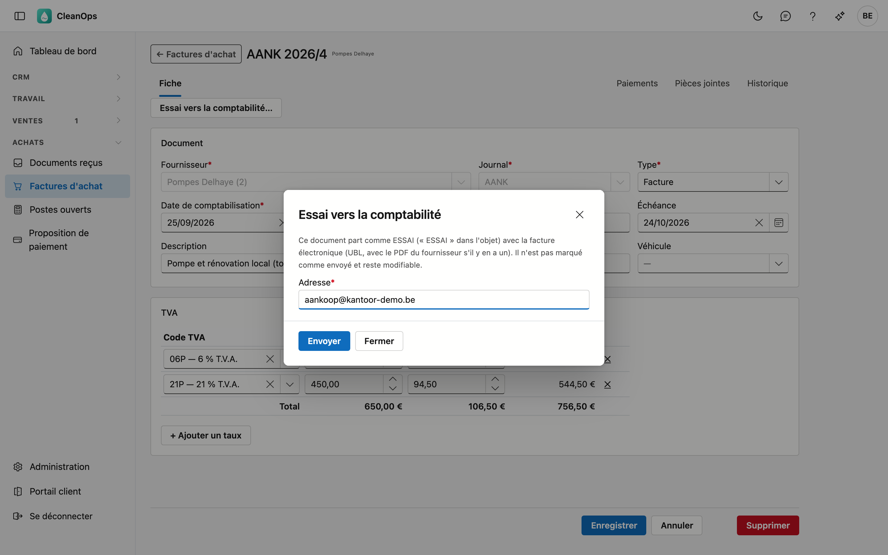

# Factures d'achat

Les factures et notes de crédit de vos fournisseurs. Par document, CleanOps garde le fournisseur, son numéro et sa
date, l'échéance, les montants par taux de TVA, et ce qui reste à payer.

## Ouvrir l'écran

Cliquez à gauche dans le menu, sous **Achats**, sur **Factures d'achat**. Il vous faut le droit *Voir les achats* ;
pour encoder des documents aussi *Modifier les achats*. Le rôle Financieel reçoit les deux.

## La liste

Par document, vous voyez la date de comptabilisation, le numéro, le type, le fournisseur, le numéro du fournisseur, le
total, ce qui reste ouvert, l'échéance et s'il est déjà **en comptabilité**. Le véhicule et la date du fournisseur sont
masqués par défaut : le sélecteur de colonnes les affiche. La comptabilisation la plus récente figure en haut.

- **Type** — uniquement les factures ou uniquement les notes de crédit.
- **Exercice** — le numéro recommence à 1 chaque exercice ; choisissez un exercice pour voir une seule série.
- **Période** — sur la date de comptabilisation.
- **Afficher** — *Ouverts* ne montre que ce qui reste à payer (ou, pour une note de crédit, à imputer).
- **Rechercher** — le curseur se trouve directement dans le champ de recherche. La recherche porte sur le numéro, le
  fournisseur, le numéro du fournisseur, la description et le véhicule.
- **Exporter** — le bouton **Exporter** vous donne la liste telle qu'elle est filtrée, sous forme de fichier.
- **Ouvrir** — double-cliquez sur une ligne pour ouvrir le document.
- **Journal** — le volet à droite montre les pièces jointes et l'historique du document sélectionné.

### Vers la comptabilité

Si c'est activé sur la [fiche d'entreprise](beheer/bedrijfsfiche.md#comptabilite), les factures et notes de crédit d'achat
enregistrées dans CleanOps partent chaque matin d'elles-mêmes chez votre bureau comptable, jusqu'à la date de
comptabilisation de la veille. **Vers la comptabilité…** le fait tout de suite : la fenêtre indique d'abord combien de
documents attendent, combien sont arrivés par Peppol, combien n'ont pas de PDF du fournisseur et vers quelle adresse ils
partent. Elle n'envoie que lorsque vous cliquez sur **Envoyer**.

- Un document arrivé par **Peppol** part tel que le fournisseur l'a envoyé.
- Un document que vous avez enregistré **à la main** part comme facture électronique (UBL) avec le premier PDF des
  **Pièces jointes**. Sans PDF, il part quand même, mais sans image : joignez donc d'abord le PDF du fournisseur.
- Les documents de votre application précédente ne partent pas.

Une fois envoyé, le document est **en comptabilité** et figé (voir [Modifier et supprimer](#modifier-et-supprimer)). Si un
document échoue, vous voyez pourquoi ; il repart le lendemain matin. Si l'envoi est désactivé, ou si votre application
précédente est encore en service, la fenêtre le dit et n'envoie rien.

## Une nouvelle facture d'achat

Cliquez sur **Nouvelle facture d'achat**. Le journal, le type *Facture* et la date de comptabilisation du jour sont
déjà remplis. Après **Enregistrer**, le document reçoit son numéro et s'ouvre à nouveau, avec ses onglets.

**Document**

| Champ | Ce que vous complétez |
|---|---|
| Fournisseur * | dans la liste des [fournisseurs](leveranciers.md) |
| Journal * | le journal d'achat |
| Type * | facture ou note de crédit |
| Date de comptabilisation * | la date à laquelle vous comptabilisez le document ; elle détermine l'exercice et donc le numéro |
| Date fournisseur * | la date sur le document du fournisseur, pas dans le futur |
| N° fournisseur * | le numéro sur le document du fournisseur |
| Échéance | à laisser vide : elle suit alors le délai de paiement du fournisseur (une note de crédit échoit à sa date) |
| Communication structurée | la communication structurée du fournisseur (+++123/4567/89002+++) ; le chiffre de contrôle est vérifié. La [proposition de paiement](betalingsvoorstel.md) la reprend dans le fichier SEPA |
| Description | ce qui a été acheté, en bref |
| Véhicule | pour un coût de véhicule, dans la liste des [véhicules](beheer/voertuigen.md) |

**TVA** — une ligne par taux de TVA. Choisissez le **code TVA** et indiquez la **base** : CleanOps propose la TVA. Si le
document du fournisseur porte un autre montant de TVA, tapez-le par-dessus. Avec **+ Ajouter un taux**, vous mettez un
deuxième taux sur le même document, par exemple 21 % et 6 %. Si le fournisseur a un code TVA par défaut, il figure déjà
dans la première ligne.

!!! note "Le même document deux fois ?"
    CleanOps refuse un document portant le même numéro et la même date du même fournisseur. Vous ne comptabilisez
    ainsi pas une facture deux fois par erreur.

## Une facture par Peppol

Si votre fournisseur envoie sa facture par Peppol, vous ne devez pas la saisir : elle figure dans
[Documents reçus](binnengekomen-documenten.md), et **Traiter** ouvre cette fiche déjà remplie. En haut figure alors la
carte **Document Peppol** avec le PDF et les lignes du fournisseur ; elle reste aussi après l'enregistrement. La TVA
du document reste : pour une telle facture, CleanOps ne la recalcule pas. Si le document porte une communication
structurée, elle aussi est déjà remplie.

## Le numéro

Le numéro court par exercice et journal d'achat, à partir de 1 ; factures et notes de crédit partagent la série. Le
numéro suivant se règle dans [Numéros de documents](beheer/documentnummers.md).

## Modifier et supprimer

Tant que rien n'est payé et qu'il n'est pas en comptabilité, vous adaptez un document et l'enregistrez. Le fournisseur, le journal et l'exercice sont
fixes : le numéro en dépend.

**Supprimer** au bas de la fiche retire définitivement le document, après confirmation. Son numéro passe au document
d'achat suivant, afin qu'il n'y ait pas de trou dans la série.

!!! note "Payé = fixe"
    Si un montant est déjà payé sur un document, cela figure en haut de la fiche et vous ne pouvez plus le modifier
    ni le supprimer. Si ce paiement était une erreur, annulez-le dans [Paiements](betalingen.md) : vous pouvez ensuite
    adapter à nouveau le document.

!!! note "En comptabilité = fixe"
    Si un document a déjà été envoyé à votre bureau comptable, la fiche indique *en comptabilité* en haut et vous ne pouvez
    plus le modifier ni le supprimer : votre comptable l'a déjà comptabilisé. Une correction se fait par note de crédit.

## Essai vers la comptabilité

**Essai vers la comptabilité…** en haut de la fiche envoie ce seul document en ESSAI vers une adresse de votre choix, avec
la facture électronique (UBL) et le PDF du fournisseur s'il y en a un. Vous vérifiez ainsi avec votre comptable que son
logiciel lit bien vos factures d'achat, avant d'activer l'envoi quotidien. Un essai ne met pas le document *en
comptabilité* : il reste modifiable.

## L'onglet Paiements

Les paiements sur ce document, avec la date et le numéro de l'extrait et le montant. Au-dessus figure ce qui reste
ouvert, comme sur l'extrait : négatif pour une facture que vous devez encore payer. S'il reste un montant ouvert,
**Saisir un paiement** ouvre la fenêtre de [Paiements](betalingen.md) avec ce document déjà rempli. Ce qui reste ouvert
chez tous vos fournisseurs se voit dans les [Postes ouverts fournisseurs](openstaande-posten-leveranciers.md).

## Les onglets Pièces jointes et Historique

Sous **Pièces jointes**, vous gardez le document du fournisseur, par exemple le PDF reçu par e-mail. L'**Historique**
montre qui a modifié quel champ, quand, et de quelle valeur vers quelle valeur.

## Questions fréquentes

**Où sont les lignes de la facture ?**
Une facture d'achat porte les montants par taux de TVA, comme votre application précédente. Le détail de ce qui a été
acheté figure sur le document du fournisseur, sous Pièces jointes. Si la facture est arrivée par Peppol, les lignes
figurent aussi en haut de la fiche, dans la carte Document Peppol.

**Je ne peux plus modifier un document.**
Regardez en haut de la fiche : s'il y est indiqué qu'un montant est déjà payé, le document est fixe. L'onglet Paiements
montre de quel paiement il s'agit ; un paiement erroné s'annule dans [Paiements](betalingen.md). S'il y est indiqué *en
comptabilité*, le document est déjà parti chez votre bureau comptable : corrigez-le par note de crédit.

**Où sont le véhicule et la date du fournisseur ?**
Dans la liste, ils sont masqués par défaut, pour que la liste tienne aussi sur un écran plus petit. Affichez-les avec le
sélecteur de colonnes ; sur la fiche, ils figurent toujours.

**L'échéance est incorrecte.**
Laissez le champ vide pour la recalculer à partir du délai de paiement du fournisseur, ou indiquez la date du document.
