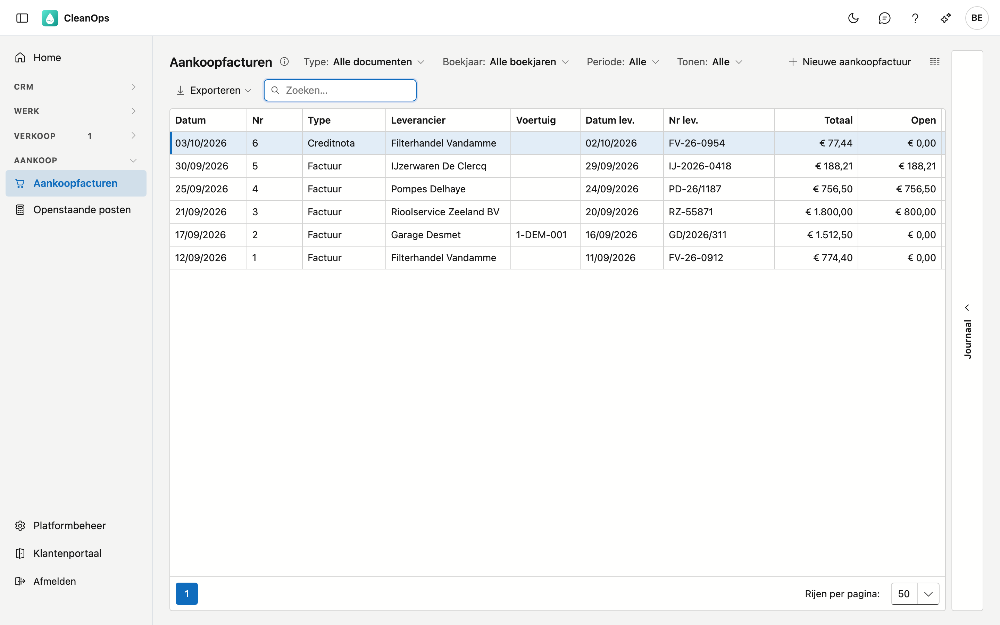
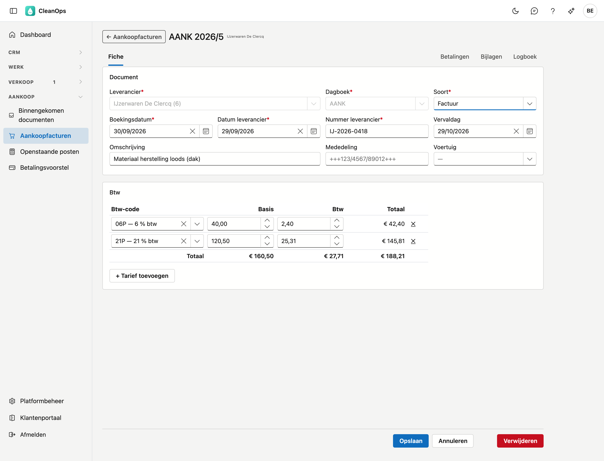

# Aankoopfacturen

De facturen en creditnota's van uw leveranciers. Per document houdt CleanOps de leverancier bij, zijn nummer en
datum, de vervaldag, de bedragen per btw-tarief, en wat er nog betaald moet worden.

## Het scherm openen

Klik links in het menu, onder **Aankoop**, op **Aankoopfacturen**. U hebt het recht *Aankoop bekijken* nodig; om
documenten in te geven ook *Aankoop bewerken*. De rol Financieel krijgt beide.

## De lijst

Per document ziet u de boekingsdatum, het nummer, de soort, de leverancier, het voertuig, de datum en het nummer van
de leverancier, het totaal, wat nog open staat, en de vervaldag. De recentste boeking staat bovenaan.

- **Type** — enkel facturen of enkel creditnota's.
- **Boekjaar** — het nummer begint elk boekjaar opnieuw bij 1; kies een boekjaar om één reeks te zien.
- **Periode** — op de boekingsdatum.
- **Tonen** — *Openstaand* toont enkel wat nog betaald (of bij een creditnota verrekend) moet worden.
- **Zoeken** — de cursor staat meteen in het zoekveld. Er wordt gezocht in het nummer, de leverancier, het nummer van
  de leverancier, de omschrijving en het voertuig.
- **Exporteren** — via de knop rechtsboven krijgt u de lijst zoals ze nu gefilterd is als bestand.
- **Openen** — dubbelklik op een rij om het document te openen.
- **Journaal** — de strook rechts toont de bijlagen en het logboek van het document dat u aanklikt.

## Een nieuwe aankoopfactuur

Klik op **Nieuwe aankoopfactuur**. Het dagboek, de soort *Factuur* en de boekingsdatum van vandaag staan al ingevuld.
Na **Opslaan** krijgt het document zijn nummer en opent het opnieuw, met de tabbladen erbij.

**Document**

| Veld | Wat u invult |
|---|---|
| Leverancier * | uit de lijst van de [leveranciers](leveranciers.md) |
| Dagboek * | het aankoopdagboek |
| Soort * | factuur of creditnota |
| Boekingsdatum * | de datum waarop u het document boekt; ze bepaalt het boekjaar en dus het nummer |
| Datum leverancier * | de datum op het document van de leverancier, niet in de toekomst |
| Nummer leverancier * | het nummer op het document van de leverancier |
| Vervaldag | leeg laten: ze volgt dan uit de betaaltermijn van de leverancier (een creditnota vervalt op haar datum) |
| Mededeling | de gestructureerde mededeling van de leverancier (+++123/4567/89002+++); het controlegetal wordt nagekeken. Het [betalingsvoorstel](betalingsvoorstel.md) zet ze in het SEPA-bestand |
| Omschrijving | wat er gekocht werd, kort |
| Voertuig | voor een kost van een voertuig, uit de lijst van de [voertuigen](beheer/voertuigen.md) |

**Btw** — per btw-tarief een regel. Kies de **btw-code** en vul de **basis** in: CleanOps stelt de btw voor. Staat er
op het document van de leverancier een ander btw-bedrag, typ dat dan over. Met **+ Tarief toevoegen** zet u een tweede
tarief op hetzelfde document, bijvoorbeeld 21 % en 6 %. Heeft de leverancier een standaard btw-code, dan staat die al
in de eerste regel.

!!! note "Hetzelfde document twee keer?"
    CleanOps weigert een document met hetzelfde nummer en dezelfde datum van dezelfde leverancier. Zo boekt u een
    factuur niet per ongeluk twee keer.

## Een factuur uit Peppol

Stuurt uw leverancier zijn factuur via Peppol, dan hoeft u ze niet in te typen: ze staat in
[Binnengekomen documenten](binnengekomen-documenten.md), en **Verwerken** opent deze fiche al ingevuld. Bovenaan staat
dan de kaart **Peppol-document** met de PDF en de lijnen van de leverancier; ze blijft er ook na het bewaren staan. De
btw van het document blijft staan: CleanOps rekent ze bij zo'n factuur niet opnieuw uit. Draagt het document een
gestructureerde mededeling, dan staat ook die al ingevuld.

## Het nummer

Het nummer loopt per boekjaar en aankoopdagboek, vanaf 1; facturen en creditnota's delen de reeks. Het volgende nummer
stelt u in op [Documentnummers](beheer/documentnummers.md).

## Wijzigen en verwijderen

Zolang er niets op betaald is, past u een document aan en bewaart u. De leverancier, het dagboek en het boekjaar
liggen vast: aan het nummer hangen ze.

**Verwijderen** onderaan de fiche haalt het document definitief weg, na een bevestiging. Zijn nummer gaat naar het
volgende aankoopdocument, zodat er geen gat in de reeks valt.

!!! note "Betaald = vast"
    Is er al iets betaald op een document, dan staat het bovenaan de fiche en kunt u het niet meer wijzigen of
    verwijderen. Was die betaling een vergissing, draai ze dan terug in [Betalingen](betalingen.md): daarna kunt u het
    document weer aanpassen.

## Het tabblad Betalingen

De betalingen op dit document, met de datum en het nummer van het uittreksel en het bedrag. Erboven staat wat er nog
openstaat, zoals op het uittreksel: negatief voor een factuur die u nog moet betalen. Staat er nog iets open, dan opent
**Betaling ingeven** het venster van [Betalingen](betalingen.md) met dit document al ingevuld. Wat er van al uw
leveranciers nog openstaat, ziet u in [Openstaande posten leveranciers](openstaande-posten-leveranciers.md).

## De tabbladen Bijlagen en Logboek

Onder **Bijlagen** bewaart u het document van de leverancier, bijvoorbeeld de PDF uit zijn mail. Het **Logboek** toont
wie welk veld wijzigde, wanneer, en van welke waarde naar welke.

## Veelgestelde vragen

**Waar staan de lijnen van de factuur?**
Een aankoopfactuur draagt de bedragen per btw-tarief, zoals uw vorige toepassing. Het detail van wat er gekocht werd,
staat op het document van de leverancier onder Bijlagen. Kwam de factuur via Peppol binnen, dan staan de lijnen ook
bovenaan de fiche, in de kaart Peppol-document.

**Een document kan ik niet meer wijzigen.**
Kijk bovenaan de fiche: staat er dat er al betaald is, dan ligt het vast. Het tabblad Betalingen toont welke betaling
het is; een verkeerde betaling draait u terug in [Betalingen](betalingen.md).

**De vervaldag klopt niet.**
Laat het veld leeg om ze opnieuw uit de betaaltermijn van de leverancier te laten berekenen, of vul de datum van het
document in.
