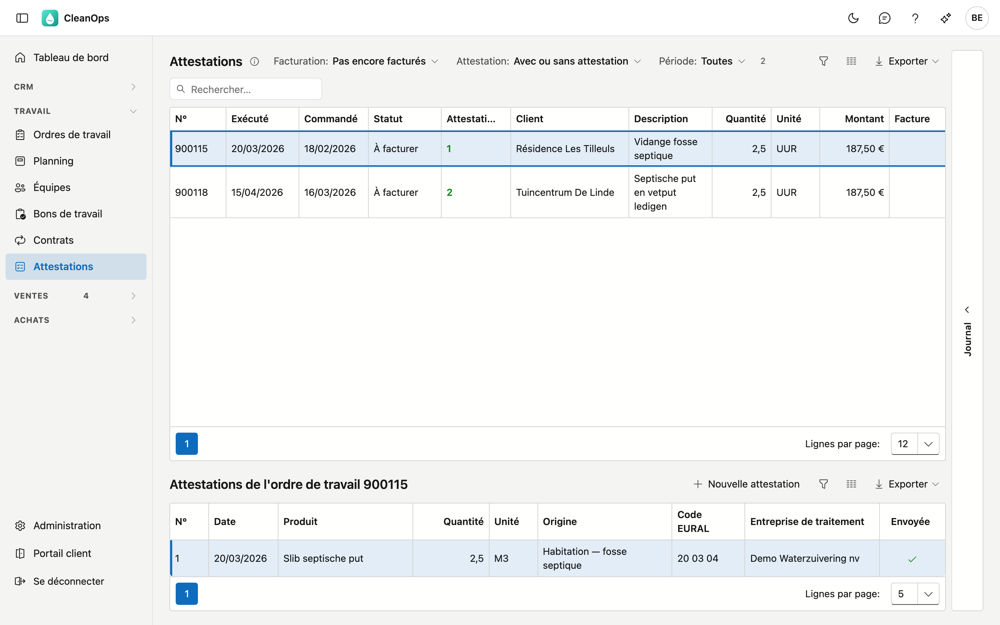
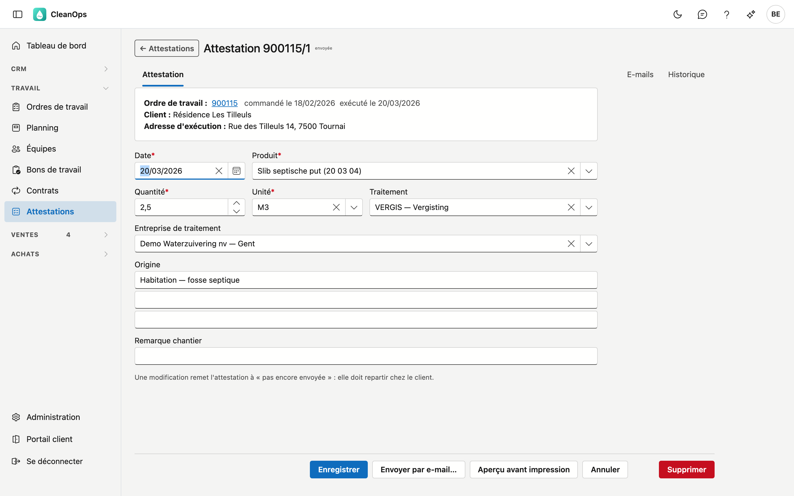
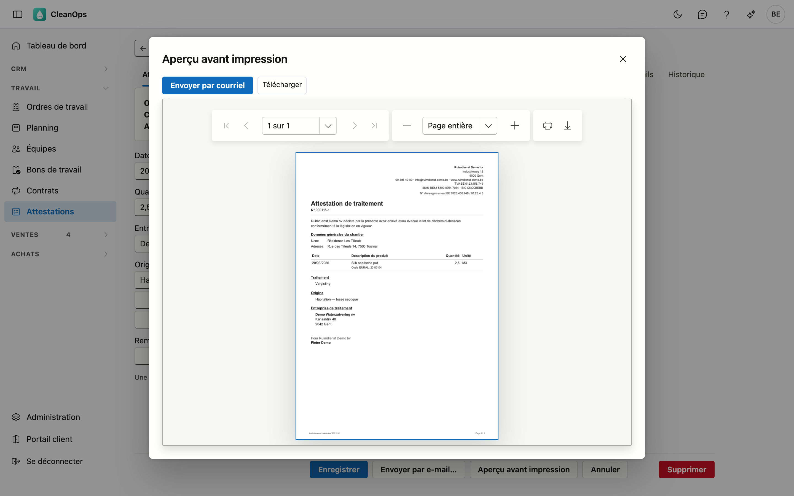
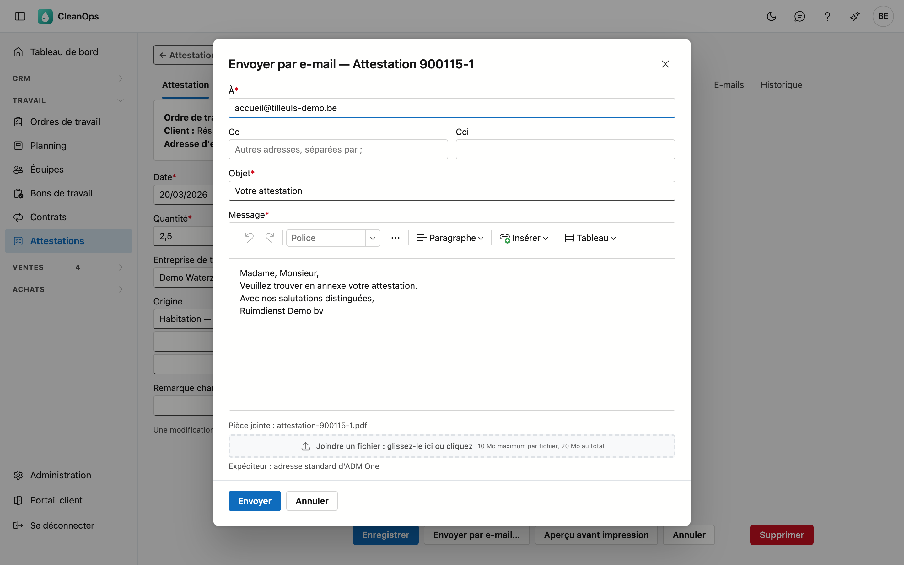

# Attestations

Une attestation de traitement prouve à votre client que les déchets que vous avez enlevés chez lui ont été évacués et
traités correctement : quel produit, quelle quantité, comment il a été traité et par quelle entreprise. Une attestation
appartient toujours à un ordre de travail ; un ordre de travail peut en porter plusieurs.

## Ouvrir l'écran

Dans le menu, sous **Travail**, cliquez sur **Attestations**. Vous trouvez aussi les attestations d'un ordre de travail
sur sa fiche, dans l'onglet **Attestations** (voir [Ordres de travail](werkorders.fr.md)).

## La liste

En haut figurent les ordres de travail qui demandent une attestation (la case **Attestation requise** sur l'ordre de
travail) ou qui en ont déjà une. Cliquez sur un ordre de travail : en dessous apparaissent les **Attestations de l'ordre
de travail**. Double-cliquez sur un ordre de travail pour ouvrir sa fiche ; **← Attestations** vous ramène à cette liste, avec vos filtres.

| Filtre | Ce qu'il fait |
|---|---|
| **Facturation** | *Pas encore facturés* (la liste s'ouvre ainsi), *Facturés* ou *Tous*. |
| **Attestation** | *Sans attestation* ne montre que les ordres de travail sans attestation — votre liste de travail. |
| **Période** | sur la date d'exécution de l'ordre de travail. |

Vous cherchez un client dans le champ de recherche. La colonne **Attestations** donne le nombre d'attestations de l'ordre
de travail, ou en rouge *manquante*. Le **prix unitaire** s'active via **Choisir les colonnes**.

!!! tip "Travailler avec Sans attestation"
    Mettez **Attestation** sur *Sans attestation* et établissez les attestations une par une. Quand vous revenez à la liste
    après l'enregistrement, l'ordre de travail que vous venez de traiter en a disparu.

## Établir ou modifier une attestation

Sous l'ordre de travail, cliquez sur **Nouvelle attestation**, ou double-cliquez sur une attestation existante.
L'attestation s'ouvre sur sa propre fiche ; **Enregistrer** et **Annuler** vous ramènent d'où vous veniez.

En haut figurent l'ordre de travail, le client et l'adresse d'exécution, tels qu'ils apparaissent sur l'attestation.

| Champ | Ce que vous indiquez |
|---|---|
| **Date** *(obligatoire)* | le jour de l'enlèvement ou de l'évacuation. Une nouvelle attestation reçoit la date d'exécution de l'ordre de travail. |
| **Produit** *(obligatoire)* | le déchet, avec son code EURAL (voir [Produits (attestations)](beheer/attest-producten.fr.md)). |
| **Quantité** *(obligatoire)* et **Unité** *(obligatoire)* | supérieure à zéro ; l'unité vient des [Unités](beheer/eenheden.fr.md), par exemple T ou M3. |
| **Traitement** | la façon dont le déchet est traité (voir [Traitements](beheer/verwerkingen.fr.md)). Si la description compte plus d'une ligne, elle figure en entier sous le champ. |
| **Entreprise de traitement** | qui le traite (voir [Entreprises de traitement](beheer/verwerkingsbedrijven.fr.md)). |
| **Origine** | trois lignes : d'où vient le déchet, par exemple *Habitation — fosse septique*. |
| **Remarque chantier** | une courte remarque sur le chantier, 35 caractères au maximum. |

Un produit, un traitement ou une entreprise de traitement archivé entre-temps reste sur une ancienne attestation et y
reste sélectionnable.

**Supprimer** efface l'attestation définitivement, après confirmation.

### Attestation établie

Dès qu'un ordre de travail a une attestation, sa case **Attestation établie** est cochée — automatiquement. Si vous
supprimez la dernière attestation, elle se décoche. Vous ne pouvez pas cocher cette case vous-même.

## Imprimer

Cliquez sur **Aperçu avant impression**. L'attestation montre l'en-tête de votre entreprise, le numéro (ordre de travail
et attestation), le document de vente si l'ordre de travail est facturé, et la déclaration que vous avez enlevé et évacué
les déchets conformément à la législation en vigueur. En dessous : le chantier, le produit avec son code EURAL, le
traitement, l'origine et l'entreprise de traitement.

Le **numéro d'enregistrement** dans l'en-tête et le **signataire** en bas viennent de la
[fiche entreprise](beheer/bedrijfsfiche.fr.md#attestations-de-traitement) ; si vous les laissez vides, ils ne figurent pas sur
l'attestation. L'attestation est dans la langue de l'ordre de travail : néerlandais ou français.

L'aperçu montre ce qui est enregistré. Si vous avez modifié quelque chose, *enregistrez d'abord* figure à côté du bouton.

## Envoyer par e-mail

Cliquez sur **Envoyer par e-mail…**, ou sur **Envoyer par courriel** dans l'aperçu. La fenêtre propose le destinataire :

- l'**adresse e-mail pour les attestations** du client, si elle est remplie — avec l'**adresse de facturation** (ou à
  défaut l'adresse principale) en **Cc** ;
- sans adresse pour les attestations : l'adresse de facturation, à défaut l'adresse principale.

Vous pouvez encore adapter le destinataire, la copie, l'objet et le texte. Le texte vient des
[Textes d'e-mail](beheer/mailteksten.fr.md), type **Attestation**. L'attestation part en PDF ; **Voir** à côté de la pièce jointe l'affiche d'abord, et **Fiche client ↗** ouvre le client dans un
nouvel onglet. **Joindre un fichier** vous
permet d'y ajouter votre propre fichier (10 Mo maximum par fichier, 20 Mo ensemble).

Une attestation peut aussi partir avec l'**e-mail de la facture** : les attestations des ordres de travail de la facture y
figurent, à cocher (voir [Factures](facturen.fr.md)). Elle est alors aussi **envoyée**.

Après l'envoi, l'attestation est **envoyée** (en haut de la fiche et dans la colonne **Envoyée**) et vous trouvez l'e-mail
dans l'onglet **E-mails**. Si vous modifiez ensuite l'attestation, elle redevient *pas encore envoyée* : elle doit repartir
chez le client. Si vous envoyez une attestation déjà envoyée, CleanOps vous demande d'abord si c'est voulu.

## Le journal

Cliquez sur une attestation dans la liste et ouvrez le volet **Journal** à droite : l'historique montre qui a établi,
modifié et envoyé l'attestation. Sur la fiche, vous trouvez la même chose sous **Historique**.

## Droits

| Droit | Ce qu'il permet |
|---|---|
| **Voir les attestations** | la liste, les fiches et l'aperçu avant impression. |
| **Modifier les attestations** | établir, modifier, supprimer et envoyer des attestations. |

Vous les attribuez dans [Rôles](beheer/rollen.fr.md).

## Questions fréquentes

**Pourquoi un ordre de travail facturé n'apparaît-il pas dans la liste ?**
La liste s'ouvre sur *Pas encore facturés*. Mettez **Facturation** sur *Facturés* ou *Tous*.

**Un ordre de travail est sur Attestation établie, mais sans attestation — est-ce possible ?**
Non. La case suit les attestations : s'il y a une attestation, elle est cochée, sinon pas.

## Voir aussi

- [Ordres de travail](werkorders.fr.md)
- [Facturation](facturatie.fr.md) — le *attestation manquante* en rouge ouvre les attestations de cet ordre de travail
- [Produits (attestations)](beheer/attest-producten.fr.md), [Traitements](beheer/verwerkingen.fr.md), [Entreprises de traitement](beheer/verwerkingsbedrijven.fr.md)
