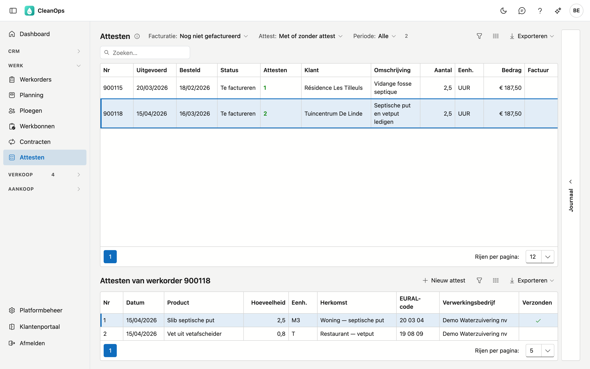
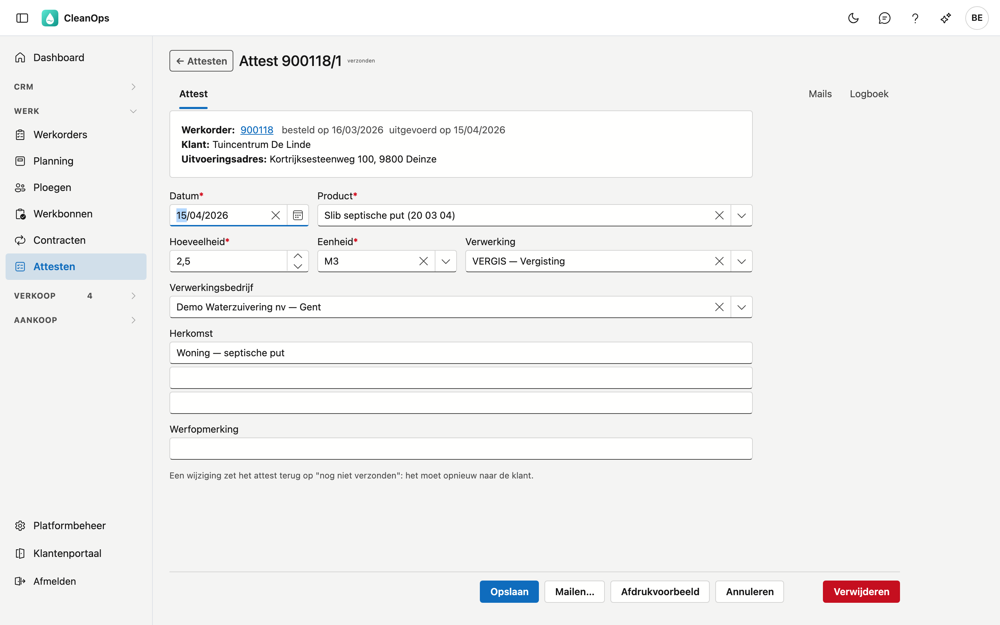
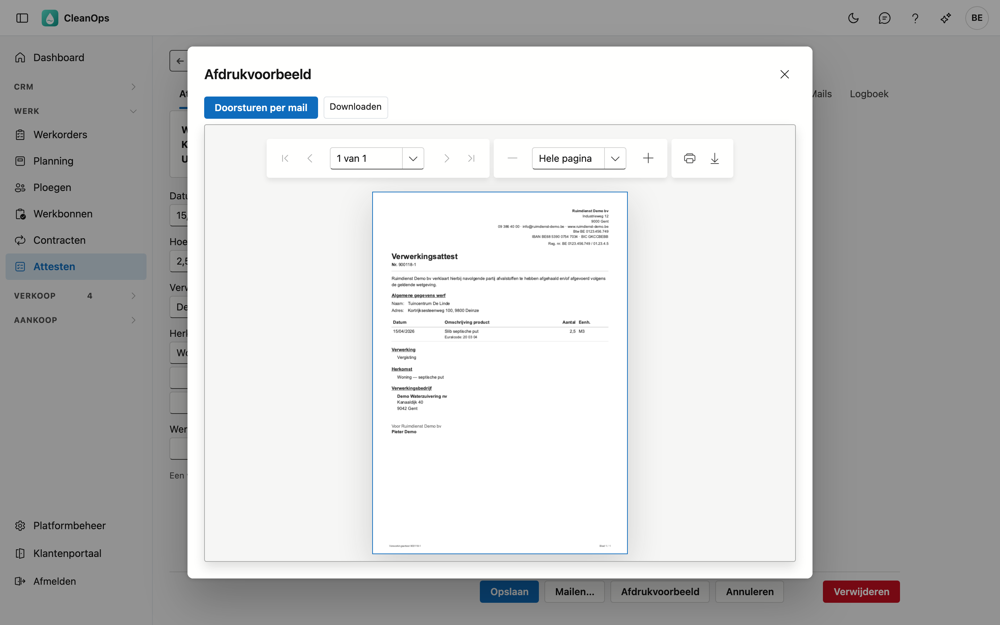
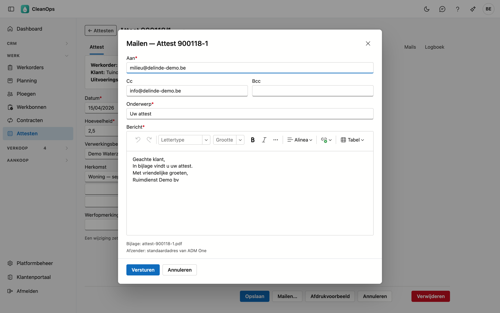

# Attesten

Een verwerkingsattest bewijst aan uw klant dat het afval dat u bij hem ophaalde, correct afgevoerd en verwerkt is: welk
product, hoeveel, hoe het verwerkt werd en door welk bedrijf. Een attest hoort altijd bij een werkorder; een werkorder
kan er meerdere dragen.

## Het scherm openen

Klik in het menu onder **Werk** op **Attesten**. De attesten van één werkorder vindt u ook op de werkorderfiche, op het
tabblad **Attesten** (zie [Werkorders](werkorders.md)).

## De lijst

Bovenaan staan de werkorders die een attest vragen (het vinkje **Attest vereist** op de werkorder) of er al een hebben.
Klik een werkorder aan: daaronder verschijnen **Attesten van werkorder** met zijn attesten. Dubbelklik op een werkorder om
de werkorderfiche te openen; **← Attesten** brengt u terug naar deze lijst, met uw filters.

| Filter | Wat het doet |
|---|---|
| **Facturatie** | *Nog niet gefactureerd* (zo opent de lijst), *Gefactureerd* of *Alle*. |
| **Attest** | *Zonder attest* toont enkel de werkorders waar nog geen attest voor bestaat — uw werklijst. |
| **Periode** | op de uitvoeringsdatum van de werkorder. |

Een klant zoekt u in het zoekveld. In de kolom **Attesten** staat het aantal attesten van de werkorder, of in het rood
*ontbreekt*.

!!! tip "Werken met Zonder attest"
    Zet **Attest** op *Zonder attest* en maak de attesten één voor één. Keert u na het bewaren terug naar de lijst, dan is de
    werkorder die u net afwerkte eruit verdwenen.

## Een attest maken of wijzigen

Klik onder de werkorder op **Nieuw attest**, of dubbelklik op een bestaand attest. Het attest opent op zijn eigen fiche;
**Bewaren** en **Annuleren** brengen u terug naar waar u vandaan kwam.

Bovenaan staan de werkorder, de klant en het uitvoeringsadres, zoals ze op het attest komen.

| Veld | Wat u invult |
|---|---|
| **Datum** *(verplicht)* | de dag van het ophalen of afvoeren. Een nieuw attest krijgt de uitvoeringsdatum van de werkorder. |
| **Product** *(verplicht)* | het afval, met zijn EURAL-code (zie [Producten (attesten)](beheer/attest-producten.md)). |
| **Hoeveelheid** *(verplicht)* en **Eenheid** *(verplicht)* | groter dan nul; de eenheid uit [Eenheden](beheer/eenheden.md), bijvoorbeeld T of M3. |
| **Verwerking** | hoe het afval verwerkt wordt (zie [Verwerkingen](beheer/verwerkingen.md)). Heeft de omschrijving meer dan één regel, dan staat ze volledig onder het veld. |
| **Verwerkingsbedrijf** | wie het verwerkt (zie [Verwerkingsbedrijven](beheer/verwerkingsbedrijven.md)). |
| **Herkomst** | drie regels: waar het afval vandaan komt, bijvoorbeeld *Woning — septische put*. |
| **Werfopmerking** | een korte opmerking over de werf, maximaal 35 tekens. |

Een product, verwerking of verwerkingsbedrijf dat intussen gearchiveerd is, blijft op een oud attest staan en is daar nog
te kiezen.

**Verwijderen** schrapt het attest definitief, na een bevestiging.

### Attest gemaakt

Zodra een werkorder een attest heeft, staat zijn vinkje **Attest gemaakt** aan — vanzelf. Verwijdert u het laatste attest,
dan gaat het weer uit. U kunt het vinkje niet zelf zetten.

## Afdrukken

Klik op **Afdrukvoorbeeld**. Het attest toont het briefhoofd van uw bedrijf, het nummer (werkorder en attest), het
verkoopdocument als de werkorder gefactureerd is, en de verklaring dat u het afval volgens de geldende wetgeving afhaalde
en afvoerde. Daaronder de werf, het product met zijn EURAL-code, de verwerking, de herkomst en het verwerkingsbedrijf.

Het **registratienummer** in het briefhoofd en de **ondertekenaar** onderaan komen uit de
[bedrijfsfiche](beheer/bedrijfsfiche.md#verwerkingsattesten); laat u ze leeg, dan staan ze niet op het attest. Het attest
staat in de taal van de werkorder: Nederlands of Frans.

Het voorbeeld toont wat bewaard is. Hebt u iets gewijzigd, dan staat naast de knop *eerst bewaren*.

## Mailen

Klik op **Mailen…**, of op **Doorsturen per mail** in het afdrukvoorbeeld. Het venster stelt de ontvanger voor:

- het **e-mailadres voor attesten** van de klant, als dat ingevuld is — met het **facturatieadres** (of anders het
  hoofdadres) in **Cc**;
- zonder attestadres: het facturatieadres, anders het hoofdadres.

U kunt de ontvanger, de cc, het onderwerp en de tekst nog aanpassen. De tekst komt uit
[Mailteksten](beheer/mailteksten.md), soort **Attest**. Het attest gaat als PDF mee. Met **Bestand meesturen** voegt u er
zelf een bestand aan toe (hooguit 10 MB per bestand, 20 MB samen).

Een attest kan ook mee met de **factuurmail**: daar staan de attesten van de werkorders op de factuur om aan te vinken (zie
[Facturen](facturen.md)). Ook dan staat het attest daarna op **verzonden**.

Na het versturen staat het attest op **verzonden** (bovenaan de fiche en in de kolom **Verzonden**) en vindt u de mail op
het tabblad **Mails**. Wijzigt u het attest daarna, dan staat het weer op *nog niet verzonden*: het moet opnieuw naar de
klant. Mailt u een attest dat al verzonden is, dan vraagt CleanOps eerst of dat de bedoeling is.

## Het journaal

Klik in de lijst een attest aan en open de strook **Journaal** rechts: het logboek toont wie het attest maakte, wijzigde
en mailde. Op de fiche staat hetzelfde onder **Logboek**.

## Rechten

| Recht | Wat het toelaat |
|---|---|
| **Attesten bekijken** | de lijst, de fiches en het afdrukvoorbeeld. |
| **Attesten bewerken** | attesten maken, wijzigen, verwijderen en mailen. |

U kent ze toe in [Rollen](beheer/rollen.md).

## Veelgestelde vragen

**Waarom staat een gefactureerde werkorder niet in de lijst?**
De lijst opent op *Nog niet gefactureerd*. Zet **Facturatie** op *Gefactureerd* of *Alle*.

**Een werkorder staat op Attest gemaakt, maar zonder attest — kan dat?**
Nee. Het vinkje volgt de attesten: is er een attest, dan staat het aan, anders uit.

## Zie ook

- [Werkorders](werkorders.md)
- [Facturatie](facturatie.md) — het rode *attest ontbreekt* opent de attesten van die werkorder
- [Producten (attesten)](beheer/attest-producten.md), [Verwerkingen](beheer/verwerkingen.md), [Verwerkingsbedrijven](beheer/verwerkingsbedrijven.md)
