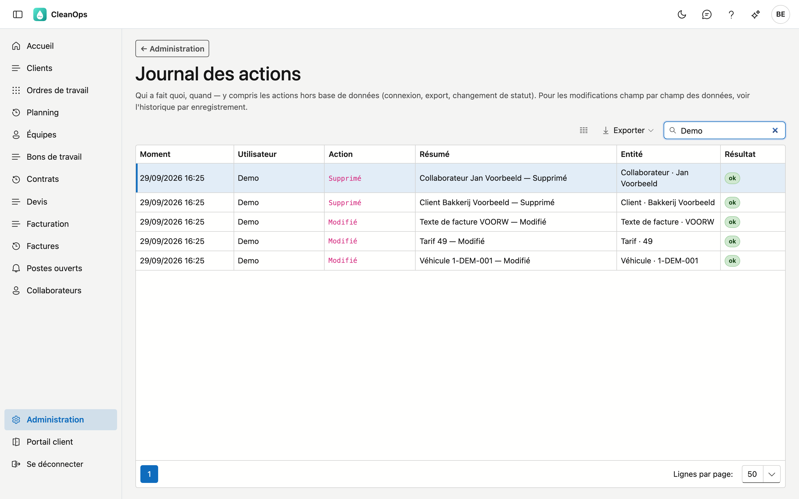

# Journal des actions

Le journal des actions montre ce qui s'est passé dans CleanOps : qui s'est connecté, qui a créé, modifié ou supprimé un enregistrement. Vous le consultez lorsque vous voulez savoir qui a fait quoi, et quand.

## Ouvrir l'écran

Dans la barre latérale, cliquez sur **Administration**, puis sur la tuile **Journal des actions**.

## La liste

| Colonne | Ce que vous voyez |
|---|---|
| **Moment** | Quand l'action a eu lieu. Les plus récentes figurent en haut. |
| **Utilisateur** | Qui l'a effectuée. Pour une connexion échouée, la mention est **onbekend** (inconnu). |
| **Action** | Ce qui s'est passé : Créé, Modifié, Supprimé, Restauré, Archivé, Rétabli, Réussi… |
| **Résumé** | Une courte phrase sur ce qui s'est passé, p. ex. *Client Bakkerij Voorbeeld — Supprimé*. |
| **Entité** | Sur quel type d'enregistrement portait l'action, avec son nom ou numéro : *Devis · 5*, *Véhicule · 1-DEM-001*. |
| **Résultat** | **ok**, ou l'étiquette rouge **Échec**. |

Cherchez avec le champ de recherche en haut et appuyez sur Entrée : la recherche porte sur l'utilisateur, l'action, le
résumé et l'entité. Avec **Exporter**, vous enregistrez la liste en fichier.

Vous ne voyez que ce qui s'est passé dans votre propre environnement. Le journal des actions est réservé au
**Tenant-beheerder** : le droit de le consulter ne peut être donné à aucun autre rôle.

## Ce qui y figure

- les connexions, y compris celles qui ont échoué
- les exportations d'une liste
- clients, adresses de clients, collaborateurs, devis, contrats et ordres de travail : créés, modifiés, supprimés vers la
  [Corbeille](prullenbak.fr.md) et restaurés ; pour les ordres de travail aussi la planification et l'ordre dans la journée
- les données de base — tarifs, textes de facture, conditions de paiement, codes TVA, tables de base, véhicules et leur
  entretien, la fiche d'entreprise : créés, modifiés, archivés et rétablis

## À quoi cela sert

- **Examiner une connexion échouée.** Plusieurs lignes **Échec** rapprochées indiquent un mot de passe oublié — ou quelqu'un qui tente d'entrer.
- **Savoir qui a supprimé quelque chose.** Le journal indique qui et quand ; la [Corbeille](prullenbak.fr.md) vous permet de restaurer.
- **Voir une modification champ par champ ?** Ce n'est pas ici mais dans l'**Historique** de l'enregistrement lui-même, dans son journal : quels champs, de quelle valeur vers quelle autre.

## Erreurs fréquentes

!!! info
    **Le journal des actions est un écran de consultation.** Vous ne pouvez rien y modifier ni supprimer — c'est voulu. Un journal modifiable ne prouve rien.

## Voir aussi

- [Corbeille](prullenbak.fr.md) — restaurer un enregistrement supprimé
- [Rôles](rollen.fr.md) — le Tenant-beheerder
