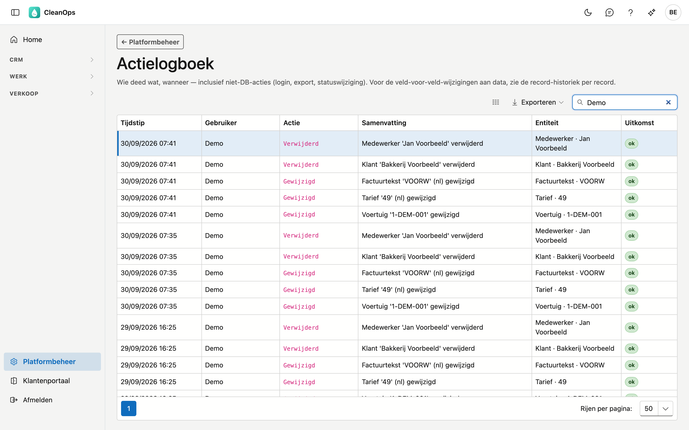

# Actielogboek

Het actielogboek toont wat er in CleanOps gebeurd is: wie zich aanmeldde, wie een record aanmaakte, wijzigde of verwijderde. U raadpleegt het wanneer u wil nagaan wie iets deed en wanneer.

## Het scherm openen

Klik in de zijbalk op **Platformbeheer** en daarna op de tegel **Actielogboek**.

## De lijst

| Kolom | Wat u ziet |
|---|---|
| **Tijdstip** | Wanneer de actie plaatsvond. De jongste staan bovenaan. |
| **Gebruiker** | Wie ze uitvoerde. Bij een mislukte aanmelding staat er **onbekend**. |
| **Actie** | Wat er gebeurde: Aangemaakt, Gewijzigd, Verwijderd, Hersteld, Gearchiveerd, Teruggehaald, Geslaagd … |
| **Samenvatting** | Een korte zin over wat er precies gebeurde, bv. *Klant 'Bakkerij Voorbeeld' verwijderd*. |
| **Entiteit** | Op welk soort record de actie sloeg, met zijn naam of nummer: *Offerte · 5*, *Voertuig · 1-DEM-001*. |
| **Uitkomst** | **ok**, of het rode label **mislukt**. |

Zoek met het zoekveld bovenaan en druk op Enter: het zoekt in de gebruiker, de actie, de samenvatting en de entiteit.
Met **Exporteren** bewaart u de lijst als bestand.

U ziet enkel wat er in uw eigen omgeving gebeurde. Het actielogboek is er voor de **Tenant-beheerder**: het recht om
het te bekijken kunt u aan geen andere rol geven.

## Wat er in staat

- aanmeldingen, ook de mislukte
- exports van een lijst
- klanten, klantadressen, medewerkers, offertes, contracten en werkorders: aangemaakt, gewijzigd, verwijderd naar de
  [Prullenbak](prullenbak.md) en hersteld; bij werkorders ook het inplannen en de volgorde op een dag
- de stamgegevens — tarieven, factuurteksten, betalingstermijnen, btw-codes, basistabellen, voertuigen en hun
  onderhoud, de bedrijfsfiche: aangemaakt, gewijzigd, gearchiveerd en teruggehaald
- facturen, voorschotfacturen en creditnota's: geboekt en gecrediteerd

## Waarvoor u het gebruikt

- **Een mislukte aanmelding onderzoeken.** Meerdere regels **mislukt** kort na elkaar wijzen op een vergeten wachtwoord — of op iemand die probeert binnen te raken.
- **Nagaan wie iets verwijderde.** Het logboek zegt wie en wanneer; de [Prullenbak](prullenbak.md) laat u het terugzetten.
- **Een wijziging veld per veld bekijken?** Dat staat niet hier maar in het **Logboek** van het record zelf, in zijn journaal: welke velden, van welke waarde naar welke.

## Veelgemaakte fouten

!!! info
    **Het actielogboek is een leesscherm.** U kunt er niets in wijzigen of verwijderen — dat is de bedoeling. Een logboek dat aanpasbaar is, bewijst niets.

## Zie ook

- [Prullenbak](prullenbak.md) — een verwijderd record terugzetten
- [Rollen](rollen.md) — de Tenant-beheerder
