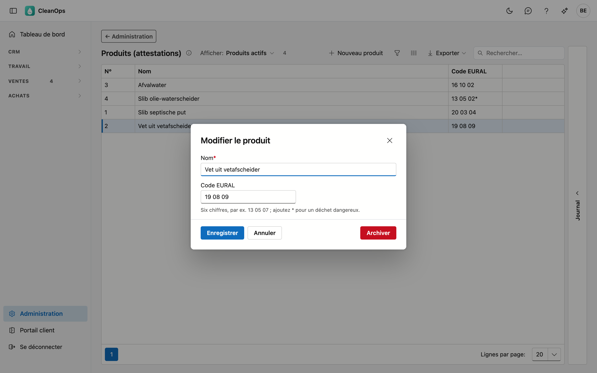

# Produits (attestations)

Les produits que vous enlevez et évacuez — boues, graisses, eaux usées… — avec leur code de déchet EURAL. Vous les
choisissez sur une [attestation de traitement](../attesten.fr.md) ; le nom et le code EURAL figurent sur l'attestation.

")

## Ouvrir l'écran

En bas du menu, cliquez sur **Administration** puis sur la tuile **Produits (attestations)**.

## La liste

| Colonne | Ce que c'est |
|---|---|
| N° | le numéro d'ordre du produit ; CleanOps le donne automatiquement. |
| Nom | ce qui figure sur l'attestation. |
| Code EURAL | le code de la liste européenne des déchets, par exemple *20 03 04*. |

La liste est triée par nom. Avec **Afficher**, vous voyez aussi les produits archivés. Un produit que vous avez créé
vous-même dans CleanOps porte l'étiquette **propre**.

## Ajouter ou modifier un produit

Cliquez sur **Nouveau produit**, ou double-cliquez sur une ligne existante.

| Champ | Ce que vous indiquez |
|---|---|
| **Nom** *(obligatoire)* | 50 caractères au plus. |
| **Code EURAL** | six chiffres. Vous pouvez les taper comme vous voulez — `200304`, `20.03.04`, `20-03-04` — CleanOps les enregistre toujours sous la forme `20 03 04`. Un déchet dangereux reçoit un astérisque : `13 05 02*`. |

## Archiver ou rétablir

Ouvrez le produit et cliquez sur **Archiver** : il disparaît de la liste de choix de l'attestation, mais les anciennes
attestations le gardent. **Rétablir** le rend à nouveau sélectionnable.

## Le journal

Sélectionnez un produit et ouvrez la bande **Journal** à droite : qui l'a créé, modifié, archivé ou rétabli.

## Voir aussi

- [Attestations](../attesten.fr.md)
- [Traitements](verwerkingen.fr.md) et [Entreprises de traitement](verwerkingsbedrijven.fr.md)
