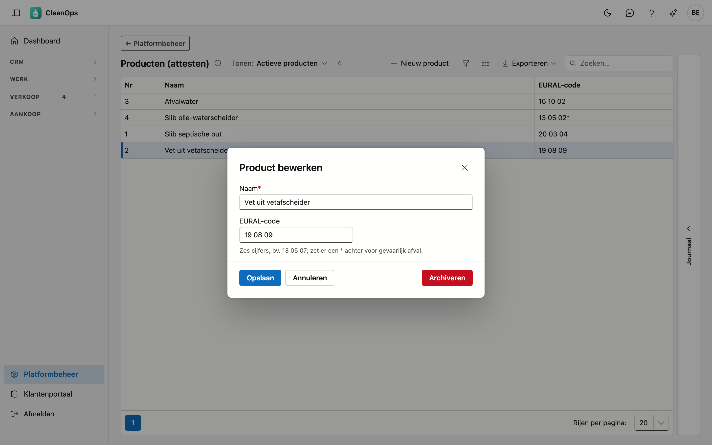

# Producten (attesten)

De producten die u ophaalt en afvoert — slib, vet, afvalwater… — met hun EURAL-afvalcode. U kiest ze op een
[verwerkingsattest](../attesten.md); de naam en de EURAL-code staan op het attest.

")

## Het scherm openen

Klik onderaan in het menu op **Platformbeheer** en daarna op de tegel **Producten (attesten)**.

## De lijst

| Kolom | Wat het is |
|---|---|
| Nr | het volgnummer van het product; CleanOps geeft het vanzelf. |
| Naam | wat op het attest staat, bijvoorbeeld *Slib septische put*. |
| EURAL-code | de code uit de Europese afvalstoffenlijst, bijvoorbeeld *20 03 04*. |

De lijst staat op naam. Met **Tonen** ziet u ook de gearchiveerde producten. Een product dat u zelf in CleanOps aangemaakt
hebt, draagt het label **eigen**.

## Een product toevoegen of wijzigen

Klik op **Nieuw product**, of dubbelklik op een bestaande rij.

| Veld | Wat u invult |
|---|---|
| **Naam** *(verplicht)* | maximaal 50 tekens. |
| **EURAL-code** | zes cijfers. U mag ze typen zoals u wil — `200304`, `20.03.04`, `20-03-04` — CleanOps bewaart ze altijd als `20 03 04`. Een gevaarlijke afvalstof krijgt een sterretje: `13 05 02*`. |

## Archiveren of terughalen

Open het product en klik op **Archiveren**: het verdwijnt uit de keuzelijst op het attest, maar oude attesten houden het.
**Terughalen** maakt het weer kiesbaar.

## Het journaal

Klik een product aan en open rechts de strook **Journaal**: wie het aanmaakte, wijzigde, archiveerde of terughaalde.

## Zie ook

- [Attesten](../attesten.md)
- [Verwerkingen](verwerkingen.md) en [Verwerkingsbedrijven](verwerkingsbedrijven.md)
