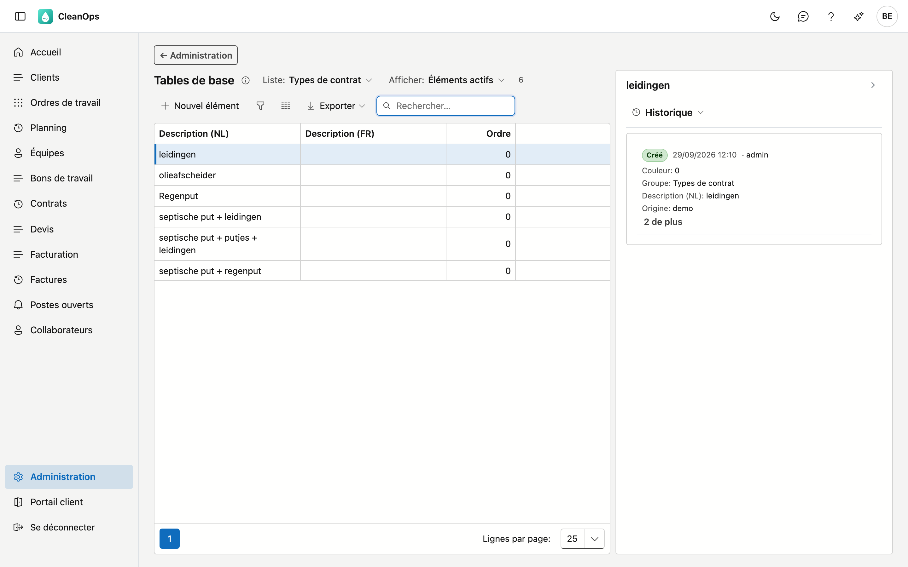
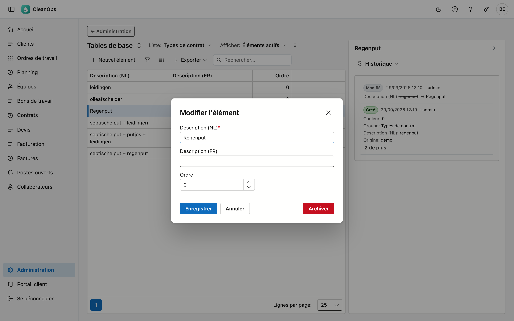
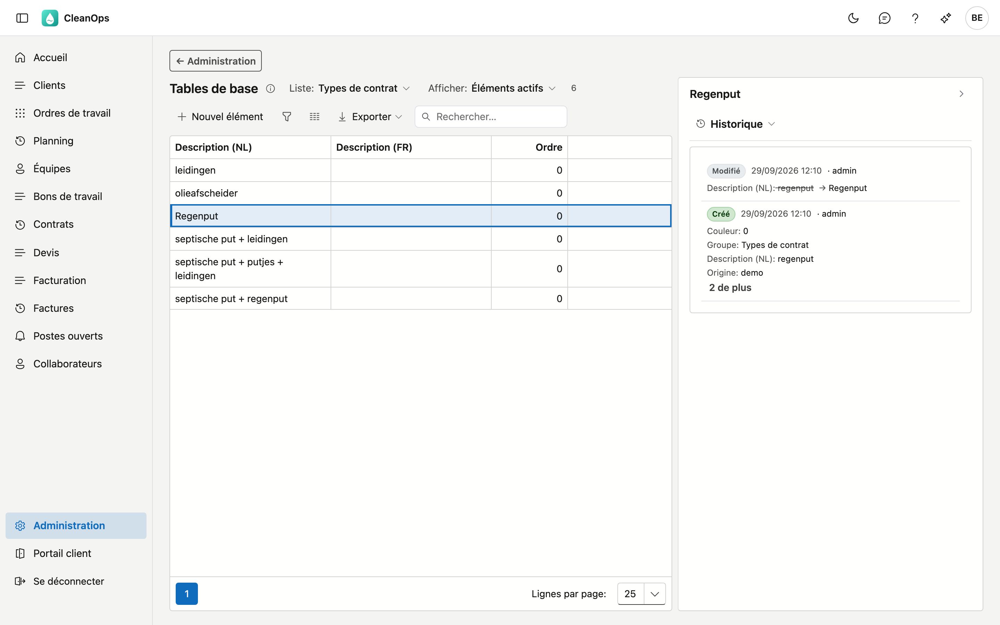

# Tables de base

Les listes de choix que votre entreprise gère elle-même. Elles alimentent les champs de sélection ailleurs
dans l'application : le type sur un contrat, les travaux sur un ordre de travail, la fonction d'un
collaborateur.

!!! note "Ce qui ne figure pas ici"
    Les pays, langues, codes postaux et données BCE proviennent de la plateforme et sont identiques pour tous
    les clients. Vous ne les gérez pas vous-même et ne les trouvez donc pas ici.

## Ouvrir l'écran

Cliquez sur **Administration** en bas du menu, puis sur la tuile **Tables de base**.

## Choisir une liste

En haut se trouve **Liste**. Vous y choisissez la liste de choix que vous consultez :

| Liste | Où vous la retrouvez |
|---|---|
| Types de contrat | le type sur un contrat périodique |
| Travaux | les travaux exécutés sur un ordre ou un bon de travail |
| Statut de planning | une classification libre ; aucun écran ne la propose aujourd'hui |
| Fonctions collaborateur | la fonction d'un collaborateur — reprise de votre application actuelle ; la fiche collaborateur ne l'affiche pas encore |
| Matériel & modes de paiement | matériel et mode de paiement sur un ordre de travail |
| Textes standard d'instructions | repris de votre application actuelle ; aucun écran ne la propose aujourd'hui |
| Types de véhicule | le type sur une fiche véhicule |

Si vous choisissez **Toutes les listes**, vous les voyez toutes ensemble. Une colonne s'ajoute alors pour
indiquer à quelle liste appartient une ligne.

Le champ de recherche est prêt dès l'ouverture et cherche dans toutes les colonnes.

## Ajouter ou modifier un élément

Cliquez sur **Nouvel élément**, ou double-cliquez sur une ligne existante. Dans les deux cas, vous obtenez la
même fenêtre.

!!! note "La création n'est possible qu'au sein d'une liste"
    Sur **Toutes les listes**, le bouton **Nouvel élément** n'apparaît pas : il n'y a alors pas de liste où
    créer l'élément. Choisissez d'abord une liste.

| Champ | Ce que vous complétez |
|---|---|
| **Description (NL)** / **(FR)** | ce que l'utilisateur voit dans les listes de choix, 100 caractères au maximum. Celle dans la langue principale de votre entreprise est obligatoire. |
| **Ordre** | 0 à 32767 — voir ci-dessous. |

Si vous travaillez en deux langues, complétez les deux descriptions ; sinon, le choix reste vide pour qui
utilise l'application dans l'autre langue.

### L'ordre

L'**ordre** ne compte que pour trois listes : **Travaux**, **Matériel & modes de paiement** et **Fonctions
collaborateur**. Le nombre le plus élevé y apparaît en premier, pour que ce que vous choisissez chaque jour
figure en tête. Les autres listes sont toujours **alphabétiques**, quel que soit l'ordre saisi — comme dans
votre application actuelle.

## Archiver ou rétablir un élément

Ouvrez la ligne et utilisez **Archiver**. L'élément disparaît des listes de choix, mais il continue d'exister.

!!! note "Ce qui porte déjà l'élément le garde"
    Un contrat, un ordre de travail ou un véhicule qui porte déjà l'élément archivé le garde ; les listes le
    montrent toujours. Archiver, c'est *ne plus choisir*, pas *retirer*.

Vous le voulez à nouveau ? En haut, réglez **Afficher** sur **Aussi les éléments archivés**, ouvrez l'élément
et cliquez sur **Rétablir**.

Un élément sans description s'appelle dans la liste *(sans nom, n° …)* : le numéro est celui de votre
application actuelle.

## Le journal

À droite de l'écran se trouve une bande **Journal**. Sélectionnez un élément dans la liste et ouvrez la bande :
le panneau montre le journal de cet élément.

L'onglet **Historique** indique qui a modifié l'élément et quand, et de quelle valeur vers quelle autre.

## Questions fréquentes

**Un nouveau type de contrat n'apparaît pas dans la liste de choix d'un contrat.**
Vérifiez que vous l'avez créé dans la bonne liste. Sur **Toutes les listes**, vous voyez pour chaque ligne à
quelle liste elle appartient.

**Je donne un ordre plus élevé à un type de contrat, mais il reste à sa place.**
C'est normal : les types de contrat sont toujours alphabétiques. L'ordre ne compte que pour Travaux, Matériel
& modes de paiement et Fonctions collaborateur.

**Chez nous, la colonne française est partout vide.**
Ce n'est pas une erreur : qui travaille uniquement en néerlandais n'a pas besoin de la remplir. Elle n'est
utilisée que lorsque quelqu'un ouvre l'application en français.
