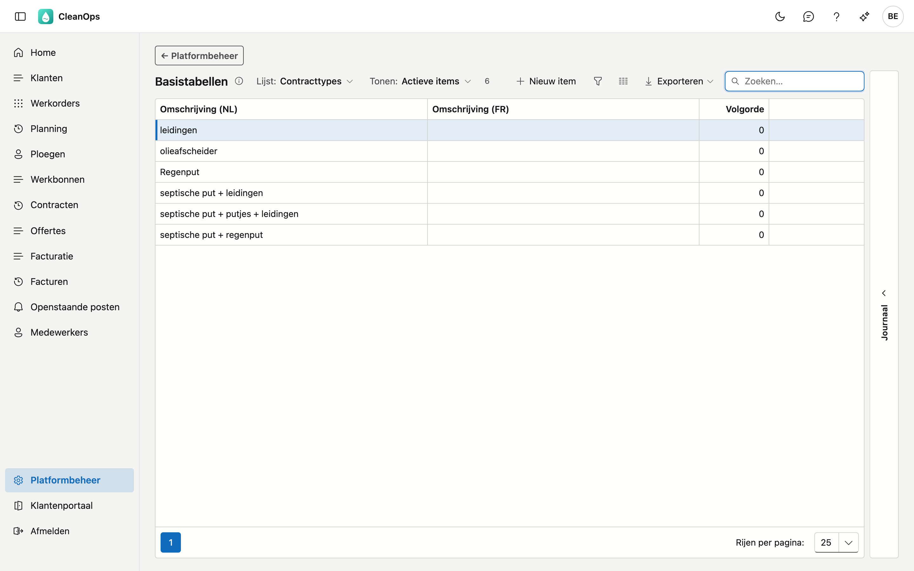
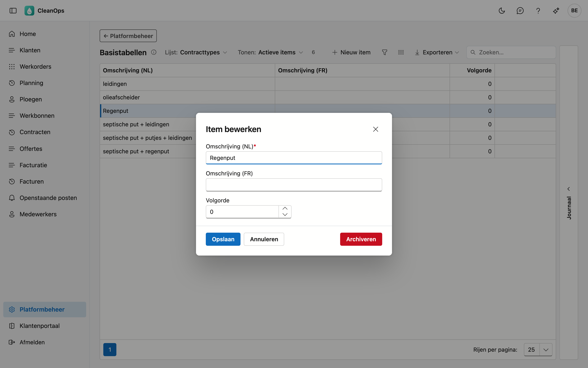
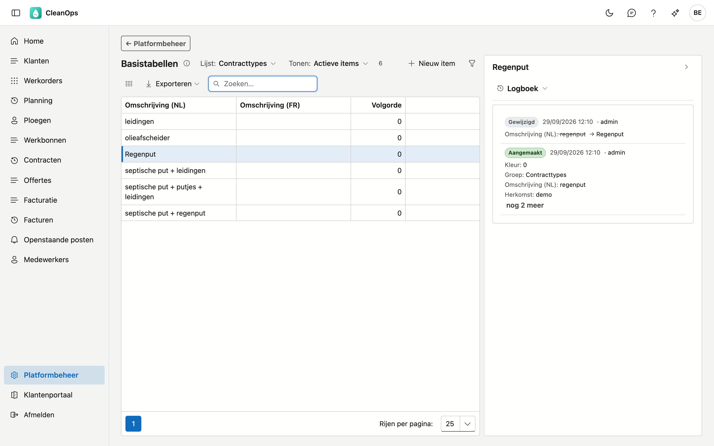

# Basistabellen

De keuzelijsten die uw bedrijf zelf beheert. Ze vullen de keuzevelden elders in de toepassing: het
contracttype op een contract, de werkzaamheden op een werkorder, de functie van een medewerker.

!!! note "Wat hier níét staat"
    Landen, talen, postcodes en KBO-gegevens komen van het platform en zijn voor alle klanten dezelfde. Die
    beheert u niet zelf, en u vindt ze hier dus niet terug.

## Het scherm openen

Klik onderaan in het menu op **Platformbeheer** en daarna op de tegel **Basistabellen**.

## Een lijst kiezen

Bovenaan staat **Lijst**. Daar kiest u welke keuzelijst u bekijkt:

| Lijst | Waar u ze terugvindt |
|---|---|
| Contracttypes | het type op een periodiek contract |
| Werkzaamheden | de uitgevoerde werken op een werkorder of werkbon |
| Planningstatus | een vrije classificatie; ze wordt vandaag op geen enkel scherm gekozen |
| Functies medewerker | de functie van een medewerker — overgenomen uit uw huidige toepassing; de medewerkersfiche toont ze nog niet |
| Materialen & betaalwijzen | materiaal en betaalwijze op een werkorder |
| Standaardteksten instructies | overgenomen uit uw huidige toepassing; ze wordt vandaag op geen enkel scherm gekozen |
| Soorten voertuig | de soort op een voertuigfiche |

Kiest u **Alle lijsten**, dan ziet u alle lijsten samen. Er komt dan een kolom bij die zegt bij welke lijst een
rij hoort.

Het zoekveld staat meteen klaar en zoekt in alle kolommen.

## Een item toevoegen of wijzigen

Klik op **Nieuw item**, of dubbelklik op een bestaande rij. In beide gevallen krijgt u hetzelfde venster.

!!! note "Aanmaken kan enkel binnen één lijst"
    Op de stand **Alle lijsten** blijft de knop **Nieuw item** weg: er is dan geen lijst om het item in te
    maken. Kies eerst een lijst.

| Veld | Wat u invult |
|---|---|
| **Omschrijving (NL)** / **(FR)** | wat de gebruiker in de keuzelijsten ziet, maximaal 100 tekens. Die in de hoofdtaal van uw bedrijf is verplicht. |
| **Volgorde** | 0 tot 32767 — zie hieronder. |

Werkt u tweetalig, vul dan beide omschrijvingen in; anders blijft de keuze leeg voor wie de toepassing in de
andere taal gebruikt.

### De volgorde

**Volgorde** telt enkel bij drie lijsten: **Werkzaamheden**, **Materialen & betaalwijzen** en **Functies
medewerker**. Daar komt het hoogste getal bovenaan, zodat wat u dagelijks kiest vooraan staat. De andere
lijsten staan altijd **alfabetisch**, ongeacht de volgorde die u invult — zoals in uw huidige toepassing.

## Een item archiveren of terughalen

Open de rij en gebruik **Archiveren**. Het item verdwijnt uit de keuzelijsten, maar blijft bestaan.

!!! note "Wat het item al draagt, houdt het"
    Een contract, werkorder of voertuig dat het gearchiveerde item al draagt, houdt het; de lijsten tonen het
    nog. Archiveren is *niet meer kiezen*, niet *weghalen*.

Wilt u het terug? Zet bovenaan **Tonen** op **Ook gearchiveerde items**, open het item en klik op
**Terughalen**.

Een item zonder omschrijving heet in de lijst *(zonder naam, nr …)*: het nummer is dat uit uw huidige
toepassing.

## Het journaal

Rechts op het scherm zit een strook **Journaal**. Klik een item in de lijst aan en open de strook: het paneel
toont het journaal van dat ene item.

Het tabblad **Logboek** toont wie het item wanneer gewijzigd heeft, en van welke waarde naar welke.

## Veelgestelde vragen

**Een nieuw contracttype verschijnt niet in de keuzelijst op een contract.**
Controleer of u het in de juiste lijst hebt aangemaakt. Op de stand **Alle lijsten** ziet u bij elke rij tot
welke lijst ze hoort.

**Ik geef een contracttype een hogere volgorde, maar het blijft op zijn plaats.**
Dat klopt: contracttypes staan altijd alfabetisch. De volgorde telt enkel bij Werkzaamheden, Materialen &
betaalwijzen en Functies medewerker.

**De Franse kolom is bij ons overal leeg.**
Dat is geen fout: wie enkel in het Nederlands werkt, hoeft die niet in te vullen. Ze wordt alleen gebruikt
wanneer iemand de toepassing in het Frans opent.
