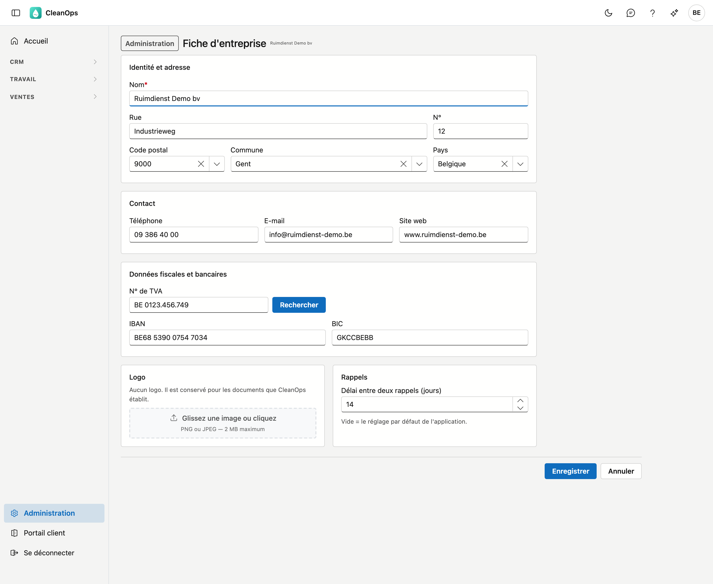
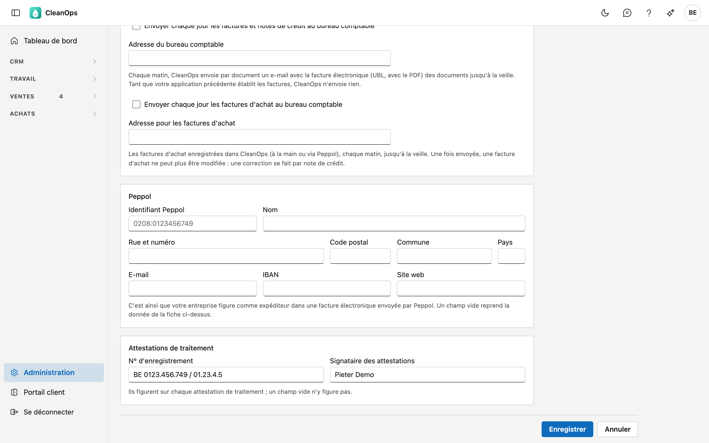

# Fiche d'entreprise

Les données de votre propre entreprise : nom, adresse, coordonnées, numéro de TVA et banque, votre logo, le
délai entre deux rappels, et comment votre entreprise figure dans une facture électronique via Peppol.

!!! note "Où CleanOps utilise ces données aujourd'hui"
    Le **délai entre deux rappels** détermine directement quels postes figurent dans la liste *Prochain rappel*
    des postes ouverts.

    Le nom, l'adresse, le contact, le numéro de TVA, l'IBAN, le BIC et le logo forment l'**en-tête** des factures,
    notes de crédit, devis, lettres de rappel et attestations que vous imprimez ou envoyez par e-mail dans CleanOps —
    voir [Factures](../facturen.fr.md#imprimer).

## Ouvrir l'écran

Cliquez sur **Administration** en bas du menu, puis sur la tuile **Fiche d'entreprise**.

## Identité et adresse

Le **nom** est obligatoire, 60 caractères au maximum. C'est le nom tel qu'il doit figurer sur vos propres
documents — votre en-tête. Il est indépendant du nom sous lequel ADM-Concept vous connaît.

En dessous : rue, numéro, code postal, commune et pays. Le code postal et la commune se complètent
mutuellement : si vous choisissez un code postal, la commune apparaît automatiquement. Le champ Commune propose
ensuite les localités de ce code postal — pour 9800 par exemple Deinze, Astene, Vinkt et les autres sections.
Vous pouvez aussi taper vous-même un nom. Le pays est une liste de choix.

## Contact

Téléphone, e-mail et site web. Lors de l'enregistrement, CleanOps vérifie qu'un numéro et une adresse e-mail
saisis sont valides. Les laisser vides est permis ; les remplir à moitié ne l'est pas.

## Données fiscales et bancaires

Le **numéro de TVA** doit figurer sur chaque facture. CleanOps vérifie le chiffre de contrôle d'un numéro belge
et l'enregistre dans son écriture fixe, par exemple `BE 0123.456.749`. À côté du champ se trouve
**Rechercher** : ce bouton consulte le numéro auprès de la Banque-Carrefour des Entreprises et complète votre
adresse avec ce qui y est enregistré.

!!! note "Rien ne revient ?"
    Le message *« Aucune donnée reçue pour ce numéro »* signifie deux choses à la fois : soit le numéro
    n'existe pas, soit le service est momentanément injoignable. L'écran ne peut pas distinguer les deux.
    Vérifiez le numéro, et complétez sinon à la main.

Votre nom n'est **pas** écrasé lors de la recherche.

L'**IBAN** est lui aussi vérifié sur son chiffre de contrôle et enregistré par groupes de quatre
(`BE68 5390 0754 7034`). À côté, le **BIC**. Le fichier SEPA de la [proposition de paiement](../betalingsvoorstel.md)
paie vos fournisseurs depuis cet IBAN.

## Logo

Glissez une image dans le cadre, ou cliquez dessus pour en choisir une. Les formats autorisés sont **PNG et
JPEG**, jusqu'à 2 MB. Pour remplacer un logo, choisissez simplement une nouvelle image. **Supprimer** l'enlève
définitivement.

## Rappels

Le **délai entre deux rappels** fixe le nombre minimum de jours entre deux relances pour un même poste : un poste
ne revient dans la liste *Prochain rappel* que lorsque son dernier rappel date d'au moins ce délai. Si vous
laissez le champ vide, 15 jours s'appliquent.

## Comptabilité

Avec **Envoyer chaque jour les factures et notes de crédit au bureau comptable**, chaque document part automatiquement
chez votre comptable. Chaque matin, CleanOps envoie par facture ou note de crédit jusqu'à la veille un e-mail à
l'**adresse du bureau comptable**, avec la facture électronique (UBL) et le PDF inclus.

| Champ | Ce que vous complétez |
|---|---|
| **Envoyer chaque jour les factures et notes de crédit au bureau comptable** | activé ou non. |
| **Adresse du bureau comptable** | l'adresse e-mail où votre comptable reçoit les factures, par exemple la boîte de son logiciel comptable. Obligatoire dès que la case est cochée. |
| **Envoyer chaque jour les factures d'achat au bureau comptable** | activé ou non. |
| **Adresse pour les factures d'achat** | l'adresse e-mail où votre comptable reçoit les factures d'achat. Obligatoire dès que la case est cochée ; peut être la même que ci-dessus. |

Avec la deuxième case, les factures et notes de crédit d'achat que vous enregistrez dans CleanOps (à la main ou via
Peppol) partent aussi chaque matin chez votre comptable, vers une adresse propre : beaucoup de logiciels comptables ont
une boîte distincte pour les achats. Une facture d'achat envoyée ne peut ensuite plus être modifiée — voir
[Factures d'achat](../aankoopfacturen.md#vers-la-comptabilite).

!!! note "Tant que votre application précédente établit les factures, CleanOps n'envoie rien"
    Sinon, votre comptable recevrait chaque facture deux fois. CleanOps ne commence qu'après le passage, et alors
    exactement aux documents que votre application précédente n'avait pas encore envoyés.

Si l'envoi d'un document échoue, il repart le lendemain matin.

## Peppol

Le bloc **Peppol** indique comment votre entreprise figure comme expéditeur dans une facture électronique, lorsque vous envoyez une
facture via Peppol (voir [Factures](../facturen.fr.md#envoyer)).

| Champ | Ce que vous remplissez |
|---|---|
| **Identifiant Peppol** | votre adresse sur le réseau Peppol, par exemple `0208:0123456749` — 0208 suivi de votre numéro d'entreprise. |
| **Nom** | le nom dans la facture électronique, par exemple votre nom légal. |
| **Rue et numéro**, **Code postal**, **Commune**, **Pays** | l'adresse dans la facture électronique. |
| **E-mail**, **IBAN**, **Site web** | votre contact et le compte sur lequel le client paie. |

Un champ vide reprend la donnée de la fiche ci-dessus. Si vous ne remplissez rien, votre entreprise figure dans la facture
électronique comme sur votre en-tête. Lors d'un passage, CleanOps reprend ces données de votre application précédente.

## Attestations de traitement

Le bloc **Attestations de traitement** porte deux données qui figurent sur chaque
[attestation de traitement](../attesten.fr.md) :

| Champ | Ce que vous indiquez |
|---|---|
| **N° d'enregistrement** | le numéro d'enregistrement qui figure dans l'en-tête de l'attestation, 50 caractères au plus. |
| **Signataire des attestations** | le nom en bas de l'attestation, après « Pour » et le nom de votre entreprise — par exemple *Jean Dupont, gérant*. 60 caractères au plus. |

Un champ vide ne figure pas sur l'attestation. Lors d'une migration, CleanOps ne les reprend pas : votre application
précédente les avait dans le modèle de l'attestation. Remplissez-les ici une fois.

## Enregistrer ou annuler

**Enregistrer** conserve vos modifications. **Annuler** les abandonne et vous ramène à l'administration.

## Questions fréquentes

**Mon numéro de TVA est refusé.**
Le chiffre de contrôle ne correspond pas : les deux derniers chiffres découlent du reste du numéro. Vérifiez le
numéro sur un document officiel, ou récupérez-le avec **Rechercher**.

**J'ai cliqué sur Rechercher et mon adresse a changé.**
C'est l'effet voulu : le bouton reprend l'adresse telle qu'elle figure à la Banque-Carrefour. Si elle est
incorrecte, corrigez-la à la main et enregistrez.

**J'ai modifié le délai, mais la liste Prochain rappel ne change pas.**
Les derniers rappels de vos postes datent alors tous d'avant l'ancien comme le nouveau délai. La différence ne
se voit que pour des postes relancés récemment.
