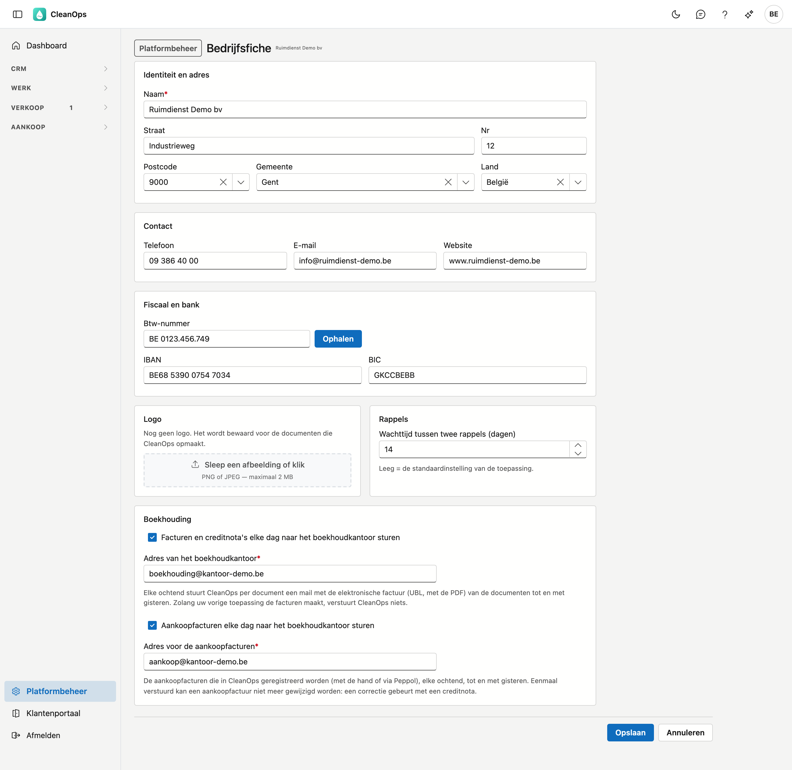

# Bedrijfsfiche

De gegevens van uw eigen bedrijf: naam, adres, contactgegevens, btw-nummer en bank, uw logo, en de wachttijd
tussen twee rappels.

!!! note "Waar CleanOps deze gegevens vandaag gebruikt"
    De **wachttijd tussen twee rappels** bepaalt meteen welke posten in de lijst *Volgende rappel* van de
    openstaande posten staan.

    Naam, adres, contact, btw-nummer, IBAN, BIC en logo vormen het **briefhoofd** van de facturen en creditnota's
    die u in CleanOps afdrukt — zie [Facturen](../facturen.md#afdrukken).

## Het scherm openen

Klik onderaan in het menu op **Platformbeheer** en daarna op de tegel **Bedrijfsfiche**.

## Identiteit en adres

De **naam** is verplicht, maximaal 60 tekens. Het is de naam zoals ze op uw eigen documenten hoort — uw
briefhoofd. Ze staat los van de naam waaronder ADM-Concept u kent.

Daaronder straat, nummer, postcode, gemeente en land. Postcode en gemeente vullen elkaar aan: kiest u een
postcode, dan verschijnt de gemeente vanzelf. Het veld Gemeente biedt daarna de plaatsen van die postcode aan —
voor 9800 bijvoorbeeld Deinze, Astene, Vinkt en de andere deelgemeenten. U mag ook zelf een naam typen. Het land
is een keuzelijst.

## Contact

Telefoon, e-mail en website. CleanOps controleert bij het opslaan of een ingevuld nummer en e-mailadres geldig
zijn. Leeg laten mag; half ingevuld niet.

## Fiscaal en bank

Het **btw-nummer** hoort op elke factuur. CleanOps controleert het controlecijfer van een Belgisch nummer en
bewaart het in de vaste schrijfwijze, bijvoorbeeld `BE 0123.456.749`. Naast het veld staat **Ophalen**: die knop
zoekt het nummer op in de Kruispuntbank van Ondernemingen en vult uw adres aan met wat daar geregistreerd staat.

!!! note "Komt er niets terug?"
    De melding *"Geen gegevens ontvangen voor dit nummer"* betekent twee dingen tegelijk: ofwel bestaat het
    nummer niet, ofwel is de dienst op dat moment onbereikbaar. Het scherm kan die twee niet uit elkaar
    houden. Controleer het nummer, en vul anders met de hand in.

Uw naam wordt bij het ophalen **niet** overschreven.

De **IBAN** wordt eveneens op zijn controlecijfer nagekeken en in groepjes van vier bewaard
(`BE68 5390 0754 7034`). Daarnaast de **BIC**.

## Logo

Sleep een afbeelding in het vak, of klik erop om er een te kiezen. Toegestaan zijn **PNG en JPEG**, tot 2 MB.
Om een logo te vervangen, kiest u gewoon een nieuwe afbeelding. Met **Verwijderen** haalt u het definitief weg.

## Rappels

**Wachttijd tussen twee rappels** bepaalt hoeveel dagen er minstens tussen twee herinneringen voor dezelfde post
zitten: een post komt pas opnieuw in de lijst *Volgende rappel* wanneer zijn laatste rappel zo lang geleden is.
Laat u het veld leeg, dan geldt 15 dagen.

## Boekhouding

Met **Facturen en creditnota's elke dag naar het boekhoudkantoor sturen** gaat elk document automatisch naar uw
boekhouder. Elke ochtend stuurt CleanOps per factuur of creditnota tot en met gisteren één mail naar het **adres van
het boekhoudkantoor**, met de elektronische factuur (UBL) en de PDF erin.

| Veld | Wat u invult |
|---|---|
| **Facturen en creditnota's elke dag naar het boekhoudkantoor sturen** | aan of uit. |
| **Adres van het boekhoudkantoor** | het e-mailadres waar uw boekhouder de facturen ontvangt, bijvoorbeeld de inbox van zijn boekhoudpakket. Verplicht zodra het vinkje aan staat. |

!!! note "Zolang uw vorige toepassing de facturen maakt, verstuurt CleanOps niets"
    Anders kreeg uw boekhouder elke factuur twee keer. CleanOps begint pas na de overstap, en dan precies bij de
    documenten die uw vorige toepassing nog niet verstuurde.

Lukt het versturen van een document niet, dan gaat het de volgende ochtend opnieuw mee.

## Bewaren of annuleren

**Opslaan** bewaart uw wijzigingen. **Annuleren** gooit ze weg en brengt u terug naar het platformbeheer.

## Veelgestelde vragen

**Mijn btw-nummer wordt geweigerd.**
Het controlecijfer klopt niet: de laatste twee cijfers volgen uit de rest van het nummer. Controleer het nummer
op een officieel document, of haal het op met **Ophalen**.

**Ik heb op Ophalen geklikt en mijn adres is gewijzigd.**
Dat is de bedoeling: de knop neemt het adres over zoals het in de Kruispuntbank staat. Klopt dat niet, pas het
dan met de hand aan en sla op.

**Ik heb de wachttijd aangepast, maar de lijst Volgende rappel verandert niet.**
Dan liggen de laatste rappels van uw posten allemaal verder terug dan de oude én de nieuwe wachttijd. Het verschil
ziet u pas bij posten die recent herinnerd werden.
