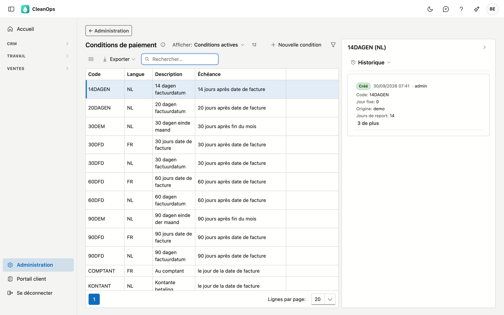
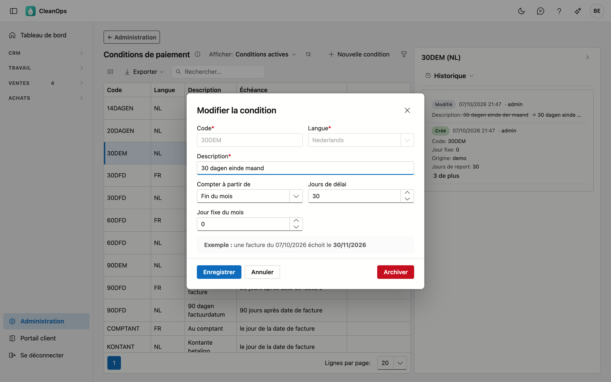
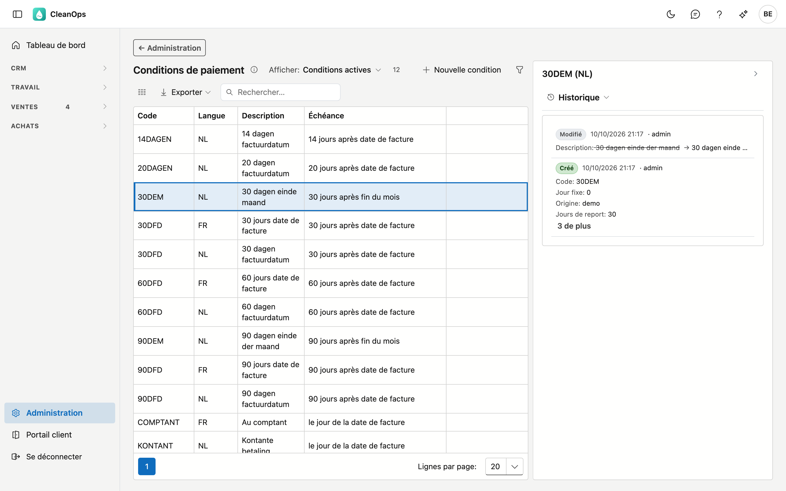

# Conditions de paiement

Une condition de paiement détermine **quand une facture échoit**. Vous en choisissez une sur une fiche
client ; elle est ensuite reprise sur les factures de ce client.

## Ouvrir l'écran

Cliquez sur **Administration** en bas du menu, puis sur la tuile **Conditions de paiement**.

## La liste

| Colonne | Ce que c'est |
|---|---|
| Code | la clé courte qui figure sur la fiche client, par exemple `30DFD` |
| Langue | la langue dans laquelle la description est rédigée |
| Description | le texte que l'utilisateur lit |
| Échéance | la règle en langage courant, par exemple *30 jours après date de facture* |

Le champ de recherche est prêt dès l'ouverture et cherche dans toutes les colonnes, y compris l'échéance :
*fin du mois* trouve les conditions qui comptent à partir de la fin du mois.

!!! note "Un même code peut figurer deux fois dans la liste"
    Ce n'est pas une erreur. Une condition existe **par langue** : `30DFD` y figure une fois avec une
    description néerlandaise et une fois avec une description française. Le **calcul** est identique dans les
    deux cas — seul le texte diffère.

    La colonne **Langue** indique laquelle est laquelle. Si vous choisissez la condition sur une fiche
    client, CleanOps prend automatiquement la version dans la langue de ce client.

## Comment l'échéance est calculée

Trois étapes, dans cet ordre :

1. **Compter à partir de** — partez de la *date de facture* elle-même, ou de la *fin du mois* dans lequel la
   facture tombe.
2. **Jours de délai** — ajoutez ce nombre de jours.
3. **Jour fixe du mois** — reportez ensuite à ce jour. S'il est déjà passé, on passe au mois suivant. Si la
   valeur est **0**, rien ne se produit.

!!! tip "La fenêtre calcule un exemple pour vous"
    Pendant que vous complétez les champs, vous voyez en bas quand *une facture d'aujourd'hui* échoirait.
    Cela utilise le même calcul que la facturation elle-même : ce qui s'affiche là est donc ce qui figurera
    sur la facture.

## Ajouter ou modifier une condition

Cliquez sur **Nouvelle condition**, ou double-cliquez sur une ligne existante.

| Champ | Ce que vous complétez |
|---|---|
| **Code** *(obligatoire)* | 10 caractères au maximum — c'est ce qui tient sur une fiche client —, enregistré en majuscules. Figé dès que la condition existe. Un code qui ne diffère d'un code existant dans la même langue que par les majuscules est refusé. |
| **Langue** *(obligatoire)* | néerlandais ou français. Également figée : le code et la langue forment ensemble la clé. |
| **Description** *(obligatoire)* | 50 caractères au maximum. |
| **Compter à partir de** | la date de facture, ou la fin du mois. |
| **Jours de délai** | 0 ou plus. À 0, la facture échoit au point de départ même, comme pour un paiement comptant. |
| **Jour fixe du mois** | 0 à 31 ; 0 = pas de jour fixe. |

Le code et la langue sont figés parce que des clients et des factures renvoient à ce code ; s'il changeait, ils
pointeraient vers quelque chose qui n'existe plus. Les conditions que vous créez ici portent la mention
**propre**.

## Archiver ou rétablir une condition

Ouvrez la ligne et utilisez **Archiver**. La condition disparaît de la liste de choix pour les **nouveaux**
clients, mais elle continue d'exister.

!!! note "Les clients qui la portent déjà ne remarquent rien"
    Un client qui a déjà la condition archivée la garde : sa fiche la montre toujours, et ses factures en
    reçoivent normalement leur échéance. Archiver, c'est *ne plus choisir*, pas *retirer*.

Vous la voulez à nouveau ? En haut de la liste, réglez **Afficher** sur **Aussi les conditions archivées**,
ouvrez la condition et cliquez sur **Rétablir**.

## Le journal

À droite de l'écran se trouve une bande **Journal**. Sélectionnez une condition dans la liste et ouvrez la
bande : le panneau montre le journal de cette condition, avec le code et la langue comme titre.

L'onglet **Historique** indique qui a modifié la condition et quand, et de quelle valeur vers quelle autre —
utile lorsqu'une échéance tombe autrement que prévu.

## Questions fréquentes

**Pourquoi `30DFD` figure-t-il deux fois dans la liste ?**
Une fois par langue. La description diffère, le calcul non. Voyez la colonne **Langue**.

**Une facture échoit à une autre date que celle que j'attendais.**
Ouvrez la condition et regardez l'exemple en bas de la fenêtre : il applique la même règle que la
facturation. Vérifiez aussi dans le journal si la condition a été modifiée entre-temps.

**Que signifie un jour fixe à 0 ?**
Qu'aucun jour fixe n'est utilisé. L'échéance est alors simplement le point de départ plus les jours de délai.
