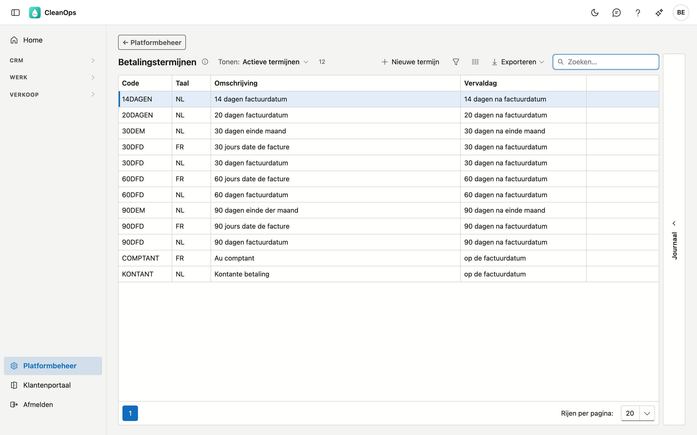
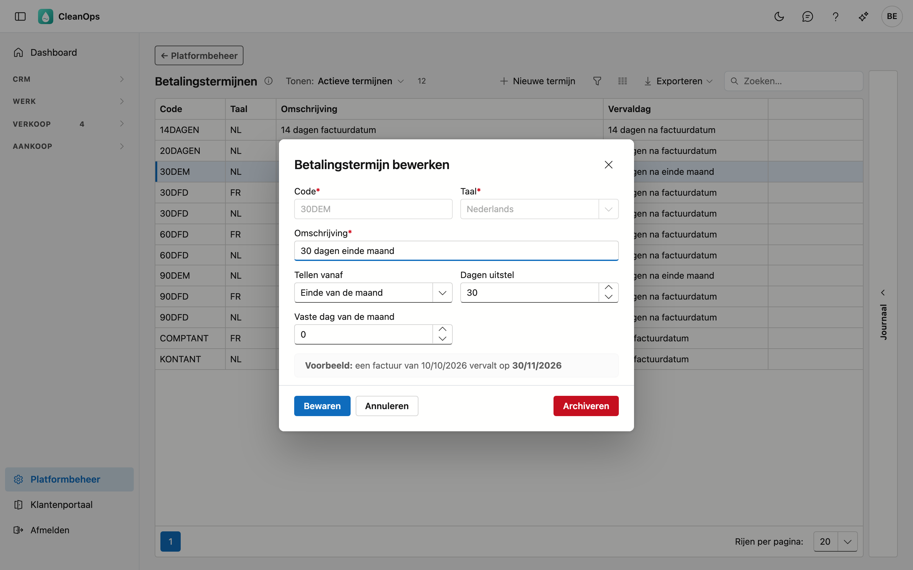
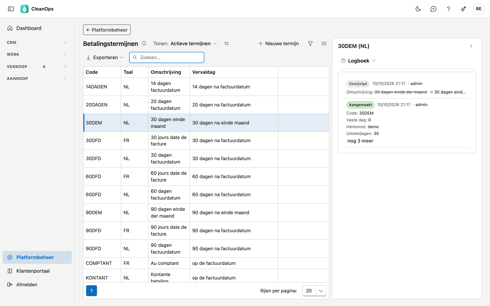

# Betalingstermijnen

Een betalingstermijn bepaalt **wanneer een factuur vervalt**. U kiest er één op een klantfiche; hij komt
daarna mee op de facturen van die klant.

## Het scherm openen

Klik onderaan in het menu op **Platformbeheer** en daarna op de tegel **Betalingstermijnen**.

## De lijst

| Kolom | Wat het is |
|---|---|
| Code | de korte sleutel die op de klantfiche staat, bijvoorbeeld `30DFD` |
| Taal | in welke taal de omschrijving staat |
| Omschrijving | de tekst die de gebruiker leest |
| Vervaldag | de regel in gewone taal, bijvoorbeeld *30 dagen na factuurdatum* |

Het zoekveld staat meteen klaar en zoekt in alle kolommen, ook in de vervaldag: *einde maand* vindt de
termijnen die vanaf het einde van de maand tellen.

!!! note "Dezelfde code kan twee keer in de lijst staan"
    Dat is geen fout. Een termijn bestaat **per taal**: `30DFD` staat er één keer met een Nederlandse
    omschrijving en één keer met een Franse. De **berekening** is in beide gevallen dezelfde — alleen de
    tekst verschilt.

    De kolom **Taal** zegt welke welke is. Kiest u de termijn op een klantfiche, dan neemt CleanOps
    automatisch de versie in de taal van die klant.

## Hoe de vervaldag berekend wordt

Drie stappen, in deze volgorde:

1. **Tellen vanaf** — begin bij de *factuurdatum* zelf, of bij het *einde van de maand* waarin de factuur
   valt.
2. **Dagen uitstel** — tel dat aantal dagen erbij.
3. **Vaste dag van de maand** — schuif daarna door naar die dag. Is die dag al voorbij, dan gaat het naar de
   volgende maand. Staat hier **0**, dan gebeurt er niets.

!!! tip "Het venster rekent een voorbeeld voor u uit"
    Terwijl u de velden invult, ziet u onderaan staan wanneer *een factuur van vandaag* zou vervallen. Dat
    gebruikt dezelfde berekening als de facturatie zelf, dus wat daar staat is wat er straks op de factuur
    komt.

## Een termijn toevoegen of wijzigen

Klik op **Nieuwe termijn**, of dubbelklik op een bestaande rij.

| Veld | Wat u invult |
|---|---|
| **Code** *(verplicht)* | maximaal 10 tekens — zoveel past er op een klantfiche —, in hoofdletters bewaard. Ligt vast zodra de termijn bestaat. Een code die enkel in hoofdletters verschilt van een bestaande in dezelfde taal, wordt geweigerd. |
| **Taal** *(verplicht)* | Nederlands of Frans. Ligt ook vast: code en taal vormen samen de sleutel. |
| **Omschrijving** *(verplicht)* | maximaal 50 tekens. |
| **Tellen vanaf** | de factuurdatum, of het einde van de maand. |
| **Dagen uitstel** | 0 of meer. Bij 0 vervalt de factuur op het startpunt zelf, zoals bij contante betaling. |
| **Vaste dag van de maand** | 0 tot 31; 0 = geen vaste dag. |

Code en taal liggen vast omdat klanten en facturen naar die code verwijzen; zou ze veranderen, dan wijzen ze
naar iets dat er niet meer is. Termijnen die u hier zelf aanmaakt, dragen het merkteken **eigen**.

## Een termijn archiveren of terughalen

Open de rij en gebruik **Archiveren**. De termijn verdwijnt uit de keuzelijst voor **nieuwe** klanten, maar hij
blijft bestaan.

!!! note "Klanten die hem al dragen, merken niets"
    Een klant die de gearchiveerde termijn al heeft, houdt hem: zijn fiche toont hem nog, en zijn facturen
    krijgen er gewoon hun vervaldag mee. Archiveren is *niet meer kiezen*, niet *weghalen*.

Wilt u hem terug? Zet bovenaan de lijst **Tonen** op **Ook gearchiveerde termijnen**, open de termijn en klik
op **Terughalen**.

## Het journaal

Rechts op het scherm zit een strook **Journaal**. Klik een termijn in de lijst aan en open de strook: het
paneel toont het journaal van die ene termijn, met de code en de taal als titel.

Het tabblad **Logboek** toont wie de termijn wanneer gewijzigd heeft, en van welke waarde naar welke — handig
wanneer een vervaldag anders uitvalt dan u verwachtte.

## Veelgestelde vragen

**Waarom staat `30DFD` twee keer in de lijst?**
Eén keer per taal. De omschrijving verschilt, de berekening niet. Zie de kolom **Taal**.

**Een factuur vervalt op een andere datum dan ik verwachtte.**
Open de termijn en kijk naar het voorbeeld onderaan het venster: dat rekent met dezelfde regel als de
facturatie. Kijk ook in het journaal of de termijn tussentijds gewijzigd is.

**Wat betekent een vaste dag van 0?**
Dat er geen vaste dag gebruikt wordt. De vervaldag is dan gewoon het startpunt plus de dagen uitstel.
