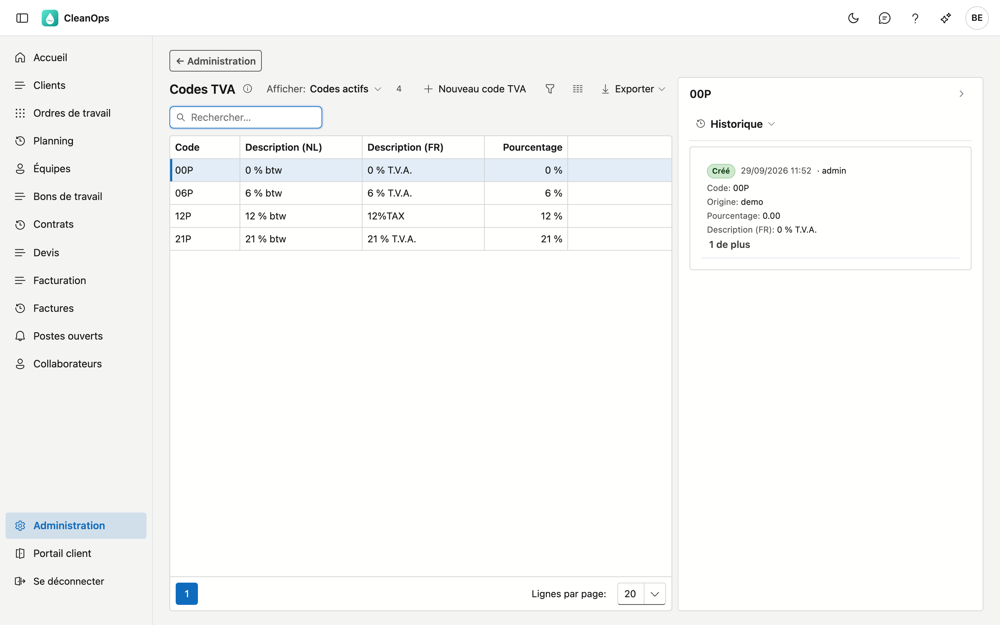
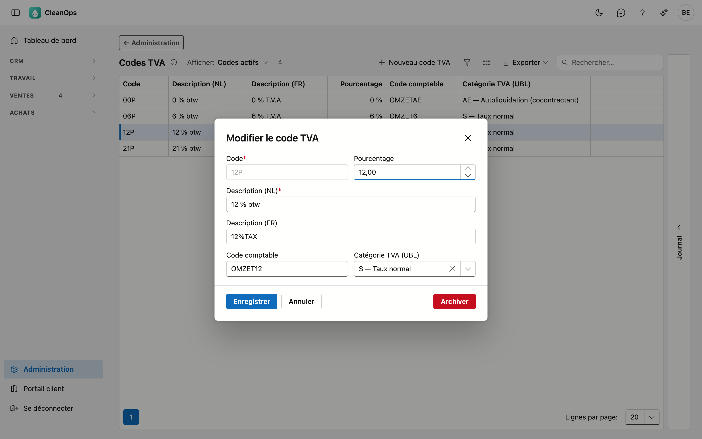
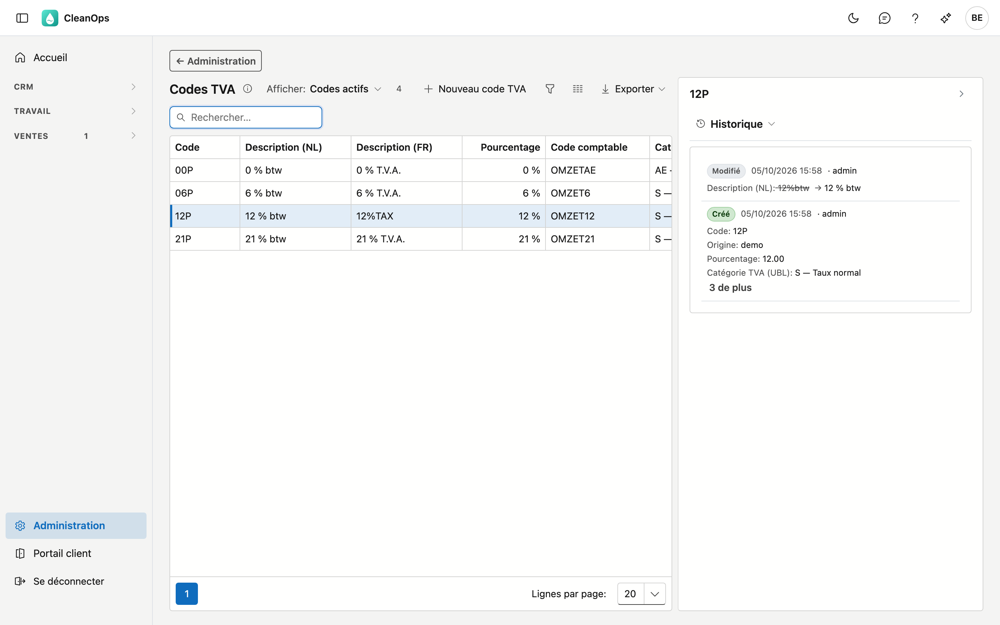

# Codes TVA

Les taux de TVA que vous choisissez sur un devis, un ordre de travail ou une ligne de facture. Chaque code
porte un pourcentage ; ce pourcentage détermine le calcul de la TVA.

## Ouvrir l'écran

Cliquez sur **Administration** en bas du menu, puis sur la tuile **Codes TVA**.

## La liste

| Colonne | Ce que c'est |
|---|---|
| Code | la clé courte, par exemple `21P` |
| Description (NL) | ce que vous voyez dans les listes de choix |
| Description (FR) | idem pour qui utilise l'application en français |
| Pourcentage | le taux servant au calcul |
| Code comptable | le code que votre logiciel comptable lit par ligne de facture, par exemple `OMZET21` |
| Catégorie TVA (UBL) | le type de TVA pour la facture électronique : taux normal, autoliquidation, exonéré … |

!!! note "Sur vos documents figure le code, pas la description"
    Une facture et un devis affichent le **code** avec le **pourcentage**. La description est destinée à vous,
    pour choisir le bon code — elle n'apparaît pas chez le client.

## Ajouter ou modifier un code TVA

Cliquez sur **Nouveau code TVA**, ou double-cliquez sur une ligne existante.

| Champ | Ce que vous complétez |
|---|---|
| **Code** *(obligatoire)* | 5 caractères au maximum, par exemple `21P`. Figé dès que le code existe. Un code qui ne diffère d'un code existant que par les majuscules (`21p` à côté de `21P`) est refusé. |
| **Pourcentage** | de 0 à 99,99. |
| **Description (NL)** / **(FR)** | 30 caractères au maximum. Celle dans la langue principale de votre entreprise est obligatoire. |
| **Code comptable** | 20 caractères au maximum. Accompagne chaque ligne de facture vers votre bureau comptable, qui l'utilise pour lier le compte de chiffre d'affaires. Demandez le bon code à votre comptable. |
| **Catégorie TVA (UBL)** | le type de TVA tel que le demande la facture électronique. *Taux normal* va avec un pourcentage supérieur à 0 ; les autres (autoliquidation, exonéré, intracommunautaire …) avec 0 %. |

!!! warning "Un code par taux"
    Un taux est une catégorie de TVA avec un pourcentage, par exemple *Taux normal* 21 %. Un deuxième code avec le même
    taux est refusé, même si le code existant est archivé : CleanOps indique quel code porte déjà ce taux. Si vous
    voulez un autre code comptable ou une autre description pour ce taux, modifiez ce code existant.

    La raison : CleanOps calcule la TVA par code, la facture électronique par taux. Si deux codes de même taux
    figurent sur une même facture, les deux calculs peuvent différer d'un cent.

!!! note "Pourquoi la catégorie ne découle pas du pourcentage"
    Un code TVA à 0 % peut être une autoliquidation (cocontractant), une exonération ou une livraison intracommunautaire. Pour
    votre client et votre comptable, la différence est grande : vous choisissez donc la catégorie vous-même.

!!! warning "Un pourcentage modifié ne touche pas les factures existantes"
    Chaque facture conserve le pourcentage avec lequel elle a été établie. Si vous augmentez un taux ici,
    rien ne change à ce qui a déjà été facturé — c'est voulu, car une facture délivrée ne peut pas changer de
    montant avec effet rétroactif.

    Les nouvelles factures utilisent bien le pourcentage modifié.

La **description française** peut rester vide si votre entreprise travaille uniquement en néerlandais.

## Le journal

À droite de l'écran se trouve une bande **Journal**. Sélectionnez un code dans la liste et ouvrez la bande : le
panneau montre le journal de ce code.

L'onglet **Historique** indique qui a modifié le code et quand, et de quelle valeur vers quelle autre. Pour la
TVA, c'est particulièrement utile : un pourcentage modifié explique pourquoi deux factures d'un même client
portent un montant différent.

## Archiver ou rétablir un code TVA

Ouvrez la ligne et utilisez **Archiver**. Le code disparaît des listes de choix, mais il continue d'exister.

!!! note "Ce qui porte déjà le code ne remarque rien"
    Les ordres de travail, devis et factures qui portent déjà le code archivé le gardent, et la facturation
    continue à calculer avec lui. Archiver, c'est *ne plus choisir*, pas *retirer*. C'est pourquoi un code archivé
    garde aussi son taux : vous ne créez pas de nouveau code avec la même catégorie et le même pourcentage.

Vous le voulez à nouveau ? En haut de la liste, réglez **Afficher** sur **Aussi les codes archivés**, ouvrez le
code et cliquez sur **Rétablir**.

## Questions fréquentes

**J'ai besoin d'un nouveau taux, par exemple pour des travaux sur des habitations.**
Créez un nouveau code avec le bon pourcentage. Ne modifiez pas un code existant, sinon vous perdez la
distinction avec ce qui a été facturé auparavant.

**Je veux un deuxième code à 21 %, avec un autre code comptable.**
Ce n'est pas possible : chaque taux a un seul code. Modifiez le code comptable du code existant, ou demandez à votre
comptable comment répartir le chiffre d'affaires autrement.

**Deux factures d'un même client portent un montant de TVA différent pour le même travail.**
Vérifiez dans le journal si le pourcentage de ce code a été modifié entre-temps. Chaque facture calcule avec
le pourcentage du moment où elle a été établie.

**Chez nous, la colonne française est partout vide.**
Ce n'est pas une erreur : qui travaille uniquement en néerlandais n'a pas besoin de la remplir.
