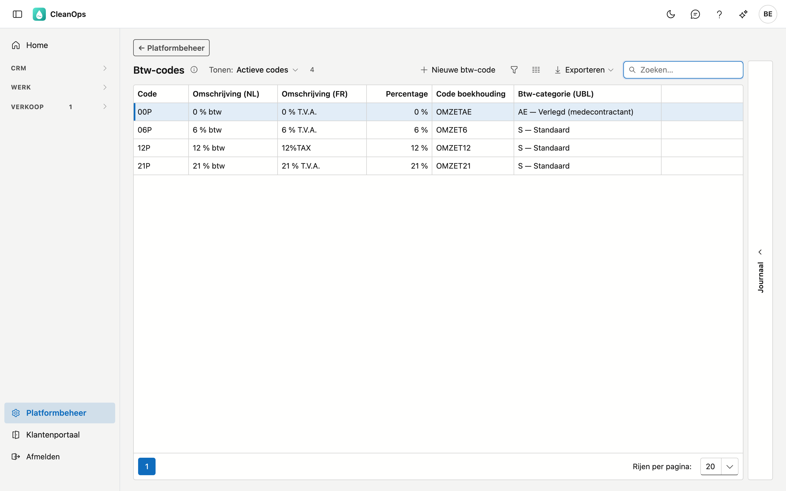
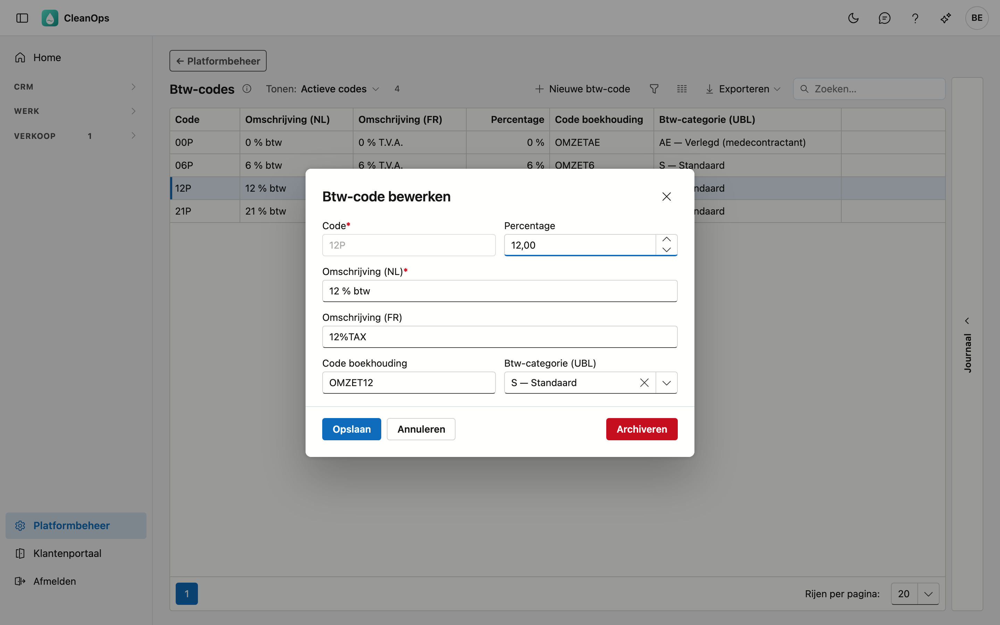
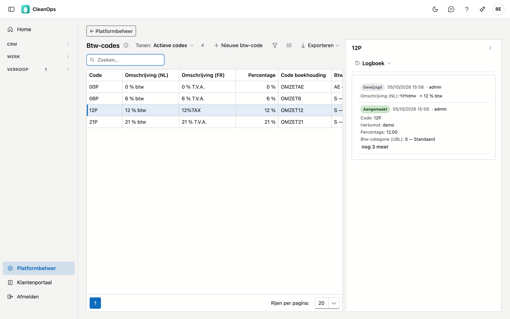

# Btw-codes

De btw-tarieven die u kiest op een offerte, een werkorder of een factuurlijn. Elke code draagt een
percentage; dat percentage bepaalt de btw-berekening.

## Het scherm openen

Klik onderaan in het menu op **Platformbeheer** en daarna op de tegel **Btw-codes**.

## De lijst

| Kolom | Wat het is |
|---|---|
| Code | de korte sleutel, bijvoorbeeld `21P` |
| Omschrijving (NL) | wat u in de keuzelijsten ziet |
| Omschrijving (FR) | idem voor wie de toepassing in het Frans gebruikt |
| Percentage | het tarief waarmee gerekend wordt |
| Code boekhouding | de code die uw boekhoudpakket per factuurlijn leest, bijvoorbeeld `OMZET21` |
| Btw-categorie (UBL) | de soort btw voor de elektronische factuur: standaard, verlegd, vrijgesteld … |

!!! note "Op uw documenten staat de code, niet de omschrijving"
    Een factuur en een offerte tonen de **code** met het **percentage**. De omschrijving is er voor u, om de
    juiste code te kunnen kiezen — ze verschijnt niet bij de klant.

## Een btw-code toevoegen of wijzigen

Klik op **Nieuwe btw-code**, of dubbelklik op een bestaande rij.

| Veld | Wat u invult |
|---|---|
| **Code** *(verplicht)* | maximaal 5 tekens, bijvoorbeeld `21P`. Ligt vast zodra de code bestaat. Een code die enkel in hoofdletters verschilt van een bestaande (`21p` naast `21P`), wordt geweigerd. |
| **Percentage** | van 0 tot 99,99. |
| **Omschrijving (NL)** / **(FR)** | maximaal 30 tekens. Die in de hoofdtaal van uw bedrijf is verplicht. |
| **Code boekhouding** | maximaal 20 tekens. Gaat met elke factuurlijn mee naar uw boekhoudkantoor, dat er de omzetrekening mee koppelt. Vraag de juiste code aan uw boekhouder. |
| **Btw-categorie (UBL)** | de soort btw zoals de elektronische factuur ze vraagt. *Standaard* hoort bij een percentage boven 0; de andere (verlegd, vrijgesteld, intracommunautair …) bij 0 %. |

!!! note "Waarom de categorie niet uit het percentage volgt"
    Een btw-code van 0 % kan verlegde btw (medecontractant), een vrijstelling of een intracommunautaire levering zijn. Voor
    uw klant en uw boekhouder is dat een groot verschil, dus kiest u de categorie zelf.

!!! warning "Een gewijzigd percentage raakt bestaande facturen niet"
    Elke factuur bewaart het percentage waarmee ze opgemaakt is. Verhoogt u hier een tarief, dan verandert er
    niets aan wat al gefactureerd is — dat is de bedoeling, want een uitgereikte factuur mag niet met
    terugwerkende kracht van bedrag veranderen.

    Nieuwe facturen rekenen wél met het gewijzigde percentage.

De **Franse omschrijving** mag u leeg laten als uw bedrijf enkel in het Nederlands werkt.

## Het journaal

Rechts op het scherm zit een strook **Journaal**. Klik een code in de lijst aan en open de strook: het paneel
toont het journaal van die ene code.

Het tabblad **Logboek** toont wie de code wanneer gewijzigd heeft, en van welke waarde naar welke. Bij btw is
dat bijzonder nuttig: een gewijzigd percentage verklaart waarom twee facturen van dezelfde klant een ander
bedrag dragen.

## Een btw-code archiveren of terughalen

Open de rij en gebruik **Archiveren**. De code verdwijnt uit de keuzelijsten, maar blijft bestaan.

!!! note "Wat de code al draagt, merkt niets"
    Werkorders, offertes en facturen die de gearchiveerde code al dragen, houden hem, en de facturatie rekent er
    gewoon mee. Archiveren is *niet meer kiezen*, niet *weghalen*.

Wilt u hem terug? Zet bovenaan de lijst **Tonen** op **Ook gearchiveerde codes**, open de code en klik op
**Terughalen**.

## Veelgestelde vragen

**Ik heb een nieuw tarief nodig, bijvoorbeeld voor werken aan woningen.**
Maak een nieuwe code aan met het juiste percentage. Wijzig geen bestaande code, anders verliest u het
onderscheid met wat er eerder gefactureerd is.

**Twee facturen van dezelfde klant hebben een ander btw-bedrag bij hetzelfde werk.**
Kijk in het journaal of het percentage van die code tussentijds gewijzigd is. Elke factuur rekent met het
percentage van het moment waarop ze opgemaakt werd.

**De Franse kolom is bij ons overal leeg.**
Dat is geen fout: wie enkel in het Nederlands werkt, hoeft die niet in te vullen.
