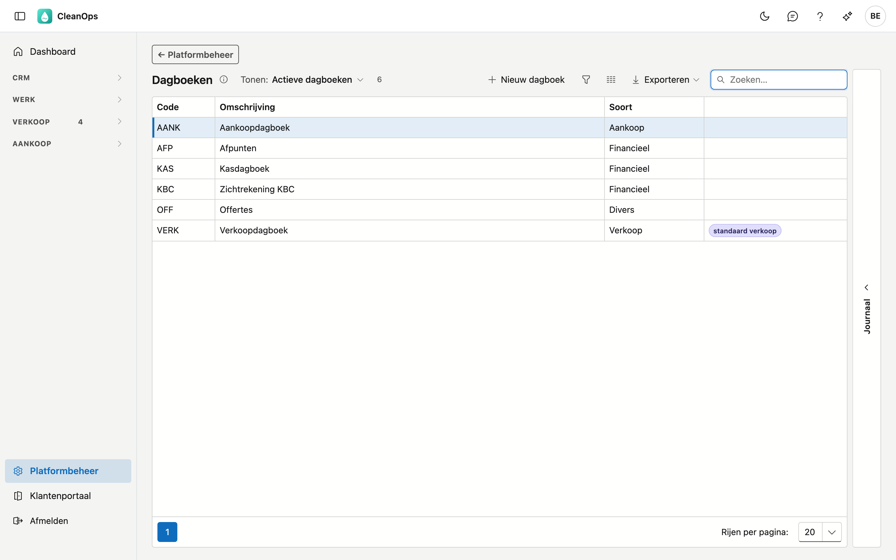
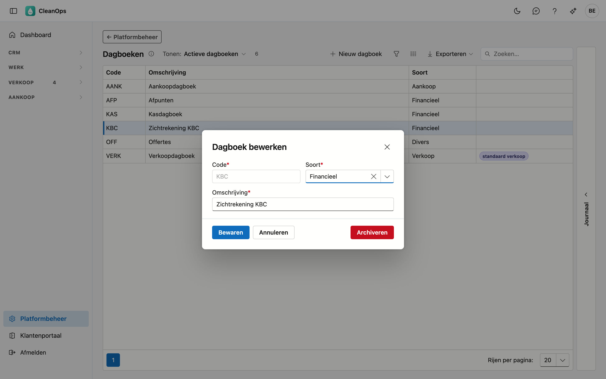

# Dagboeken

De dagboeken waarop u factureert en betalingen boekt: het verkoopdagboek van de facturen, en de financiële dagboeken
van uw bankrekeningen en kas.

## Het scherm openen

Klik onderaan in het menu op **Platformbeheer** en daarna op de tegel **Dagboeken**.

## De lijst

| Kolom | Wat het is |
|---|---|
| Code | de korte sleutel die op facturen en betalingen staat, bijvoorbeeld `VERK` of `KBC` |
| Omschrijving | waarvoor het dagboek dient, bijvoorbeeld *Zichtrekening KBC* |
| Soort | Verkoop, Aankoop, Financieel of Divers |

Het dagboek van de facturatie draagt het label **standaard verkoop**. Een dagboek dat u zelf in CleanOps aangemaakt
hebt, draagt het label **eigen**; de andere komen uit uw vorige toepassing.

## De soort

| Soort | Waarvoor |
|---|---|
| **Financieel** | uw bankrekeningen en de kas — én de dagboeken waarmee u vereffent zonder geld te ontvangen, zoals een creditnota tegen een factuur afpunten of een onbetaalde factuur afboeken. Een betaling boekt u altijd op een financieel dagboek. |
| **Verkoop** | uw facturen en creditnota's |
| **Aankoop** | de facturen van uw leveranciers |
| **Divers** | al de rest |

## Een dagboek toevoegen of wijzigen

Klik op **Nieuw dagboek**, of dubbelklik op een bestaande rij.

| Veld | Wat u invult |
|---|---|
| **Code** *(verplicht)* | maximaal 6 tekens, bijvoorbeeld `BELF`. Ligt vast zodra het dagboek bestaat. Een code die enkel in hoofdletters verschilt van een bestaande (`kbc` naast `KBC`), wordt geweigerd — ook als die bestaande gearchiveerd is. |
| **Soort** *(verplicht)* | zie hierboven. |
| **Omschrijving** *(verplicht)* | maximaal 30 tekens. |
| **Standaard verkoopdagboek** | enkel bij een verkoopdagboek: het dagboek waarop gefactureerd wordt. |

!!! note "Er is maar één standaard verkoopdagboek"
    Vinkt u het bij een ander verkoopdagboek aan, dan gaat het bij het vorige vanzelf uit.

!!! warning "Wisselen kan enkel vóór de eerste factuur van een boekjaar"
    Draagt het lopende boekjaar al facturen of creditnota's in een verkoopdagboek, dan kan een ander dagboek de standaard niet
    worden: CleanOps zegt in welk dagboek ze staan en hoeveel het er zijn. Een tweede dagboek zou in hetzelfde boekjaar opnieuw
    bij het eerste factuurnummer beginnen, met dezelfde gestructureerde mededeling. Wissel dus bij het begin van een boekjaar.
    Om dezelfde reden boekt CleanOps geen factuur in een boekjaar dat al facturen in een ander verkoopdagboek draagt.

## Het journaal

Rechts op het scherm zit een strook **Journaal**. Klik een dagboek in de lijst aan en open de strook: het paneel toont
wie het wanneer aangemaakt, gewijzigd, gearchiveerd of teruggehaald heeft.

## Een dagboek archiveren of terughalen

Open de rij en gebruik **Archiveren**. Het dagboek verdwijnt uit de keuzelijsten, maar blijft bestaan: facturen en
betalingen die het al dragen, houden het.

Het standaard verkoopdagboek kan niet gearchiveerd worden. Zet het vinkje eerst op een ander verkoopdagboek; dat kan enkel
vóór de eerste factuur van een boekjaar.

Wilt u een dagboek terug? Zet bovenaan de lijst **Tonen** op **Ook gearchiveerde dagboeken**, open het en klik op
**Terughalen**.

## Veelgestelde vragen

**Ik heb een nieuwe bankrekening.**
Maak een nieuw dagboek aan met de soort **Financieel**. Vanaf dan kunt u er betalingen op boeken.

**Waarom staat er geen munt bij een dagboek?**
CleanOps werkt in euro. Uw vorige toepassing vroeg een munt per financieel dagboek, maar daar stond overal EUR.
