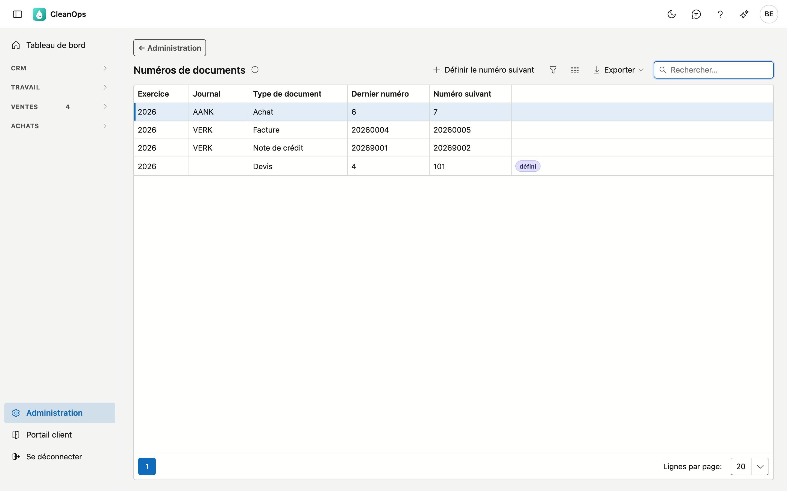
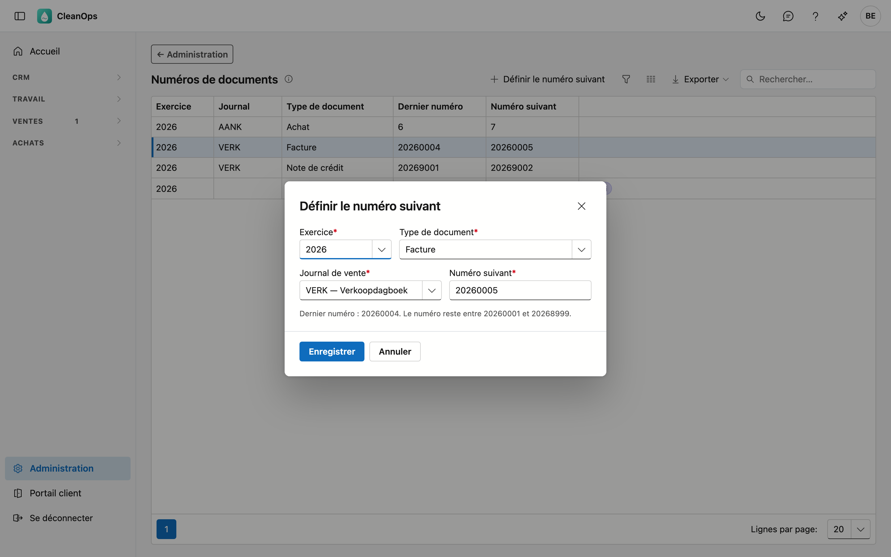

# Numéros de documents

Le numéro suivant de vos factures, notes de crédit, devis et documents d'achat. CleanOps numérote lui-même ; ici, vous définissez un
autre numéro suivant, par exemple pour poursuivre la numérotation de votre logiciel précédent.

## Ouvrir l'écran

Cliquez sur **Administration** en bas du menu, puis sur la tuile **Numéros de documents**.

## La liste

Par exercice, vous voyez chaque série de l'année précédente, de cette année et de l'année suivante qui porte déjà un
numéro ou pour laquelle vous avez défini quelque chose. Les séries de cette année y figurent toujours, même vides.

| Colonne | Ce que c'est |
|---|---|
| Exercice | l'année des documents (l'année civile) |
| Journal | le journal de vente ou d'achat ; vide pour les devis |
| Type de document | facture, note de crédit, devis ou achat |
| Dernier numéro | le numéro le plus élevé qui existe déjà |
| Numéro suivant | le numéro que recevra le document suivant |

Si **défini** figure à côté d'une série, le numéro suivant vient de votre réglage.

## Définir le numéro suivant

Cliquez sur **Définir le numéro suivant**, ou double-cliquez sur une série.

| Champ | Ce que vous complétez |
|---|---|
| **Exercice** *(obligatoire)* | l'année précédente, cette année ou l'année suivante |
| **Type de document** *(obligatoire)* | facture, note de crédit, devis ou achat |
| **Journal de vente** ou **Journal d'achat** *(obligatoire, sauf pour les devis)* | le journal de la série |
| **Numéro suivant** *(obligatoire)* | le numéro du document suivant |

!!! note "Pourquoi le numéro ne peut être que plus élevé"
    Le numéro suivant doit être plus élevé que le dernier numéro de la série. Ainsi, deux documents ne reçoivent
    jamais le même numéro, même si quelqu'un facture au même moment.

!!! note "Pourquoi un numéro de facture commence par l'année"
    Une facture reste entre *aaaa0001* et *aaaa8999*, une note de crédit entre *aaaa9001* et *aaaa9999* — pour 2026,
    donc de 20260001 à 20268999 et de 20269001 à 20269999. La communication structurée de la facture découle du
    numéro et reste ainsi unique pour chaque document. Si votre logiciel précédent est arrivé en 2026 à la facture 411,
    définissez *20260412*.

Un devis n'a ni journal ni communication : un numéro plus élevé que le dernier suffit.

**Achat** — les [factures d'achat](../aankoopfacturen.md) et notes de crédit d'achat partagent une série par exercice
et journal d'achat, qui commence à 1. Un document d'achat supprimé rend son numéro : le document suivant reçoit d'abord
un tel numéro libéré, ensuite la série continue à partir du numéro le plus élevé ou du numéro que vous avez défini.
L'aperçu indique combien de numéros sont libres (par exemple **7 libres**). Si vous définissez un numéro suivant pour cette
série, les numéros libérés sont **supprimés** : la fenêtre indique d'avance combien, et le document suivant reçoit le numéro que
vous définissez.

## Questions fréquentes

**Puis-je mettre un numéro plus bas ?**
Pas plus bas que le dernier numéro qui existe déjà. Un numéro défini qui n'a pas encore servi peut être adapté, tant
qu'il reste plus élevé que le dernier.

**Que devient le numéro d'une facture supprimée ?**
CleanOps ne supprime pas de factures : une facture pas encore envoyée se rouvre ; sinon, vous la créditez. Il n'y a
donc pas de trou dans la numérotation. Un document d'achat peut, lui, être supprimé tant que rien n'est payé ; son
numéro passe alors au document d'achat suivant.

**Une nouvelle année commence-t-elle d'elle-même ?**
Oui. La première facture d'une nouvelle année reçoit *aaaa0001*, la première note de crédit *aaaa9001* et le premier
devis 1, sauf si vous définissez autre chose pour cette année.
