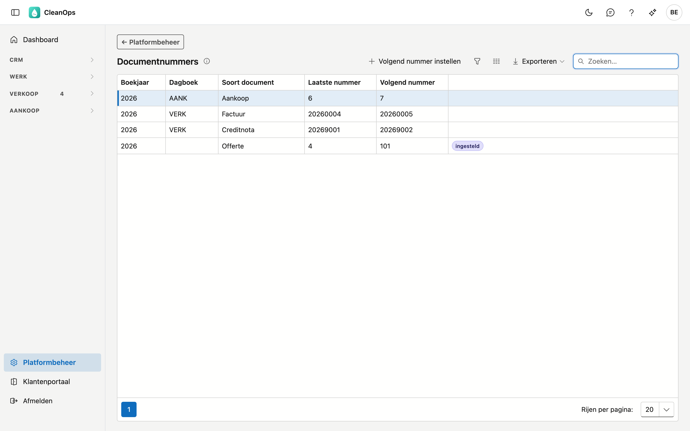
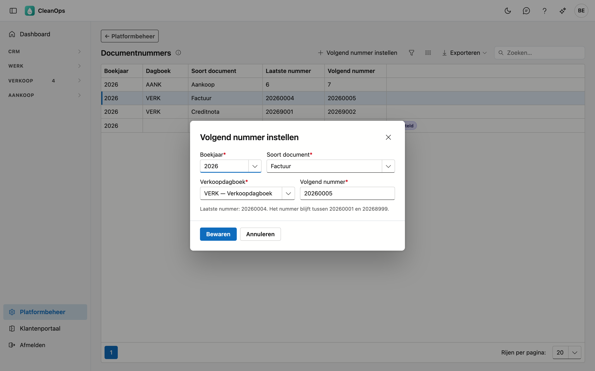

# Documentnummers

Het volgende nummer van uw facturen, creditnota's, offertes en aankoopdocumenten. CleanOps nummert zelf door; hier stelt u een ander
volgend nummer in, bijvoorbeeld om de nummering uit uw vorige pakket verder te zetten.

## Het scherm openen

Klik onderaan in het menu op **Platformbeheer** en daarna op de tegel **Documentnummers**.

## De lijst

Per boekjaar ziet u elke reeks van vorig, dit en volgend jaar die al een nummer draagt of waarvoor u iets instelde.
De reeksen van dit jaar staan er altijd, ook als er nog niets in zit.

| Kolom | Wat het is |
|---|---|
| Boekjaar | het jaar van de documenten (het kalenderjaar) |
| Dagboek | het verkoop- of aankoopdagboek; leeg bij offertes |
| Soort document | factuur, creditnota, offerte of aankoop |
| Laatste nummer | het hoogste nummer dat al bestaat |
| Volgend nummer | het nummer dat het volgende document krijgt |

Staat er **ingesteld** naast een reeks, dan komt het volgende nummer uit uw instelling.

## Het volgende nummer instellen

Klik op **Volgend nummer instellen**, of dubbelklik op een reeks.

| Veld | Wat u invult |
|---|---|
| **Boekjaar** *(verplicht)* | vorig, dit of volgend jaar |
| **Soort document** *(verplicht)* | factuur, creditnota, offerte of aankoop |
| **Verkoopdagboek** of **Aankoopdagboek** *(verplicht, behalve bij offertes)* | het dagboek van de reeks |
| **Volgend nummer** *(verplicht)* | het nummer van het volgende document |

!!! note "Waarom het nummer enkel hoger kan"
    Het volgende nummer moet hoger zijn dan het laatste nummer van de reeks. Zo krijgen twee documenten nooit
    hetzelfde nummer, ook niet als iemand op hetzelfde moment factureert.

!!! note "Waarom een factuurnummer met het jaar begint"
    Een factuur blijft tussen *jjjj0001* en *jjjj8999*, een creditnota tussen *jjjj9001* en *jjjj9999* — voor 2026
    dus 20260001 tot 20268999 en 20269001 tot 20269999. De gestructureerde mededeling op de factuur komt uit het
    nummer, en zo blijft ze voor elk document uniek. Kwam uw vorige pakket in 2026 tot factuur 411, dan stelt u
    *20260412* in.

Een offerte heeft geen dagboek en geen mededeling: daar volstaat een nummer hoger dan het laatste.

**Aankoop** — de [aankoopfacturen](../aankoopfacturen.md) en -creditnota's delen één reeks per boekjaar en
aankoopdagboek, die bij 1 begint. Een verwijderd aankoopdocument geeft zijn nummer terug: het volgende document krijgt
eerst zo'n vrijgekomen nummer, daarna loopt de reeks verder vanaf het hoogste nummer of het nummer dat u instelde.
Het overzicht zegt hoeveel nummers er vrij liggen (bijvoorbeeld **7 vrij**). Stelt u voor die reeks een volgend nummer in, dan
**vervallen** de vrijgekomen nummers: het venster zegt vooraf hoeveel, en het volgende document krijgt het nummer dat u instelt.

## Veelgestelde vragen

**Kan ik een nummer lager zetten?**
Niet lager dan het laatste nummer dat al bestaat. Een ingesteld nummer dat nog niet gebruikt is, kunt u wel
aanpassen, zolang het hoger blijft dan het laatste.

**Wat gebeurt er met een nummer van een verwijderde factuur?**
CleanOps verwijdert geen facturen: een factuur die nog niet verstuurd is, heropent u; anders crediteert u ze. Er
valt dus geen gat in de nummering. Een aankoopdocument kunt u wel verwijderen zolang er niets op betaald is; zijn
nummer gaat dan naar het volgende aankoopdocument.

**Begint een nieuw jaar vanzelf?**
Ja. De eerste factuur van een nieuw jaar krijgt *jjjj0001*, de eerste creditnota *jjjj9001* en de eerste offerte 1,
tenzij u voor dat jaar iets anders instelt.
