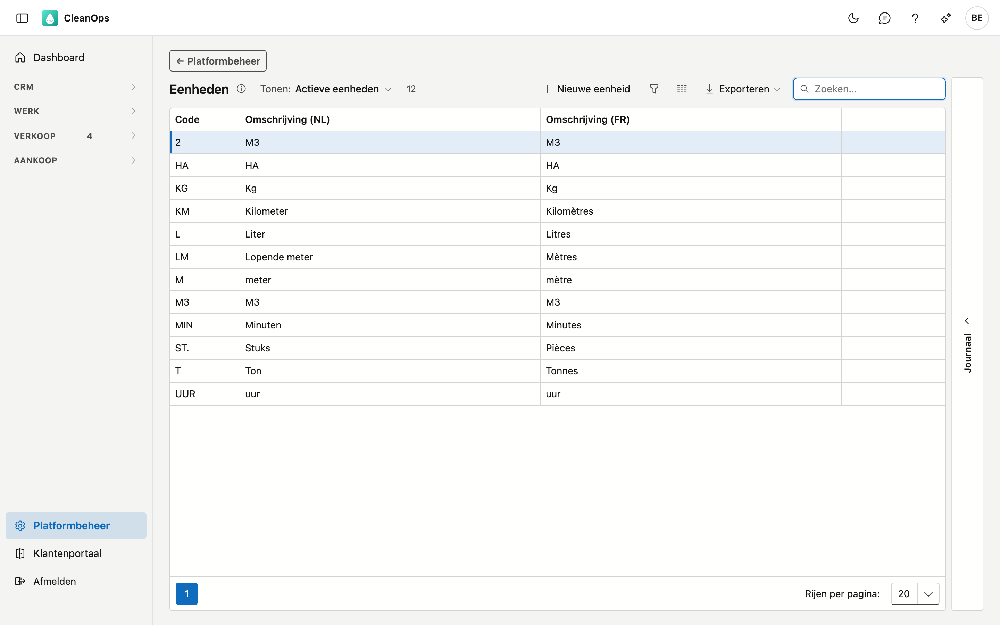
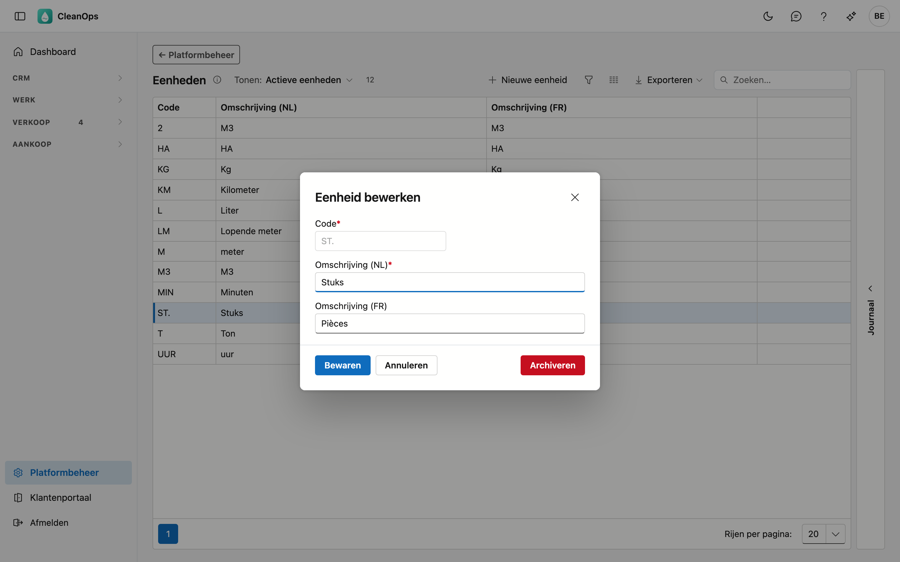
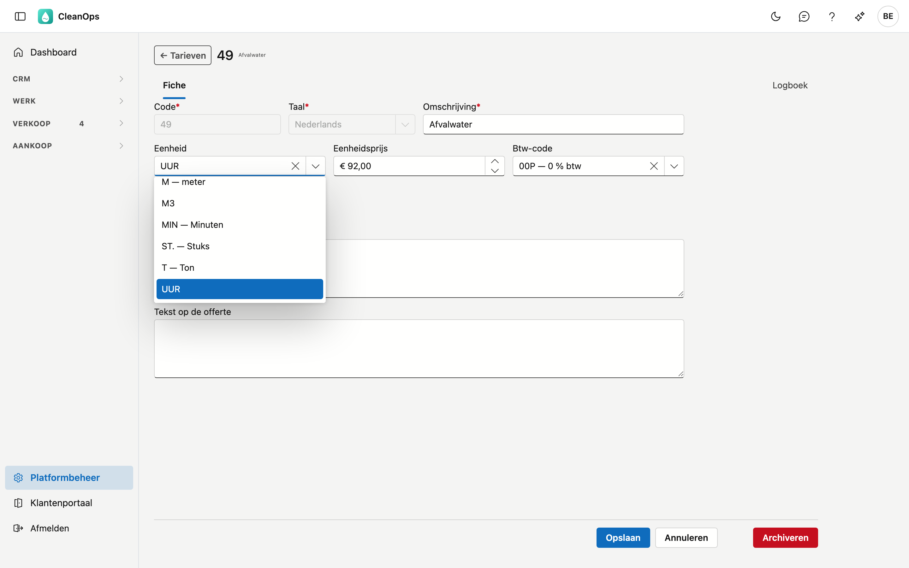
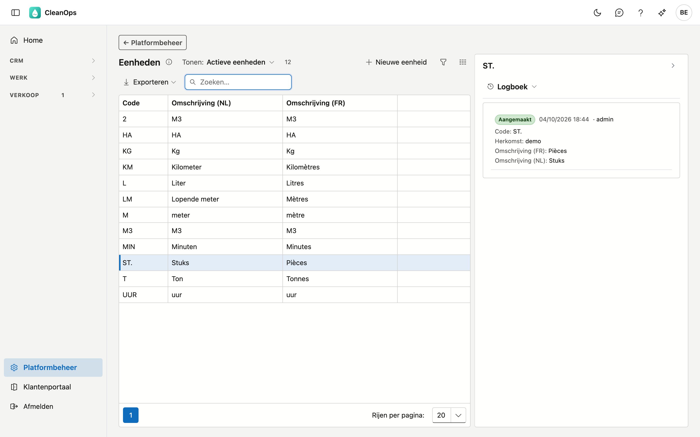

# Eenheden

De eenheden die u kiest op een tarief, een werkorder, een offertelijn of een factuurlijn: uur, stuks, m³, kilometer…
De code van de eenheid staat op uw documenten naast de hoeveelheid.

## Het scherm openen

Klik onderaan in het menu op **Platformbeheer** en daarna op de tegel **Eenheden**.

## De lijst

| Kolom | Wat het is |
|---|---|
| Code | de korte sleutel die op uw documenten staat, bijvoorbeeld `UUR` of `ST.` |
| Omschrijving (NL) | wat u naast de code in de keuzelijsten ziet |
| Omschrijving (FR) | idem voor wie de toepassing in het Frans gebruikt |

Een eenheid die u zelf in CleanOps aangemaakt hebt, draagt het label **eigen**. De andere komen uit uw vorige
toepassing.

## Een eenheid toevoegen of wijzigen

Klik op **Nieuwe eenheid**, of dubbelklik op een bestaande rij.

| Veld | Wat u invult |
|---|---|
| **Code** *(verplicht)* | maximaal 3 tekens, bijvoorbeeld `M2`, in hoofdletters bewaard. Ligt vast zodra de eenheid bestaat. Een code die enkel in hoofdletters verschilt van een bestaande (`uur` naast `UUR`), wordt geweigerd — ook als die bestaande gearchiveerd is. |
| **Omschrijving (NL)** / **(FR)** | maximaal 30 tekens. Die in de hoofdtaal van uw bedrijf is verplicht. |

!!! note "Waarom de code vastligt"
    Tarieven, werkorders en documenten bewaren de **code** van hun eenheid als tekst. Kon u de code wijzigen, dan
    droegen ze een code die niet meer in de lijst staat. De omschrijvingen kunt u altijd aanpassen.

De **Franse omschrijving** mag u leeg laten als uw bedrijf enkel in het Nederlands werkt.

## Waar u de eenheid kiest

Op een tarief, een werkorder, een offertelijn en een manuele factuur kiest u de eenheid uit deze lijst. De
keuzelijst toont de code met de omschrijving, bijvoorbeeld *ST. — Stuks*.

Draagt een oud document een eenheid die niet (meer) in de lijst staat, bijvoorbeeld een vrij getypte *liters*
uit uw vorige toepassing, dan blijft die gewoon staan en ziet u ze in de keuzelijst. Kiest u een andere en
bewaart u, dan verdwijnt die oude waarde uit de keuzelijst.

## Het journaal

Rechts op het scherm zit een strook **Journaal**. Klik een eenheid in de lijst aan en open de strook: het paneel
toont wie ze wanneer aangemaakt, gewijzigd, gearchiveerd of teruggehaald heeft.

## Een eenheid archiveren of terughalen

Open de rij en gebruik **Archiveren**. De eenheid verdwijnt uit de keuzelijsten, maar blijft bestaan.

!!! note "Wat de eenheid al draagt, merkt niets"
    Tarieven, werkorders, offertes en facturen die de gearchiveerde eenheid al dragen, houden ze. Archiveren is
    *niet meer kiezen*, niet *weghalen*.

Wilt u ze terug? Zet bovenaan de lijst **Tonen** op **Ook gearchiveerde eenheden**, open de eenheid en klik op
**Terughalen**.

## Veelgestelde vragen

**Waarom kan ik een eenheid niet verwijderen?**
Omdat tarieven en documenten haar code dragen. Archiveren haalt ze uit de keuzelijsten zonder iets van wat al
bestaat te raken.

**Ik zie twee keer m³ in de lijst.**
Uw vorige toepassing had er twee, met de codes `M3` en `2`. Archiveer de eenheid die u niet meer gebruikt.

**De Franse kolom is bij ons overal leeg.**
Dat is geen fout: wie enkel in het Nederlands werkt, hoeft die niet in te vullen.
