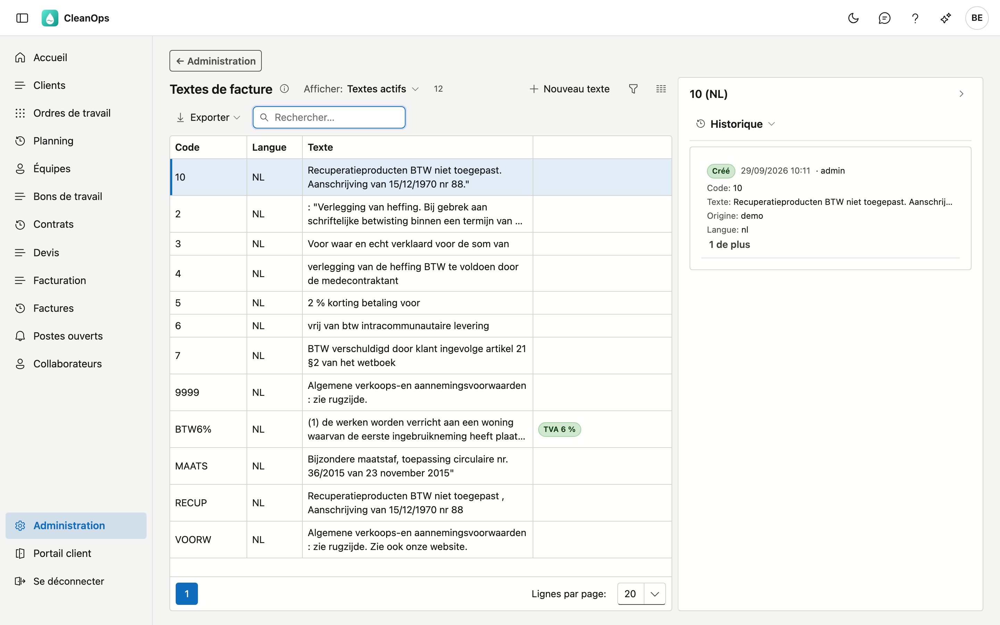
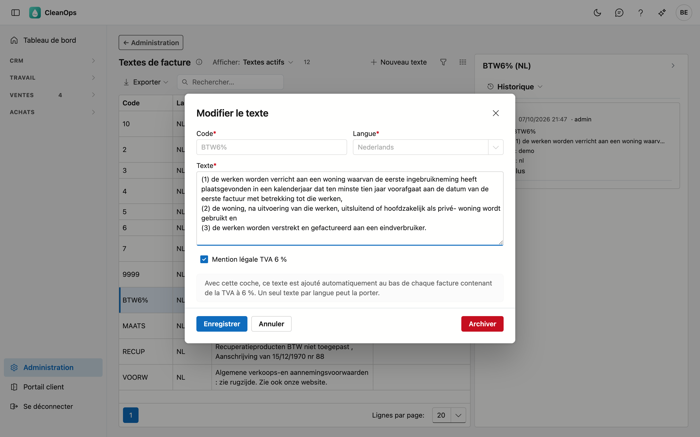
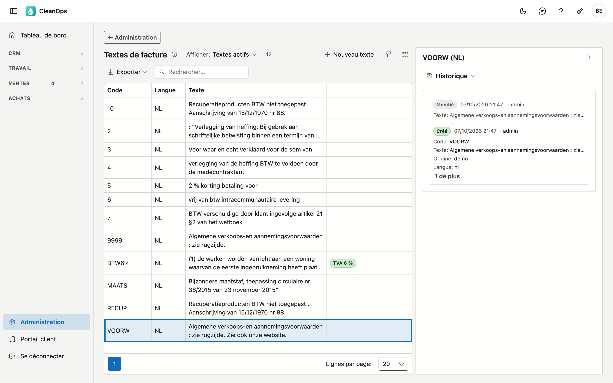

# Textes de facture

Les textes de facture sont les **textes standard qui peuvent figurer au bas d'une facture** : mentions TVA,
conditions générales, l'attestation pour une rénovation à 6 %.

!!! warning "L'un de ces textes est ajouté automatiquement"
    Le texte portant la marque **TVA 6 %** est placé **automatiquement** au bas de chaque facture comportant
    de la TVA à 6 %. Vous n'avez rien à choisir et vous ne pouvez pas l'oublier.

    Cela distingue cet écran des autres listes de l'Administration : ce que vous modifiez ici figurera
    littéralement sur une facture adressée à votre client.

## Ouvrir l'écran

Cliquez sur **Administration** en bas du menu, puis sur la tuile **Textes de facture**.

## La liste

| Colonne | Ce que c'est |
|---|---|
| Code | la clé courte issue de votre application actuelle, par exemple `BTW6%` ou `VOORW` |
| Langue | la langue dans laquelle le texte est rédigé |
| Texte | le **début** du texte — ouvrez la ligne pour le voir en entier |
| Marques | **TVA 6 %**, **propre** ou **archivé** |

La colonne Texte est tronquée à dessein : l'attestation de rénovation compte plus de quatre cents caractères
et rendrait la liste illisible. Double-cliquez sur une ligne pour voir et modifier le texte complet.

## La marque TVA 6 %

Un **seul texte par langue** peut porter cette marque. Ce texte est la mention légale qui doit figurer sur
une facture dès qu'elle comporte des travaux à 6 % de TVA.

Si vous tentez de cocher un deuxième texte, CleanOps refuse et nomme celui qui la porte aujourd'hui. Ainsi
la mention ne se déplace jamais sans que vous le voyiez.

!!! note "Pourquoi ne pas décocher l'autre automatiquement ?"
    Parce que vous auriez demain une autre phrase sur vos factures qu'hier, sans que rien ne l'ait montré.
    CleanOps vous laisse le choix : retirez d'abord la coche là où elle se trouve.

## La langue

Une facture utilise la **langue du client**. Si le texte à 6 % n'existe qu'en néerlandais et que votre client
est francophone, **aucune** mention ne figurera sur cette facture.

!!! tip "C'est volontaire, et c'est un point à vérifier"
    Une mention légale néerlandaise sur une facture francophone est pire que pas de mention : votre client ne
    peut pas la lire, et elle donne l'impression que l'obligation est remplie.

    Si vous envoyez des factures francophones avec de la TVA à 6 %, créez une deuxième ligne avec le même
    texte en français et cochez-la également. Dans votre application actuelle, **tous** les textes ne sont
    rédigés qu'en néerlandais.

## Modifier ou ajouter un texte

Double-cliquez sur une ligne, ou utilisez **Nouveau texte**. La fenêtre montre le texte complet.

| Champ | Ce que vous complétez |
|---|---|
| **Code** *(obligatoire)* | 5 caractères au maximum, comme dans votre application actuelle. Figé dès que le texte est enregistré. |
| **Langue** *(obligatoire)* | néerlandais ou français. Également figée : le code et la langue forment ensemble la clé. |
| **Texte** *(obligatoire)* | le texte complet, tel qu'il figurera au bas de la facture. |
| **Mention légale TVA 6 %** | voir plus haut : un seul texte par langue. |

Cliquez sur **Enregistrer**. Les textes que vous créez ici portent la marque **propre**.

## Archiver ou rétablir un texte

Ouvrez la ligne et utilisez **Archiver**. Le texte disparaît de la liste mais continue d'exister.

Archiver et non effacer : les factures déjà établies portent le texte en **copie**, elles ne changent donc pas.
Le code reste utile comme référence si vous voulez vérifier plus tard quel texte a été utilisé.

Vous le voulez à nouveau ? En haut de la liste, réglez **Afficher** sur **Aussi les textes archivés**, ouvrez le
texte et cliquez sur **Rétablir**.

!!! note "Un texte archivé garde sa coche"
    Si un texte archivé porte la coche **TVA 6 %**, vous ne pouvez pas la placer sur un autre texte dans cette
    langue : sinon, il y en aurait deux après le rétablissement. CleanOps nomme le texte et indique qu'il est
    archivé. Rétablissez-le, retirez la coche et archivez-le à nouveau.

## Où vous retrouvez le texte

Sur la fiche d'une facture, le bloc **Texte de pied de page** figure en bas — vous y lisez ce qui est
réellement apparu sur cette facture. S'il n'y a rien, le bloc n'apparaît pas. (L'écran **Factures** sera libéré plus tard.)

## Le journal

À droite de l'écran se trouve une bande **Journal**. Sélectionnez un texte dans la liste et ouvrez la bande : le
panneau montre le journal de ce texte, avec le code et la langue comme titre. Si vous sélectionnez un autre
texte, le journal suit.

L'onglet **Historique** indique qui a modifié le texte et quand, et de quelle valeur vers quelle autre. Pour une
mention légale, c'est plus qu'une question d'ordre : il montre quand la phrase figurant sur vos factures a
changé, et par qui. Toutes les modifications de tous les textes se trouvent dans le **Journal des actions**
(Administration → Historique ; cet écran sera libéré plus tard).

## Questions fréquentes

**Lequel des douze textes figure réellement sur ma facture ?**
Uniquement celui portant la marque **TVA 6 %**, et uniquement sur les factures comportant de la TVA à 6 %.
Les autres sont disponibles comme référence ; ils ne sont pas utilisés automatiquement aujourd'hui.

**Pourquoi ma facture francophone à 6 % ne porte-t-elle aucune mention ?**
Parce qu'il n'existe pas encore de texte français portant la marque **TVA 6 %**. Créez-en un et cochez-le.

**Puis-je placer moi-même un texte sur une facture ?**
Non, et c'est un choix. Une mention légale qui dépend d'un clic finit tôt ou tard par manquer — c'est pourquoi
CleanOps la place lui-même, en fonction de la TVA de la facture. Aujourd'hui, c'est le cas pour la mention à 6 %.
