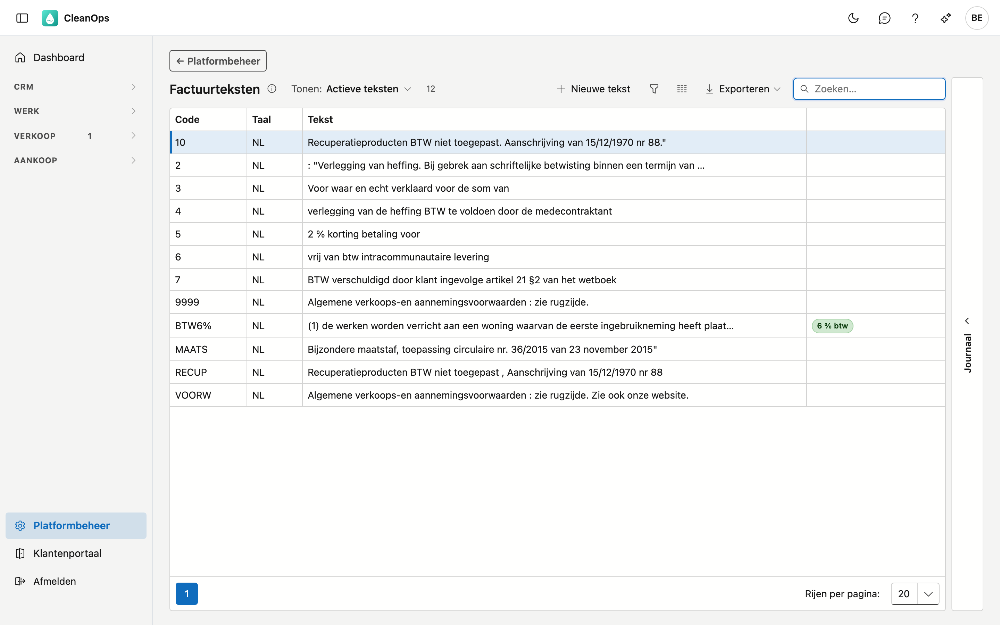
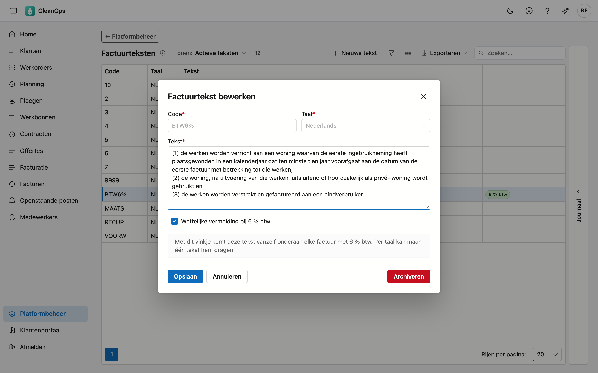
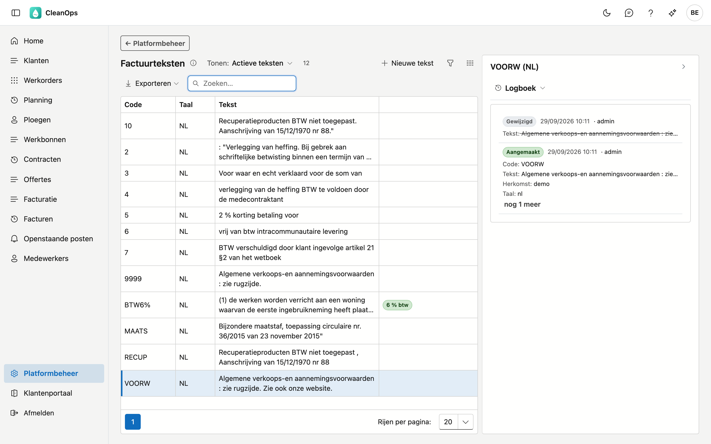

# Factuurteksten

Factuurteksten zijn de **standaardteksten die onderaan een factuur kunnen staan**: btw-vermeldingen,
algemene voorwaarden, het attest bij een renovatie aan 6 %.

!!! warning "Eén van deze teksten komt er vanzelf op"
    De tekst met het merkteken **6 % btw** wordt **automatisch** onderaan elke factuur gezet waarop 6 % btw
    voorkomt. U hoeft daar niets te kiezen en u kunt het ook niet vergeten.

    CleanOps neemt de tekst in de **taal van de klant**. Ontbreekt die — bijvoorbeeld een Franstalige klant terwijl er
    enkel een Nederlandse tekst is — dan wordt de factuur **niet geboekt** en zegt CleanOps welke taal u moet aanmaken.
    Een factuur zonder de wettelijke vermelding kunt u niet terugroepen; een tekst toevoegen kan meteen.

    Dat maakt dit scherm anders dan de andere lijsten in Platformbeheer: wat u hier wijzigt, staat straks
    letterlijk op een factuur aan uw klant.

## Het scherm openen

Klik onderaan in het menu op **Platformbeheer** en daarna op de tegel **Factuurteksten**.

## De lijst

| Kolom | Wat het is |
|---|---|
| Code | de korte sleutel uit uw huidige toepassing, bijvoorbeeld `BTW6%` of `VOORW` |
| Taal | in welke taal de tekst staat |
| Tekst | het **begin** van de tekst — open de rij om ze voluit te zien |
| Merktekens | **6 % btw**, **eigen** of **gearchiveerd** |

De kolom Tekst is afgekapt met opzet: het renovatie-attest is meer dan vierhonderd tekens en zou de lijst
onleesbaar maken. Dubbelklik op een rij om de hele tekst te zien en te wijzigen.

## Het merkteken 6 % btw

Precies **één tekst per taal** mag dit merkteken dragen. Die tekst is de wettelijke vermelding die op een
factuur hoort zodra er werken aan 6 % btw op staan.

Probeert u het vinkje op een tweede tekst te zetten, dan weigert CleanOps dat en noemt hij de tekst die het
vandaag draagt. Zo verspringt de vermelding nooit zonder dat u het ziet.

!!! note "Waarom niet gewoon de andere automatisch afvinken?"
    Omdat u dan morgen een andere zin op uw facturen hebt dan gisteren, zonder dat er iets te zien was.
    CleanOps laat de keuze bij u: haal het vinkje eerst weg waar het nu staat.

## De taal

Een factuur gebruikt de **taal van de klant**. Staat de 6 %-tekst enkel in het Nederlands en is uw klant
Franstalig, dan komt er **geen** vermelding op die factuur.

!!! tip "Dat is opzettelijk, en het is iets om na te kijken"
    Een Nederlandse wettelijke vermelding op een Franstalige factuur is erger dan geen: uw klant kan ze niet
    lezen, en ze wekt de indruk dat de verplichting vervuld is.

    Verstuurt u Franstalige facturen met 6 % btw, maak dan een tweede rij met dezelfde tekst in het Frans en
    zet het vinkje daar ook. In uw huidige toepassing staan **alle** teksten enkel in het Nederlands.

## Een tekst wijzigen of toevoegen

Dubbelklik op een rij, of gebruik **Nieuwe tekst**. Het venster toont de hele tekst.

| Veld | Wat u invult |
|---|---|
| **Code** *(verplicht)* | maximaal 5 tekens, zoals in uw huidige toepassing. Ligt vast zodra de tekst bewaard is. |
| **Taal** *(verplicht)* | Nederlands of Frans. Ligt ook vast: code en taal vormen samen de sleutel. |
| **Tekst** *(verplicht)* | de volledige tekst, zoals hij onderaan de factuur komt. |
| **Wettelijke vermelding bij 6 % btw** | zie hierboven: één tekst per taal. |

Klik op **Bewaren**. Teksten die u hier zelf aanmaakt, dragen het merkteken **eigen**.

## Een tekst archiveren of terughalen

Open de rij en gebruik **Archiveren**. De tekst verdwijnt uit de lijst maar blijft bestaan.

Archiveren en niet verwijderen: facturen die al gemaakt zijn dragen de tekst als **kopie**, dus ze veranderen
niet mee. De code blijft wel een verwijzing waard wanneer u later wil nakijken welke tekst er gebruikt werd.

Wilt u hem terug? Zet bovenaan de lijst **Tonen** op **Ook gearchiveerde teksten**, open de tekst en klik op
**Terughalen**.

!!! note "Een gearchiveerde tekst houdt zijn vinkje"
    Draagt een gearchiveerde tekst het vinkje **6 % btw**, dan kunt u het niet op een andere tekst in die taal
    zetten: bij het terughalen zouden er anders twee zijn. CleanOps noemt de tekst en zegt dat hij
    gearchiveerd is. Haal hem terug, haal het vinkje weg en archiveer hem opnieuw.

## Waar u de tekst terugziet

Op de fiche van een [factuur](../facturen.md) staat onderaan het blok **Slottekst** — daar leest u wat er werkelijk op die
factuur is komen te staan. Staat er niets, dan is het blok er ook niet.

## Het journaal

Rechts op het scherm zit een strook **Journaal**. Klik een tekst in de lijst aan en open de strook: het paneel
toont het journaal van die ene tekst, met de code en de taal als titel. Klikt u een andere tekst aan, dan
wisselt het journaal mee.

Het tabblad **Logboek** toont wie de tekst wanneer gewijzigd heeft, en van welke waarde naar welke. Bij een
wettelijke vermelding is dat meer dan netheid: het laat zien wanneer de zin op uw facturen veranderd is, en
door wie. Alle wijzigingen aan alle teksten samen vindt u in het [Actielogboek](actielogboek.md) (Platformbeheer → Historiek).

## Veelgestelde vragen

**Welke van de twaalf teksten komt er nu eigenlijk op mijn factuur?**
Alleen die met het merkteken **6 % btw**, en alleen op facturen waarop 6 % btw voorkomt. De andere staan
klaar als naslag; ze worden vandaag niet automatisch gebruikt.

**Waarom staat er op mijn Franstalige factuur met 6 % geen vermelding?**
Omdat er nog geen Franse tekst met het merkteken **6 % btw** bestaat. Maak er een en zet het vinkje.

**Kan ik zelf een tekst op een factuur zetten?**
Nee, en dat is een keuze. Een wettelijke vermelding die van een klik afhangt, ontbreekt vroeg of laat —
daarom zet CleanOps ze zelf, op basis van de btw op de factuur. Vandaag gebeurt dat voor de 6 %-vermelding.
