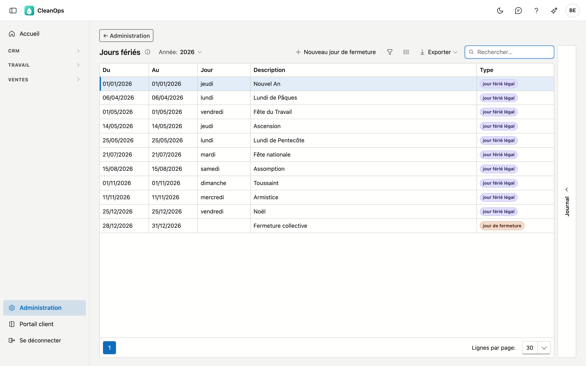
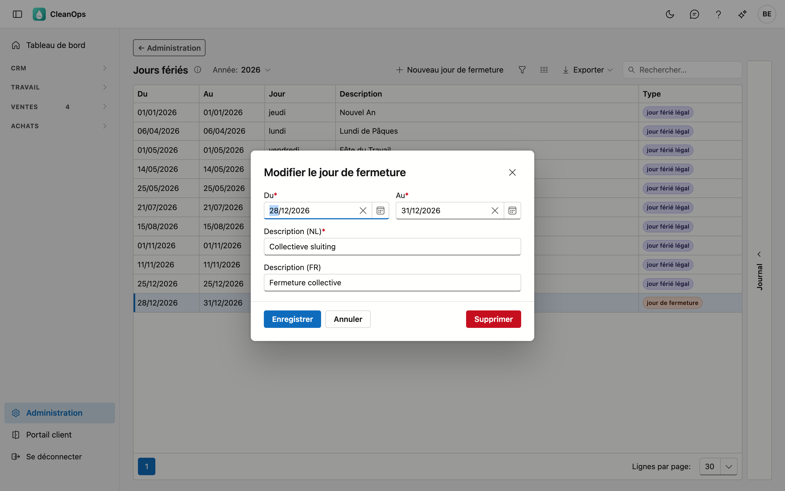

# Jours fériés

Les jours non travaillés : les **jours fériés légaux** et vos propres **jours de fermeture**, comme un pont ou la
fermeture collective entre Noël et Nouvel An. Aucun des deux ne compte comme jour de congé, et le tableau des équipes
les affiche.

## Ouvrir l'écran

Dans le menu, cliquez en bas sur **Administration**, puis sur la tuile **Jours fériés**.

## La liste

La liste montre une année ; choisissez-la en haut à **Année**. Pour chaque jour ou période, vous voyez :

| Colonne | Ce que c'est |
|---|---|
| Du, Au | le premier et le dernier jour |
| Jour | le jour de la semaine, pour un seul jour |
| Description | le nom, par exemple *Lundi de Pâques* ou *Fermeture collective* |
| Type | **jour férié légal** ou **jour de fermeture** |

### Jours fériés légaux

CleanOps calcule lui-même chaque année les jours fériés légaux belges, y compris ceux qui dépendent de Pâques : le
lundi de Pâques, l'Ascension et le lundi de Pentecôte. Vous n'avez pas à les encoder, et vous ne pouvez ni les
modifier ni les supprimer. Si vous choisissez l'année suivante, ils y figurent déjà.

Un jour férié qui tombe un samedi ou un dimanche figure aussi dans la liste. Pour les congés, cela ne change rien : ce
jour n'était pas un jour de travail.

!!! note "L'année ne peut pas être chargée ?"
    Un message apparaît alors au-dessus de la liste, et vous ne voyez que vos propres jours de fermeture. Réessayez un
    peu plus tard. Tant que les jours fériés ne peuvent pas être chargés, CleanOps refuse aussi d'encoder des congés :
    sinon, un jour férié compterait comme jour de congé.

### Jours de fermeture

Les jours de fermeture sont décidés par votre entreprise : un pont, la fermeture collective, le congé du bâtiment.

- **Ajouter** — cliquez sur **Nouveau jour de fermeture**. Du et Au sont obligatoires (pour un seul jour, indiquez
  deux fois la même date), ainsi qu'une description dans au moins une langue. Avec **Couleur sur le planning des équipes**,
  vous choisissez la couleur du jour sur le [planning des équipes](../ploegen.fr.md), ou aucune couleur.
- **Modifier** — double-cliquez sur la ligne.
- **Supprimer** — ouvrez la ligne et cliquez sur **Supprimer**. Après confirmation, le jour de fermeture disparaît
  définitivement.

## Le journal

À droite se trouve le **Journal**. L'onglet **Historique** montre qui a créé, modifié ou supprimé quel jour de
fermeture, et quand — y compris ceux qui ne figurent plus dans la liste. Chaque ligne nomme le jour de fermeture
concerné.

## Où les jours fériés comptent

- **Congés** — pour une période de congé sur la [fiche collaborateur](../medewerkers.fr.md), CleanOps ne compte que
  les jours de travail du collaborateur, sans jours fériés ni jours de fermeture.
- **Équipes** — le tableau des équipes colore le jour et en affiche le nom.
