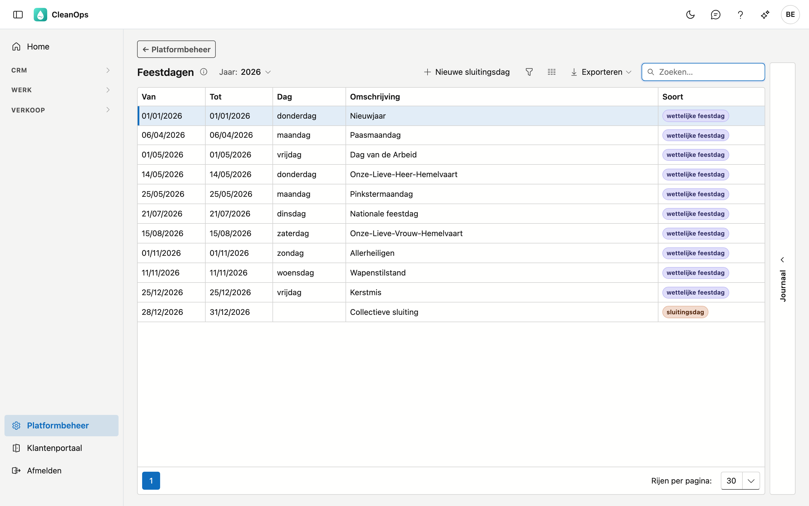
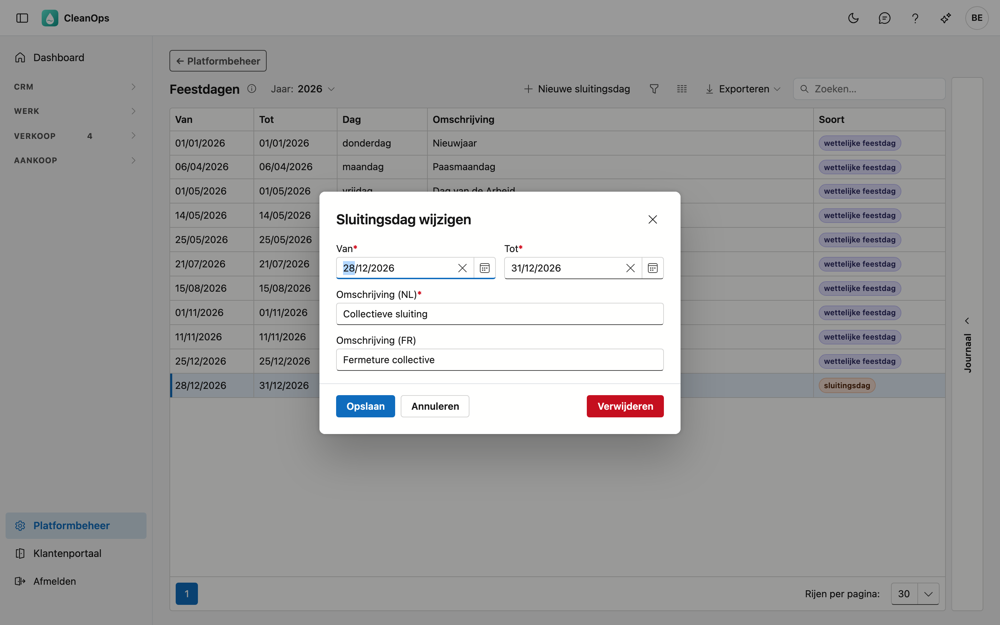

# Feestdagen

De dagen waarop niet gewerkt wordt: de **wettelijke feestdagen** en uw eigen **sluitingsdagen**, zoals een brugdag of
de collectieve sluiting tussen Kerstmis en Nieuwjaar. Geen van beide telt mee als verlofdag, en het ploegenbord toont
ze.

## Het scherm openen

Klik onderaan in het menu op **Platformbeheer** en daarna op de tegel **Feestdagen**.

## De lijst

De lijst toont één jaar; kies het bovenaan bij **Jaar**. Per dag of periode ziet u:

| Kolom | Wat het is |
|---|---|
| Van, Tot | de eerste en de laatste dag |
| Dag | de weekdag, bij een enkele dag |
| Omschrijving | de naam, bijvoorbeeld *Paasmaandag* of *Collectieve sluiting* |
| Soort | **wettelijke feestdag** of **sluitingsdag** |

### Wettelijke feestdagen

CleanOps rekent de Belgische wettelijke feestdagen elk jaar zelf uit, ook de dagen die met Pasen meeschuiven:
Paasmaandag, Hemelvaart en Pinkstermaandag. U hoeft ze niet in te geven, en u kunt ze niet wijzigen of verwijderen.
Kiest u een volgend jaar, dan staan ze er al.

Ook een feestdag die op een zaterdag of zondag valt, staat in de lijst. Voor het verlof maakt dat niets uit: die dag
was geen werkdag.

!!! note "Kan het jaar niet geladen worden?"
    Dan staat er een melding boven de lijst, en ziet u enkel uw eigen sluitingsdagen. Probeer het even later
    opnieuw. Zolang de feestdagen niet geladen kunnen worden, weigert CleanOps ook verlof te boeken: anders zou een
    feestdag als verlofdag meetellen.

### Sluitingsdagen

Sluitingsdagen beslist uw bedrijf zelf: een brugdag, de collectieve sluiting, het bouwverlof.

- **Toevoegen** — klik op **Nieuwe sluitingsdag**. Van en Tot zijn verplicht (voor één dag vult u tweemaal dezelfde
  datum in), en een omschrijving in minstens één taal. Met **Kleur op het ploegenbord** kiest u de kleur waarmee de dag op
  het [ploegenbord](../ploegen.md) staat, of *Geen kleur*.
- **Wijzigen** — dubbelklik op de rij.
- **Verwijderen** — open de rij en klik op **Verwijderen**. Na een bevestiging is de sluitingsdag definitief weg.

## Het journaal

Rechts staat het **Journaal**. Het tabblad **Logboek** toont wie welke sluitingsdag wanneer aanmaakte, wijzigde of
verwijderde — ook sluitingsdagen die niet meer in de lijst staan. Elke regel noemt de sluitingsdag waarover hij gaat.

## Waar de feestdagen meetellen

- **Verlof** — bij een verlofperiode op de [medewerkerfiche](../medewerkers.md) telt CleanOps enkel de werkdagen van
  de medewerker, zonder feestdagen en sluitingsdagen.
- **Ploegen** — het ploegenbord kleurt de dag en toont de naam.
