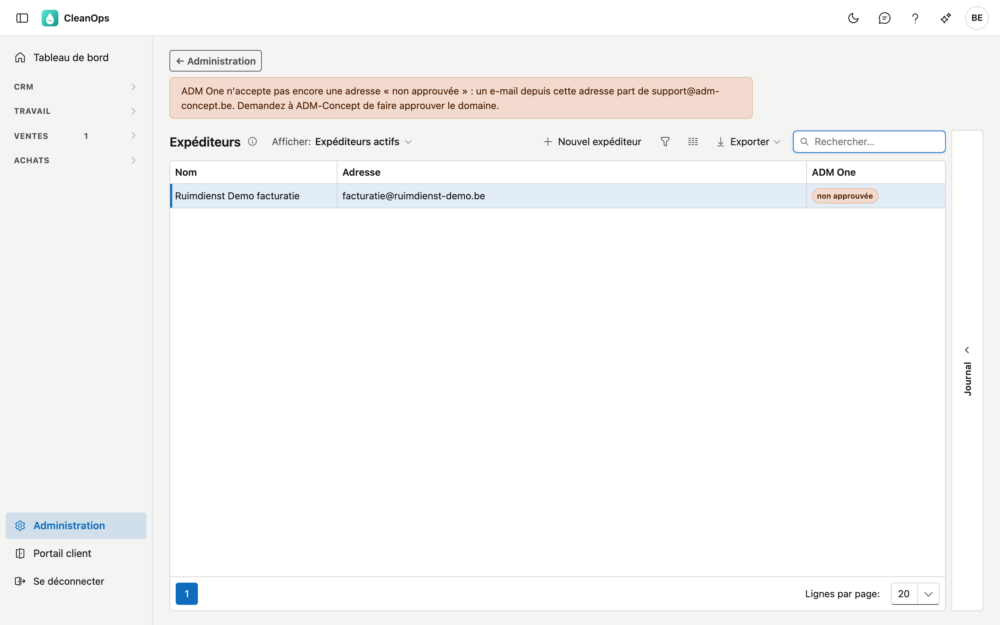

# Expéditeurs

Les expéditeurs sont les **adresses depuis lesquelles CleanOps envoie vos e-mails**. Chaque
[texte d'e-mail](mailteksten.fr.md) en choisit une dans l'onglet **Envoi**.

## Ouvrir l'écran

Cliquez en bas du menu sur **Administration**, puis sur la tuile **Expéditeurs**.

## La liste

| Colonne | Ce que c'est |
|---|---|
| Nom | le nom affiché que le client voit comme expéditeur |
| Adresse | l'adresse e-mail de l'expéditeur |
| ADM One | si l'adresse est approuvée pour l'envoi |

CleanOps envoie ses e-mails via ADM One. ADM One n'envoie que depuis une adresse dont le domaine est approuvé.
La colonne **ADM One** indique où en est l'adresse :

- **approuvée** — l'e-mail part de cette adresse ;
- **non approuvée** — l'e-mail part de l'adresse standard d'ADM One. Le message au-dessus de la liste nomme cette
  adresse ;
- **inconnu** — ADM One n'a pas répondu. Réessayez plus tard.

!!! warning "Non approuvée ? Faites approuver le domaine"
    Un e-mail depuis une adresse non approuvée part bien, mais avec l'adresse d'ADM One comme expéditeur.
    Demandez à ADM-Concept de faire approuver le domaine de votre adresse.

## Ajouter ou modifier un expéditeur

Cliquez sur **Nouvel expéditeur**, ou double-cliquez sur une ligne.

| Champ | Ce que vous remplissez |
|---|---|
| **Adresse e-mail** *(obligatoire)* | l'adresse depuis laquelle l'e-mail part. Une adresse ne figure qu'une fois dans la liste. |
| **Nom affiché** | le nom que le client voit comme expéditeur, par exemple « Votre entreprise — facturation » |

Cliquez sur **Enregistrer**.

## Archiver ou rétablir un expéditeur

Ouvrez la ligne et cliquez sur **Archiver**. L'expéditeur disparaît de la liste et du choix sur un texte
d'e-mail. Un texte d'e-mail qui le porte encore part de l'adresse standard d'ADM One.

Vous le voulez de retour ? Réglez **Afficher** sur **Aussi les archivés**, ouvrez l'expéditeur et cliquez sur
**Rétablir**.

## Le journal

Le volet **Journal** se trouve à droite de l'écran. Sélectionnez un expéditeur et ouvrez le volet : l'onglet
**Historique** montre qui l'a modifié et quand.

## Questions fréquentes

**Mon client voit une adresse d'ADM One comme expéditeur.**
L'adresse du texte d'e-mail n'est pas approuvée, elle est archivée, ou aucun expéditeur n'a été choisi.
Vérifiez la colonne **ADM One** et l'onglet **Envoi** du [texte d'e-mail](mailteksten.fr.md).

## Voir aussi

- [Textes d'e-mail](mailteksten.fr.md)
- [Factures](../facturen.fr.md)
