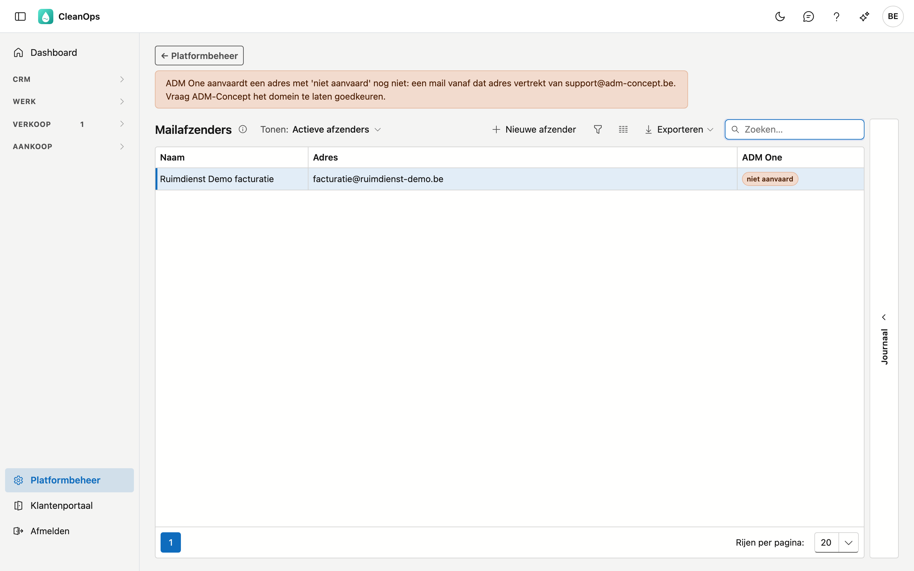

# Mailafzenders

De mailafzenders zijn de **adressen waarvan CleanOps uw mails verstuurt**. Elke [mailtekst](mailteksten.md) kiest
er één op het tabblad **Verzending**.

## Het scherm openen

Klik onderaan in het menu op **Platformbeheer** en daarna op de tegel **Mailafzenders**.

## De lijst

| Kolom | Wat het is |
|---|---|
| Naam | de weergavenaam die de klant als afzender ziet |
| Adres | het e-mailadres van de afzender |
| ADM One | of het adres goedgekeurd is om vanaf te versturen |

CleanOps verstuurt zijn mails via ADM One. ADM One verstuurt enkel vanaf een adres waarvan het domein
goedgekeurd is. De kolom **ADM One** zegt hoe het daarmee staat:

- **aanvaard** — de mail vertrekt van dit adres;
- **niet aanvaard** — de mail vertrekt van het standaardadres van ADM One. De melding boven de lijst noemt dat adres;
- **onbekend** — ADM One antwoordde niet. Probeer het later opnieuw.

!!! warning "Niet aanvaard? Vraag het domein te laten goedkeuren"
    Een mail vanaf een niet aanvaard adres vertrekt wel, maar met het adres van ADM One als afzender. Vraag
    ADM-Concept om het domein van uw adres te laten goedkeuren.

## Een afzender toevoegen of wijzigen

Klik op **Nieuwe afzender**, of dubbelklik op een rij.

| Veld | Wat u invult |
|---|---|
| **E-mailadres** *(verplicht)* | het adres waarvan de mail vertrekt. Een adres staat maar één keer in de lijst. |
| **Weergavenaam** | de naam die de klant als afzender ziet, bijvoorbeeld "Uw firma — facturatie" |

Klik op **Opslaan**.

## Een afzender archiveren of terughalen

Open de rij en klik op **Archiveren**. De afzender verdwijnt uit de lijst en uit de keuze op een mailtekst. Een
mailtekst die hem nog draagt, vertrekt van het standaardadres van ADM One.

Wilt u hem terug? Zet **Tonen** op **Ook gearchiveerde**, open de afzender en klik op **Terughalen**.

## Het journaal

Rechts op het scherm zit een strook **Journaal**. Klik een afzender aan en open de strook: het tabblad
**Logboek** toont wie hem wanneer gewijzigd heeft.

## Veelgestelde vragen

**Mijn klant ziet een adres van ADM One als afzender.**
Het adres op de mailtekst is niet aanvaard, gearchiveerd, of er is geen afzender gekozen. Kijk de kolom
**ADM One** na en het tabblad **Verzending** van de [mailtekst](mailteksten.md).

## Zie ook

- [Mailteksten](mailteksten.md)
- [Facturen](../facturen.md)
