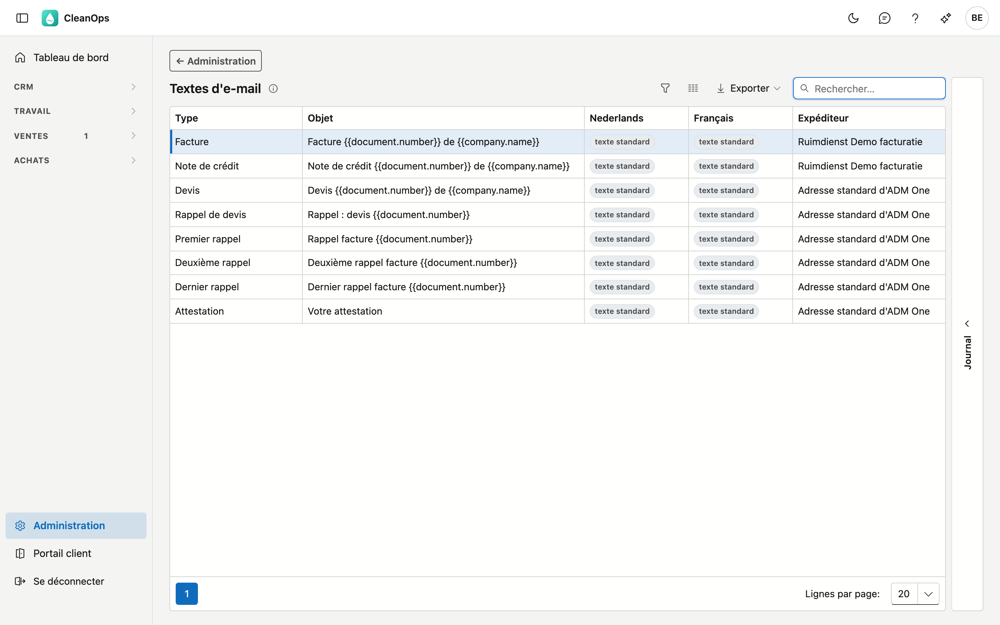
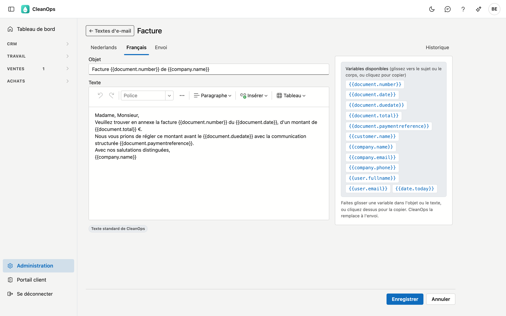

# Textes d'e-mail

Les textes d'e-mail sont **l'objet et le texte des e-mails que CleanOps envoie à vos clients**, par type de
document, en néerlandais et en français.

CleanOps utilise les textes **Facture** et **Note de crédit** lorsque vous envoyez une facture avec
**Envoyer par e-mail…** sur la facture (voir [Factures](../facturen.fr.md)). Les autres types ne sont pas encore
envoyés par e-mail.

## Ouvrir l'écran

Cliquez en bas du menu sur **Administration**, puis sur la tuile **Textes d'e-mail**.

## La liste

| Colonne | Ce que c'est |
|---|---|
| Type | le document auquel le texte sert : facture, note de crédit, devis, rappel de devis, rappel 1 à 3, attestation |
| Objet | l'objet de l'e-mail, dans la langue de l'écran |
| Nederlands, Français | **texte propre** si vous avez enregistré un texte propre pour cette langue, sinon **texte standard** |
| Expéditeur | l'adresse depuis laquelle l'e-mail part — voir [Expéditeurs](mailafzenders.fr.md) |

Sans texte propre, CleanOps utilise son **texte standard** : un e-mail court et sobre avec le numéro, la date,
le montant et, pour une facture, l'échéance et la communication structurée. Vous voyez ce texte en entier dès
que vous ouvrez le type.

## Modifier un texte d'e-mail

Double-cliquez sur un type. La fiche a un onglet par langue et l'onglet **Envoi**.

Sur l'onglet **Nederlands** ou **Français** :

- **Objet** — la ligne d'objet de l'e-mail.
- **Texte** — l'e-mail lui-même, avec mise en forme : gras, italique, listes. Insérer une image n'est pas
  possible : une image dans un e-mail est un lien que beaucoup de destinataires ne voient pas.
- Sous le texte figure **Texte standard de CleanOps** ou **Texte propre**. **Rétablir le texte standard** remet
  le texte standard de cette langue.

Cliquez sur **Enregistrer**. Si le texte diffère du texte standard, il devient votre texte propre.

### Les variables

Les **variables disponibles** figurent à droite. Faites-en glisser une dans l'objet ou le texte, ou cliquez
dessus pour la copier. À l'envoi, CleanOps les remplit avec les données du document. Pour une facture et une note
de crédit :

| Variable | Devient à l'envoi |
|---|---|
| `{{document.number}}` | le numéro du document, par exemple 20260001 |
| `{{document.date}}` | la date du document |
| `{{document.duedate}}` | l'échéance |
| `{{document.total}}` | le total TVA comprise, **sans devise** : 1 234,56 |
| `{{document.paymentreference}}` | la communication structurée |
| `{{customer.name}}` | le nom du client |
| `{{company.name}}`, `{{company.email}}`, `{{company.phone}}` | les données de votre [fiche d'entreprise](bedrijfsfiche.fr.md) |
| `{{user.fullname}}`, `{{user.email}}` | le nom et l'adresse e-mail de la personne qui envoie |
| `{{date.today}}` | la date du jour |

!!! tip "Ajoutez vous-même la devise dans la phrase"
    Un montant est inséré sans devise. Écrivez donc « {{document.total}} € » ou « {{document.total}} euros ».
    Pour une note de crédit, le montant figure sans signe moins : la phrase indique déjà qu'il s'agit d'une note de
    crédit.

Une variable que CleanOps ne connaît pas pour ce type, par exemple à cause d'une faute de frappe, est refusée à
l'enregistrement. CleanOps la nomme.

### L'onglet Envoi

| Champ | Ce que vous remplissez |
|---|---|
| **Expéditeur** | l'adresse depuis laquelle cet e-mail part. Vide : l'adresse standard d'ADM One. |
| **Cc** | des adresses qui reçoivent une copie de chaque e-mail de ce type, séparées par un point-virgule |
| **Cci** | idem, mais invisibles pour le client — par exemple votre propre adresse d'archive |

## Le journal

Le volet **Journal** se trouve à droite de l'écran. Sélectionnez un type dans la liste et ouvrez le volet :
l'onglet **Historique** montre qui a modifié ce texte et quand. Sur la fiche, l'historique se trouve en haut à
droite.

## Questions fréquentes

**Dans quelle langue l'e-mail part-il ?**
Dans la langue de la facture, qui suit le client. Un client francophone reçoit le texte français.

**J'ai modifié le texte, mais un e-mail envoyé plus tôt n'a pas changé.**
C'est exact : un e-mail envoyé reste tel qu'il est parti. Vous le retrouvez sur l'onglet **E-mails** de la facture.

**Puis-je encore adapter un e-mail juste avant l'envoi ?**
Oui. La fenêtre **Envoyer par e-mail** affiche l'objet et le texte remplis, et vous les modifiez là pour cet
e-mail seulement. Le texte d'e-mail ici reste inchangé.

## Voir aussi

- [Expéditeurs](mailafzenders.fr.md)
- [Factures](../facturen.fr.md)
- [Fiche d'entreprise](bedrijfsfiche.fr.md)
