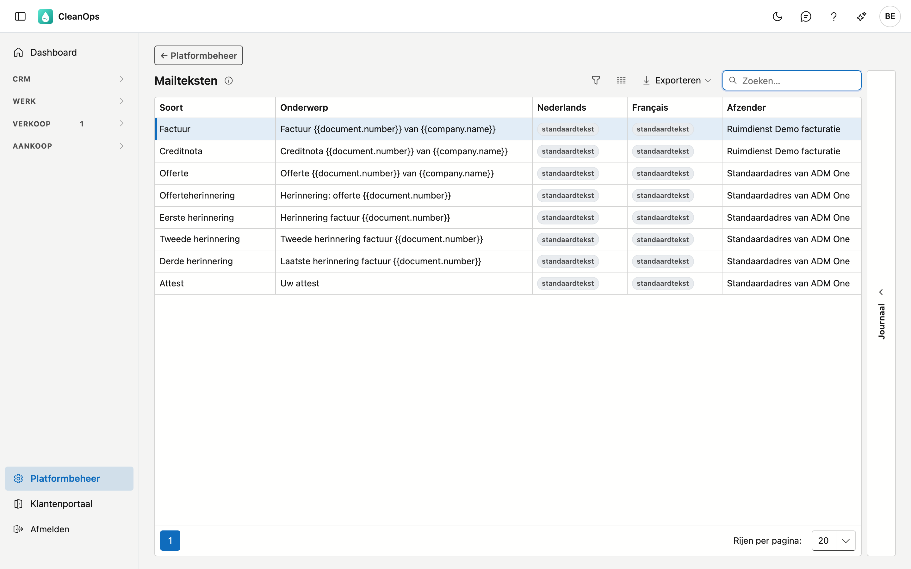
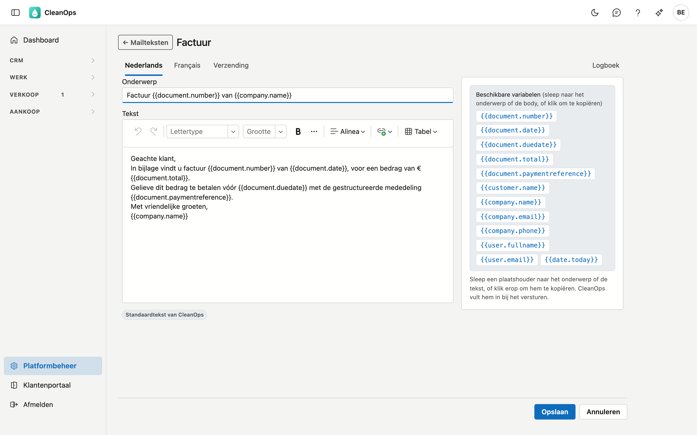

# Mailteksten

Mailteksten zijn het **onderwerp en de tekst van de mails die CleanOps naar uw klanten stuurt**, per soort
document, in het Nederlands en het Frans.

CleanOps gebruikt de teksten **Factuur** en **Creditnota** wanneer u een factuur mailt met **Mailen…** op de
factuur (zie [Facturen](../facturen.md)). De andere soorten worden nog niet gemaild.

## Het scherm openen

Klik onderaan in het menu op **Platformbeheer** en daarna op de tegel **Mailteksten**.

## De lijst

| Kolom | Wat het is |
|---|---|
| Soort | het document waarvoor de tekst dient: factuur, creditnota, offerte, offerteherinnering, rappel 1 tot 3, attest |
| Onderwerp | het onderwerp van de mail, in de taal van het scherm |
| Nederlands, Français | **eigen tekst** als u voor die taal een eigen tekst bewaarde, anders **standaardtekst** |
| Afzender | het adres waarvan de mail vertrekt — zie [Mailafzenders](mailafzenders.md) |

Zonder eigen tekst gebruikt CleanOps zijn **standaardtekst**: een korte, zakelijke mail met het nummer, de datum,
het bedrag en, bij een factuur, de vervaldag en de gestructureerde mededeling. U ziet die tekst voluit zodra u de
soort opent.

## Een mailtekst wijzigen

Dubbelklik op een soort. De fiche heeft een tabblad per taal en het tabblad **Verzending**.

Op het tabblad **Nederlands** of **Français**:

- **Onderwerp** — de onderwerpregel van de mail.
- **Tekst** — de mail zelf, met opmaak: vet, cursief, lijsten. Een afbeelding invoegen kan niet: een
  afbeelding in een mail is een verwijzing die veel ontvangers niet te zien krijgen.
- Onder de tekst ziet u **Standaardtekst van CleanOps** of **Eigen tekst**. **Standaardtekst terugzetten**
  zet de standaardtekst van die taal terug.

Klik op **Opslaan**. Wijkt de tekst af van de standaardtekst, dan wordt ze uw eigen tekst.

### De plaatshouders

Rechts staan de **beschikbare variabelen**. Sleep er een naar het onderwerp of de tekst, of klik erop om ze te
kopiëren. Bij het mailen vult CleanOps ze in met de gegevens van het document. Voor een factuur en een creditnota:

| Variabele | Wordt bij het mailen |
|---|---|
| `{{document.number}}` | het documentnummer, bijvoorbeeld 20260001 |
| `{{document.date}}` | de documentdatum |
| `{{document.duedate}}` | de vervaldag |
| `{{document.total}}` | het totaal inclusief btw, **zonder munt**: 1.234,56 |
| `{{document.paymentreference}}` | de gestructureerde mededeling |
| `{{customer.name}}` | de naam van de klant |
| `{{company.name}}`, `{{company.email}}`, `{{company.phone}}` | de gegevens uit uw [bedrijfsfiche](bedrijfsfiche.md) |
| `{{user.fullname}}`, `{{user.email}}` | de naam en het e-mailadres van wie de mail verstuurt |
| `{{date.today}}` | de datum van vandaag |

!!! tip "Zet de munt zelf in de zin"
    Een bedrag komt zonder munt in de mail. Schrijf dus "€ {{document.total}}" of "{{document.total}} euro".
    Bij een creditnota staat het bedrag zonder minteken: de zin zegt al dat het om een creditnota gaat.

Een variabele die CleanOps voor die soort niet kent, bijvoorbeeld door een tikfout, wordt bij het opslaan
geweigerd. CleanOps noemt ze dan.

### Het tabblad Verzending

| Veld | Wat u invult |
|---|---|
| **Afzender** | het adres waarvan deze mail vertrekt. Leeg: het standaardadres van ADM One. |
| **Cc** | adressen die bij elke mail van deze soort een kopie krijgen, gescheiden door een puntkomma |
| **Bcc** | idem, maar onzichtbaar voor de klant — bijvoorbeeld uw eigen archiefadres |

## Het journaal

Rechts op het scherm zit een strook **Journaal**. Klik een soort in de lijst aan en open de strook: het tabblad
**Logboek** toont wie die tekst wanneer gewijzigd heeft. Op de fiche staat het logboek rechts bovenaan.

## Veelgestelde vragen

**In welke taal vertrekt de mail?**
In de taal van de factuur, en die volgt de klant. Een Franstalige klant krijgt de Franse tekst.

**Ik heb de tekst gewijzigd, maar een mail die ik eerder verstuurde is niet veranderd.**
Dat klopt: een verstuurde mail blijft zoals ze vertrok. Op het tabblad **Mails** van de factuur ziet u ze terug.

**Kan ik een mail nog aanpassen vlak voor het versturen?**
Ja. Het venster **Mailen** toont onderwerp en tekst ingevuld, en u wijzigt ze daar voor die ene mail. De mailtekst
hier blijft dan zoals ze is.

## Zie ook

- [Mailafzenders](mailafzenders.md)
- [Facturen](../facturen.md)
- [Bedrijfsfiche](bedrijfsfiche.md)
