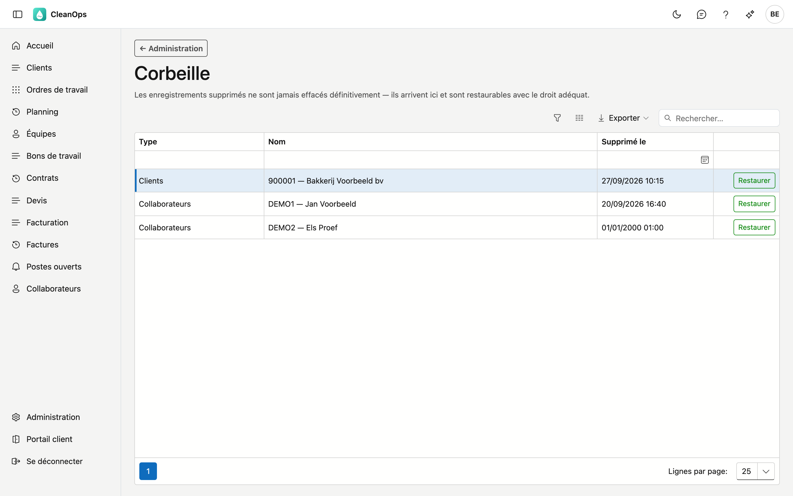

# Corbeille

Ce que vous supprimez dans CleanOps n'est pas détruit mais mis de côté. L'élément arrive dans la corbeille et y reste restaurable. Sur cet écran, vous remettez un enregistrement à sa place.

## Ouvrir l'écran

Dans la barre latérale, cliquez sur **Administration**, puis sur la tuile **Corbeille**.

## Ce qui arrive dans la corbeille

Tout ce que vous supprimez avec le bouton **Supprimer** sur une fiche :

- clients et adresses de clients
- fournisseurs
- collaborateurs
- devis
- contrats
- ordres de travail
- rapports caméra

CleanOps demande d'abord une confirmation et précise que vous retrouverez l'enregistrement dans la corbeille.

Les **données de base** — tarifs, textes de facture, conditions de paiement, codes TVA, tables de base et véhicules —
n'arrivent pas ici. Vous les archivez sur leur propre écran, et c'est là aussi que vous les rétablissez.

## La liste

| Colonne | Ce que vous voyez |
|---|---|
| **Type** | De quel type d'enregistrement il s'agit : Clients, Devis, Ordres de travail… |
| **Nom** | La description à laquelle vous reconnaissez l'enregistrement, p. ex. le numéro et le nom du client. |
| **Supprimé le** | Quand il est arrivé dans la corbeille. Les plus récents figurent en haut. |

Si la date est **01/01/2000**, l'enregistrement a été supprimé dans votre application précédente, qui ne notait pas
quand. Ces enregistrements figurent toujours en bas.

Cherchez dans le champ de recherche en haut, ou filtrez par colonne. Avec **Exporter**, vous enregistrez la liste en
fichier Excel, CSV ou PDF. Si rien n'a été supprimé, la mention **La corbeille est vide.** s'affiche.

## Restaurer un enregistrement

Cliquez en fin de ligne sur **Restaurer**. L'enregistrement est immédiatement remis à sa place et disparaît de la
corbeille. Qui l'a restauré et quand figure dans l'historique de l'enregistrement.

Restaurer requiert le droit **Restaurer des enregistrements**, ainsi que le droit de modifier ce type
d'enregistrement — le même droit qui permet de le supprimer :

| Type | Droit de modification |
|---|---|
| Clients, adresses de clients | Modifier les clients |
| Fournisseurs | Modifier les fournisseurs |
| Collaborateurs | Modifier les collaborateurs |
| Devis | Modifier les devis |
| Contrats | Modifier les contrats |
| Ordres de travail, rapports caméra | Modifier les ordres de travail |

Si ce second droit manque, l'enregistrement reste dans la corbeille et CleanOps indique le droit qui vous manque.

Consulter la corbeille requiert le droit **Voir la corbeille**. Votre administrateur attribue ces droits dans
[Rôles](rollen.fr.md).

## Erreurs fréquentes

!!! warning
    **Restaurez d'abord le client, puis son adresse.** Une adresse de client appartient à la fiche de son client. Si le client lui-même est aussi dans la corbeille, vous ne reverrez l'adresse restaurée qu'après avoir restauré le client.

## Voir aussi

- [Rôles](rollen.fr.md) — les droits pour consulter et restaurer
- [Journal des actions](actielogboek.fr.md) — vérifier qui a supprimé quelque chose
