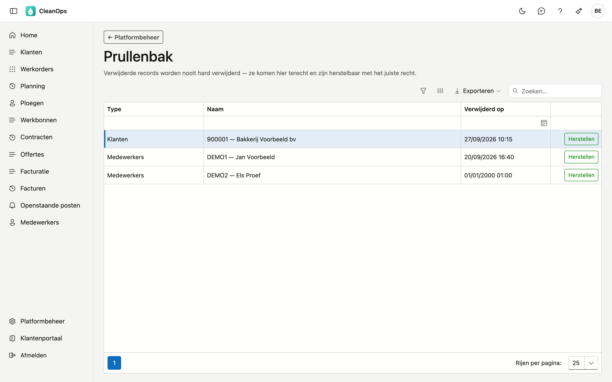

# Prullenbak

Wat u in CleanOps verwijdert, wordt niet vernietigd maar weggelegd. Het komt in de prullenbak terecht en blijft daar herstelbaar. Op dit scherm zet u een record terug op zijn plaats.

## Het scherm openen

Klik in de zijbalk op **Platformbeheer** en daarna op de tegel **Prullenbak**.

## Wat er in de prullenbak komt

Alles wat u verwijdert met de knop **Verwijderen** op een fiche:

- klanten en klantadressen
- medewerkers
- offertes
- contracten
- werkorders

CleanOps vraagt eerst een bevestiging en zegt daarbij dat u het record in de prullenbak terugvindt.

De **stamgegevens** — tarieven, factuurteksten, betalingstermijnen, btw-codes, basistabellen en voertuigen — komen hier
niet terecht. Die archiveert u op hun eigen scherm, en daar haalt u ze ook terug.

## De lijst

| Kolom | Wat u ziet |
|---|---|
| **Type** | Om wat voor record het gaat: Klanten, Offertes, Werkorders … |
| **Naam** | De omschrijving waaraan u het record herkent, bv. het klantnummer en de naam. |
| **Verwijderd op** | Wanneer het in de prullenbak kwam. De jongste staan bovenaan. |

Staat er **01/01/2000**, dan werd het record verwijderd in uw vorige toepassing, die niet bijhield wanneer. Zulke
records staan altijd onderaan.

Zoek in het zoekveld bovenaan, of filter per kolom. Met **Exporteren** bewaart u de lijst als Excel-, CSV- of
PDF-bestand. Is er niets verwijderd, dan staat er **De prullenbak is leeg.**

## Een record herstellen

Klik achteraan de rij op **Herstellen**. Het record staat meteen terug op zijn plaats en verdwijnt uit de prullenbak.
Wie het herstelde en wanneer, staat in het logboek van het record.

Herstellen vraagt het recht **Verwijderde records herstellen**. Kijken in de prullenbak vraagt het recht **Prullenbak
bekijken**. Uw beheerder geeft die rechten bij [Rollen](rollen.md).

## Veelgemaakte fouten

!!! warning
    **Herstel eerst de klant, dan zijn adres.** Een klantadres hoort bij de fiche van zijn klant. Ligt de klant zelf ook in de prullenbak, dan ziet u het herstelde adres pas terug nadat u ook de klant hersteld hebt.

## Zie ook

- [Rollen](rollen.md) — de rechten om te kijken en te herstellen
