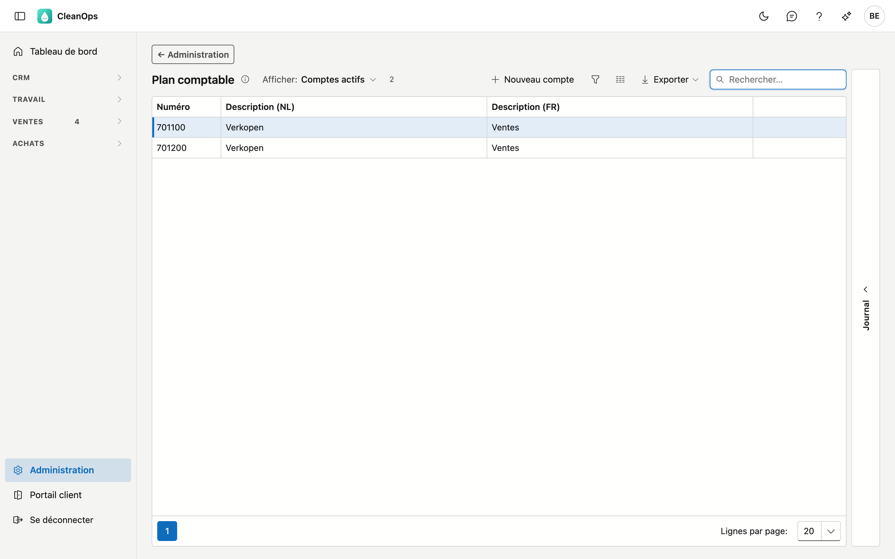
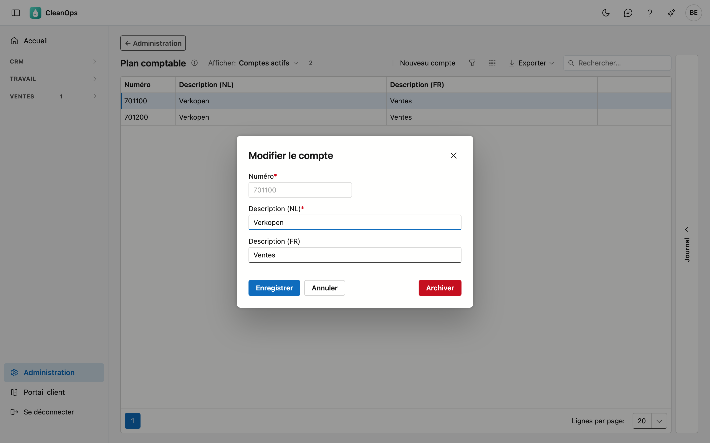
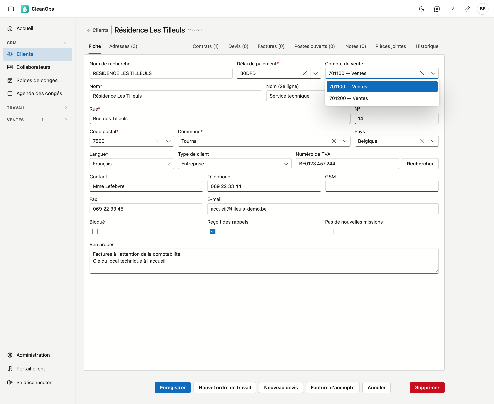

# Plan comptable

Les comptes généraux que vous choisissez sur un client ou un tarif, par exemple *701100 — Ventes*. Le compte est une
donnée pour votre **bureau comptable** : CleanOps ne calcule rien avec.

## Ouvrir l'écran

Cliquez sur **Administration** en bas du menu, puis sur la tuile **Plan comptable**.

## La liste

| Colonne | Ce que c'est |
|---|---|
| Numéro | le numéro du compte, par exemple `701100` |
| Description (NL) | ce que vous voyez à côté du numéro dans les listes de choix |
| Description (FR) | idem pour qui utilise l'application en français |

Un compte que vous avez créé vous-même dans CleanOps porte l'étiquette **propre**. Les autres viennent de votre
application précédente.

## Ajouter ou modifier un compte

Cliquez sur **Nouveau compte**, ou double-cliquez sur une ligne existante.

| Champ | Ce que vous complétez |
|---|---|
| **Numéro** *(obligatoire)* | uniquement des chiffres, 8 au maximum, par exemple `702000`. Figé dès que le compte existe. Un numéro qui existe déjà est refusé — même si ce compte existant est archivé. |
| **Description (NL)** / **(FR)** | 35 caractères au maximum. Celle dans la langue principale de votre entreprise est obligatoire. |

!!! note "Pourquoi le numéro est figé"
    Les clients et les tarifs conservent le **numéro** de leur compte sous forme de texte. Si vous pouviez modifier
    le numéro, ils porteraient un numéro qui ne figure plus dans le plan comptable. Les descriptions, vous pouvez
    toujours les adapter.

La **description française** peut rester vide si votre entreprise travaille uniquement en néerlandais.

## Où vous choisissez le compte

Sur la fiche d'un [client](../klanten.fr.md) et d'un [tarif](tarieven.fr.md), vous choisissez le **compte de vente**
dans cette liste. La liste de choix montre le numéro avec la description, par exemple *701100 — Ventes*.

Si un client porte un numéro qui ne figure pas dans le plan comptable (venant de votre application précédente),
vous le voyez avec la mention *hors plan*. Vous pouvez le laisser et enregistrer la fiche ; si vous
choisissez un autre numéro, celui-ci doit bien figurer dans le plan comptable.

Dans la liste des clients, vous trouvez les clients qui ont un compte donné en tapant le numéro complet dans le
champ de recherche. Avec **Choisir les colonnes**, vous ajoutez la colonne *Compte de vente*.

## Le journal

À droite de l'écran se trouve une bande **Journal**. Sélectionnez un compte dans la liste et ouvrez la bande : le
panneau montre qui l'a créé, modifié, archivé ou rétabli, et quand.

## Archiver ou rétablir un compte

Ouvrez la ligne et utilisez **Archiver**. Le compte disparaît des listes de choix, mais il continue d'exister.

!!! note "Ce qui porte déjà le compte ne remarque rien"
    Les clients et les tarifs qui portent déjà le compte archivé le gardent. Archiver, c'est *ne plus choisir*,
    pas *retirer*.

Vous le voulez à nouveau ? En haut de la liste, réglez **Afficher** sur **Aussi les comptes archivés**, ouvrez le
compte et cliquez sur **Rétablir**.

## Questions fréquentes

**Pourquoi ne puis-je pas supprimer un compte ?**
Parce que des clients et des tarifs portent son numéro. Archiver le retire des listes de choix sans toucher à ce qui
existe déjà.

**CleanOps utilise-t-il le compte lors de la facturation ?**
Non. Il figure sur le client et le tarif comme donnée pour votre bureau comptable, comme dans votre application
précédente.
