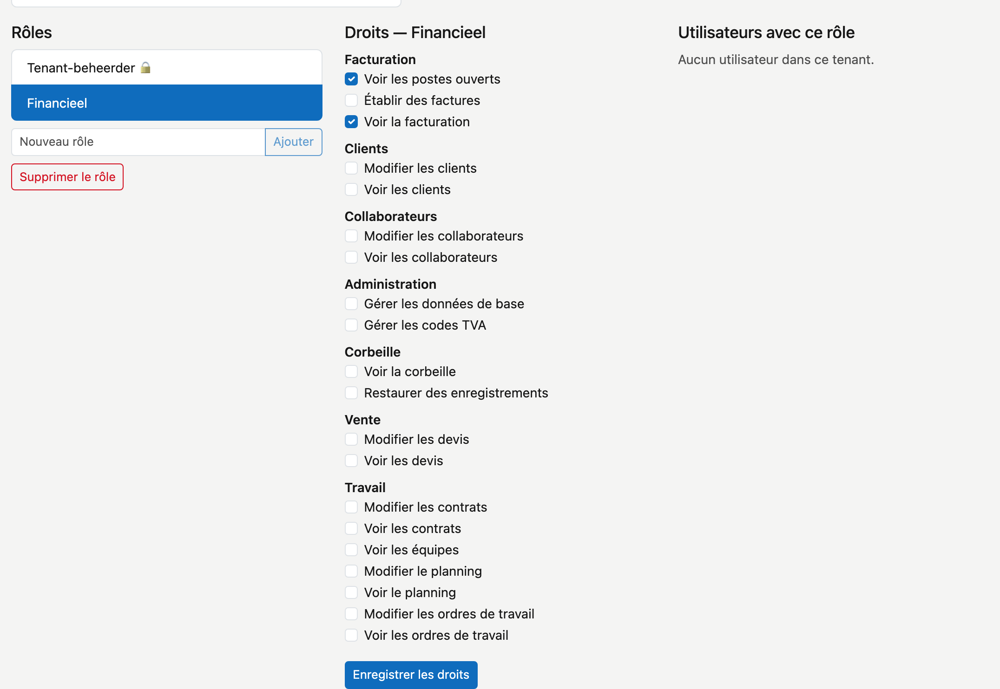

# Rôles

Un rôle est un ensemble de droits. Vous donnez un rôle à quelqu'un plutôt que chaque droit séparément — ainsi, pour un nouveau collègue, vous ne faites qu'un seul choix.

## Ouvrir l'écran

Dans la barre latérale, cliquez sur **Administration**, puis sur la tuile **Rôles**.

À gauche figurent les **Rôles**, au milieu les **Droits** du rôle choisi, à droite les **Utilisateurs avec ce rôle**.

## Comment les droits s'additionnent

Chaque utilisateur a un **rôle de base**, affiché comme étiquette à côté de son nom (p. ex. **Utilisateur**). Ce rôle de
base permet de tout consulter, sauf la partie financière, et ne permet rien modifier.

Les rôles de cet écran s'y **ajoutent**. Une personne avec le rôle de base Utilisateur et le rôle Financieel peut faire
tout ce que les deux permettent. Pour qu'un collègue puisse modifier les clients, créez un rôle avec le droit **Modifier
les clients** et donnez-lui ce rôle.

## Les deux rôles déjà présents

Les noms de ces deux rôles restent en néerlandais : ce sont des données, pas des textes de l'écran.

**Tenant-beheerder 🔒** est l'administrateur de votre environnement. Ce rôle possède automatiquement tous les droits,
y compris ceux qui s'ajouteront plus tard. Vous ne pouvez ni le modifier ni le supprimer. Seul un Tenant-beheerder peut
gérer les rôles : ce droit ne peut être donné à aucun autre rôle. C'est pourquoi vous ne pouvez pas décocher le
**dernier** Tenant-beheerder : CleanOps le refuse et en explique la raison. Donnez d'abord le rôle à une deuxième personne.

**Financieel** est créé d'office pour chaque client. Il porte par défaut deux droits : **Voir la facturation** et
**Voir les postes ouverts**. Celui qui établit aussi des factures a besoin en plus de **Établir des factures** — cochez-le
pour ce rôle, ou créez un rôle distinct.

Vous pouvez adapter le rôle Financieel ; CleanOps ne remplace pas votre choix. Si vous le supprimez, CleanOps le recrée
à la prochaine mise à jour, sans utilisateurs.

## Créer un rôle

Saisissez le nom sous **Nouveau rôle** et cliquez sur **Ajouter**. Le nouveau rôle apparaît dans la liste **Rôles** à
gauche, encore sans droits ni utilisateurs.

## Modifier les droits d'un rôle

Cliquez à gauche sur le rôle. Au milieu figurent les **Droits**, groupés comme le menu : **CRM**, **Travail**, **Ventes** et **Achats**,
plus **Administration** et **Corbeille**. Cochez ce que ce rôle
peut faire et cliquez sur **Enregistrer les droits**. En cas de succès, la mention **✓ enregistré** s'affiche.

## Donner un rôle à quelqu'un

Cliquez à gauche sur le rôle. À droite, sous **Utilisateurs avec ce rôle**, figurent tous les utilisateurs de votre
environnement. Une coche signifie : cette personne porte le rôle.

Cochez une personne pour lui donner le rôle, ou décochez-la pour le lui retirer. C'est enregistré **immédiatement** —
le bouton **Enregistrer les droits** n'est pas nécessaire pour cela.

## Supprimer un rôle

Cliquez à gauche sur le rôle, puis sur **Supprimer le rôle**. CleanOps demande d'abord une confirmation : la suppression est définitive. Celui qui
portait le rôle perd les droits qu'il n'avait que par ce rôle. Donnez donc d'abord un autre rôle à ces personnes.

## Ce que fait un droit

Un droit que vous **décochez** masque l'écran **et** le bloque. L'entrée de menu disparaît, et celui qui saisit l'adresse directement n'entre pas davantage. Vous ne devez donc pas raisonner séparément en « visible » et « accessible » : c'est un seul et même réglage.

## Erreurs fréquentes

!!! info
    **Un rôle ajouté ou retiré s'applique à la prochaine connexion.** Une personne en train de travailler ne le remarquera qu'après s'être déconnectée et reconnectée. Demandez-le-lui si c'est urgent.

## Voir aussi

- [Administration](../platformbeheer.fr.md) — les autres tuiles de gestion
