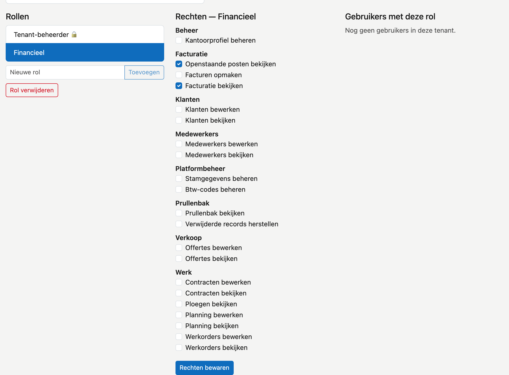

# Rollen

Een rol is een bundel rechten. U geeft iemand een rol in plaats van elk recht apart — zo hoeft u bij een nieuwe collega maar één keuze te maken.

## Het scherm openen

Klik in de zijbalk op **Platformbeheer** en daarna op de tegel **Rollen**.

Links staan de **Rollen**, in het midden de **Rechten** van de gekozen rol, rechts de **Gebruikers met deze rol**.

## Hoe rechten optellen

Elke gebruiker heeft een **basisrol**, die u als label naast de naam ziet (bv. **Gebruiker**). Die basisrol laat alles
bekijken, behalve de financiële onderdelen, en laat niets wijzigen.

De rollen op dit scherm komen daar **bovenop**. Iemand met de basisrol Gebruiker én de rol Financieel mag alles wat
beide toelaten. Wilt u een collega klanten laten bewerken, maak dan een rol met het recht **Klanten bewerken** en geef
hem die rol.

## De twee rollen die er al staan

**Tenant-beheerder 🔒** is de beheerder van uw omgeving. Deze rol heeft automatisch álle rechten, ook de rechten die er
later bij komen. U kunt ze niet bewerken en niet verwijderen. Enkel een Tenant-beheerder kan rollen beheren: dat recht
kunt u aan geen andere rol geven. Daarom kunt u de **laatste** Tenant-beheerder niet uitvinken: CleanOps weigert dat en
zegt waarom. Geef eerst een tweede persoon de rol.

**Financieel** krijgt elke klant vanzelf. Ze draagt standaard twee rechten: **Facturatie bekijken** en **Openstaande
posten bekijken**. Wie ook facturen maakt, heeft daarnaast **Facturen opmaken** nodig — vink dat aan bij deze rol, of
maak er een aparte rol voor.

U mag de rol Financieel aanpassen; CleanOps overschrijft uw keuze niet. Verwijdert u ze, dan maakt CleanOps ze bij de
volgende update opnieuw aan, zonder gebruikers.

## Een rol aanmaken

Typ de naam bij **Nieuwe rol** en klik op **Toevoegen**. De nieuwe rol verschijnt in de lijst **Rollen** links, nog
zonder rechten en zonder gebruikers.

## De rechten van een rol wijzigen

Klik links op de rol. In het midden staan de **Rechten**, gegroepeerd zoals het menu: **CRM**, **Werk**, **Verkoop** en **Aankoop**,
plus **Platformbeheer** en **Prullenbak**. Vink aan wat deze rol
mag en klik op **Rechten bewaren**. Bij een geslaagde bewaring verschijnt **✓ bewaard**.

## Een rol aan iemand geven

Klik links op de rol. Rechts, onder **Gebruikers met deze rol**, staan alle gebruikers van uw omgeving. Een vinkje
betekent: deze persoon draagt de rol.

Vink iemand aan om de rol te geven, of uit om ze af te nemen. Dat wordt **meteen** bewaard — de knop **Rechten
bewaren** is daarvoor niet nodig.

## Een rol verwijderen

Klik links op de rol en daarna op **Rol verwijderen**. CleanOps vraagt eerst een bevestiging: verwijderen is definitief. Wie de rol droeg, verliest
de rechten die hij enkel via deze rol had. Geef die personen dus eerst een andere rol.

## Wat een recht doet

Een recht dat u **uitvinkt**, verbergt het scherm én blokkeert het. De menu-ingang verdwijnt, en wie het adres rechtstreeks intypt komt er evenmin binnen. U hoeft dus niet apart na te denken over "zichtbaar" en "toegankelijk" — dat is één en dezelfde instelling.

## Veelgemaakte fouten

!!! info
    **Een nieuwe of afgenomen rol geldt vanaf de volgende aanmelding.** Iemand die op dit moment werkt, merkt het pas nadat hij zich afmeldt en opnieuw aanmeldt. Vraag de persoon dat te doen wanneer het dringend is.

## Zie ook

- [Platformbeheer](../platformbeheer.md) — de andere beheertegels
