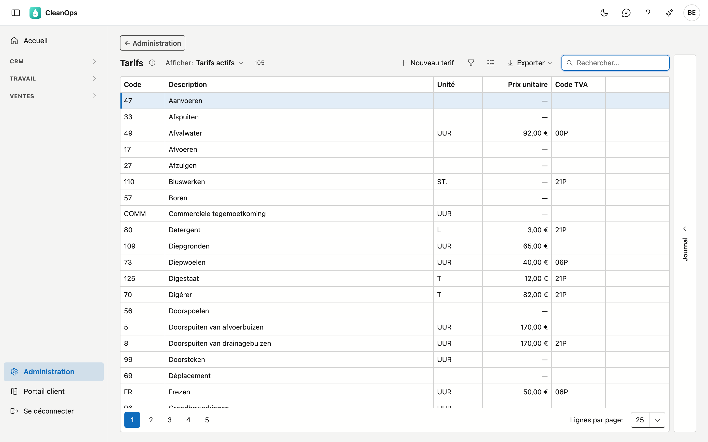
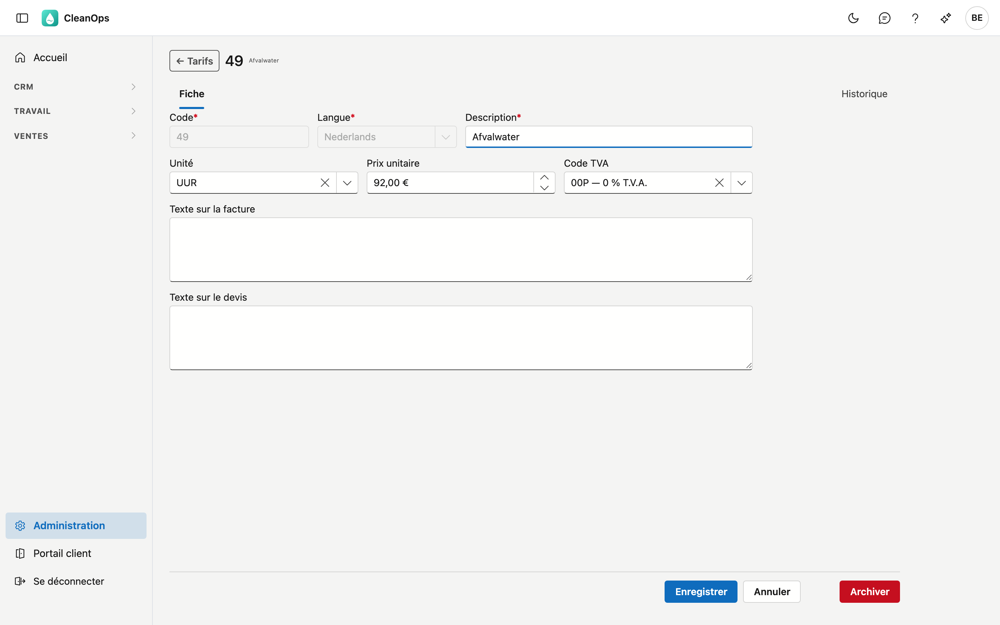
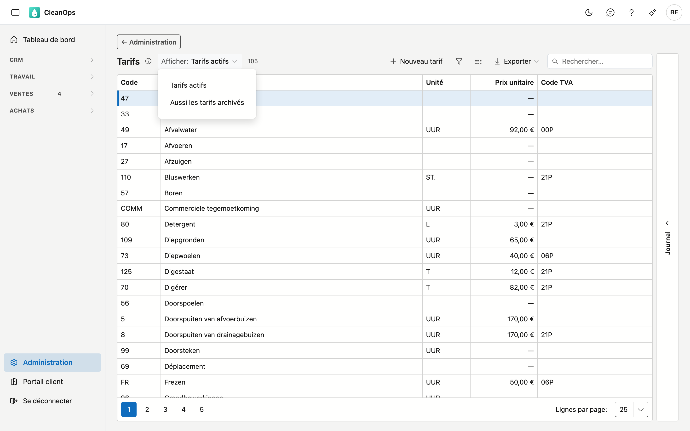
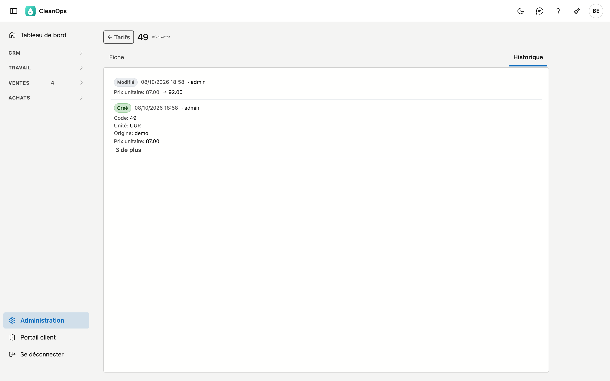

# Tarifs

Vos codes de facturation : chaque tarif porte une description, une unité, un prix unitaire et un code TVA.
Si vous choisissez un tarif sur une ligne de devis, il complète ces champs pour vous. Sur cet écran, vous créez
des tarifs, vous les modifiez et vous les archivez.

## Ouvrir l'écran

Cliquez sur **Administration** en bas du menu, puis sur la tuile **Tarifs**. Le curseur se trouve directement
dans le champ de recherche : tapez un code ou une partie de la description.

## La liste

| Colonne | Ce que c'est |
|---|---|
| Code | la clé courte avec laquelle vous choisissez le tarif, par exemple `121` |
| Description | le texte qui figure sur la ligne de devis ou de facture |
| Unité | ce en quoi vous comptez : heure, pièce, tonne, m³ … |
| Prix unitaire | le prix par unité |
| Code TVA | le code TVA repris par défaut |

En haut se trouve un compteur, par exemple **105 sur 114** : combien de tarifs vous voyez, et combien il y en
a au total. Un tarif que vous avez créé vous-même porte l'étiquette **propre**.

!!! warning "Un tiret à la place du prix n'est pas la même chose que gratuit"
    Si un **—** figure à la place d'un montant, aucun prix n'est encodé. Cela signifie *à compléter*, et non
    *gratuit*. Vous complétez alors le prix sur la ligne de devis elle-même.

    C'est le cas pour environ deux tiers des tarifs. C'est normal : de nombreux travaux sont chiffrés par
    dossier.

## Modifier ou créer un tarif

**Double-cliquez** sur un tarif dans la liste, ou cliquez sur **Nouveau tarif**. La fiche du tarif s'ouvre.

| Champ | Ce que vous encodez |
|---|---|
| **Code** *(obligatoire)* | 5 caractères au maximum. Fixé dès que le tarif est enregistré. |
| **Langue** *(obligatoire)* | Nederlands ou Français. Le même code peut exister une fois dans chaque langue. Fixée dès que le tarif est enregistré. |
| **Description** *(obligatoire)* | 35 caractères au maximum ; figure sur la ligne de devis ou de facture. |
| **Unité** | un choix parmi les [unités](eenheden.fr.md) de l'Administration (UUR, T, M3 …). |
| **Prix unitaire** | jamais négatif. Laissez-le à zéro si le prix est fixé par dossier. |
| **Code TVA** | un choix parmi vos codes TVA ; peut rester vide. |
| **Compte de vente** | le compte général pour votre bureau comptable, choisi dans le [plan comptable](rekeningplan.fr.md) ; peut rester vide. |
| **Texte sur la facture** | quand vous choisissez ce tarif sur un ordre de travail, il s'ajoute à sa remarque de facturation, et donc à la facture — c'est ce que lit le client. |
| **Texte sur le devis** | s'ajoute au texte de la ligne de devis quand vous choisissez ce tarif — le client le lit aussi. |

Cliquez sur **Enregistrer**. Après la création d'un nouveau tarif, sa fiche s'ouvre automatiquement.

## Archiver ou rétablir un tarif

En bas à droite de la fiche se trouve **Archiver**. Un tarif archivé disparaît des listes de choix, mais il
subsiste : des ordres de travail, devis et factures plus anciens portent encore le code.

Vous le voulez de retour ? En haut de la liste, mettez **Afficher** sur **Aussi les tarifs archivés**, ouvrez le
tarif et cliquez sur **Rétablir**.

## Utiliser un tarif sur un devis

Sur une ligne de devis, vous choisissez un tarif. CleanOps complète alors la description, l'unité, le prix, le
code TVA et le texte sur le devis. Sur un ordre de travail, le texte sur la facture s'ajoute à la remarque de
facturation.

Ces champs restent ensuite **librement modifiables**. Le prix du tarif est une valeur de départ : si vous
l'adaptez sur la ligne, rien ne change au tarif lui-même, ni aux autres devis.

## L'historique

La fiche d'un tarif porte l'onglet **Historique**. Il montre ce qui a été modifié sur ce tarif, quand, par qui —
et de quelle valeur vers quelle autre.

Vous le voyez aussi sans ouvrir la fiche : sélectionnez un tarif dans la liste et ouvrez à droite le volet
**Journal**. Si vous choisissez un autre tarif, le journal suit.

## Erreurs fréquentes

!!! warning
    **Créer un tarif avec le même code qu'un tarif archivé.** C'est impossible : le code existe toujours,
    simplement archivé. Rétablissez l'ancien tarif et adaptez-le, au lieu d'en créer un nouveau.

!!! warning
    **Mettre un prix à zéro pour marquer un travail comme gratuit.** Zéro signifie *à compléter*. Un travail
    gratuit s'indique sur la ligne de devis elle-même.

## Questions fréquentes

**Je ne retrouve pas un tarif que nous utilisions auparavant.**
Mettez **Afficher** sur *Aussi les tarifs archivés*. Il a probablement été archivé ; il subsiste pour les
documents plus anciens qui y renvoient.

**Le prix sur mon devis ne correspond pas à ce qui figure ici.**
C'est possible : le prix du tarif est une valeur de départ et peut être adapté sur la ligne. Regardez dans
l'historique du tarif s'il a lui-même été modifié entre-temps.

**Il me manque une unité dans la liste de choix.**
Ajoutez-la dans Administration → [Unités](eenheden.fr.md). Une unité archivée n'y figure plus ; rétablissez-la
là.

## Voir aussi

- [Codes TVA](btw-codes.fr.md) — les codes TVA que vous choisissez sur un tarif
- [Administration](../platformbeheer.fr.md) — tous les écrans d'administration
