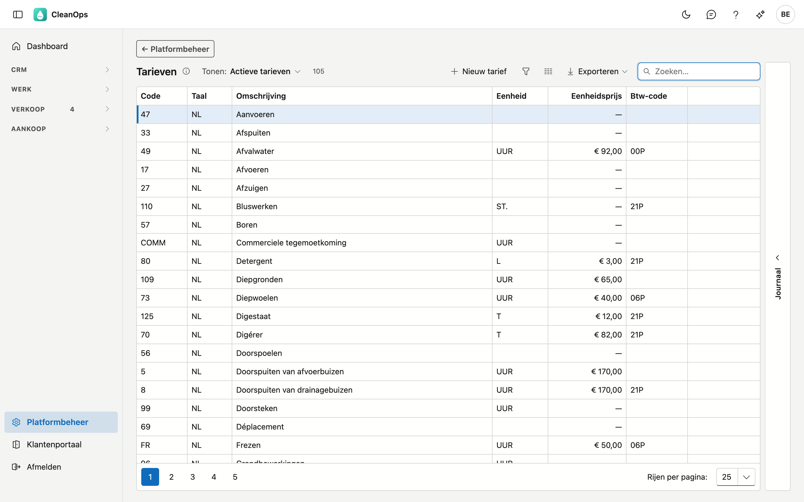
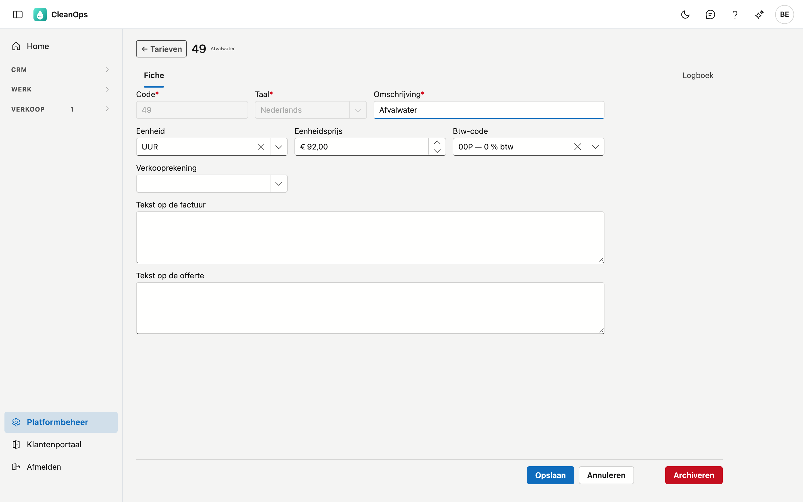
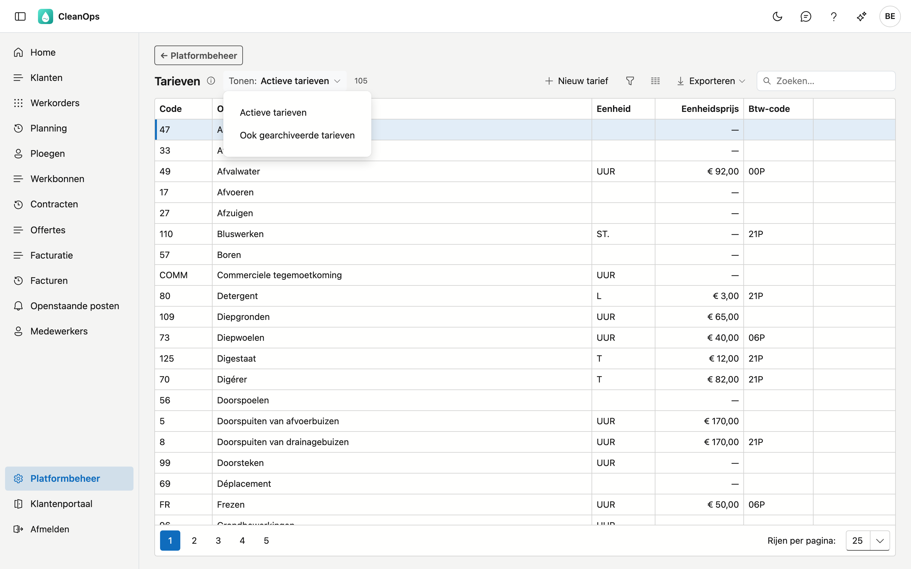
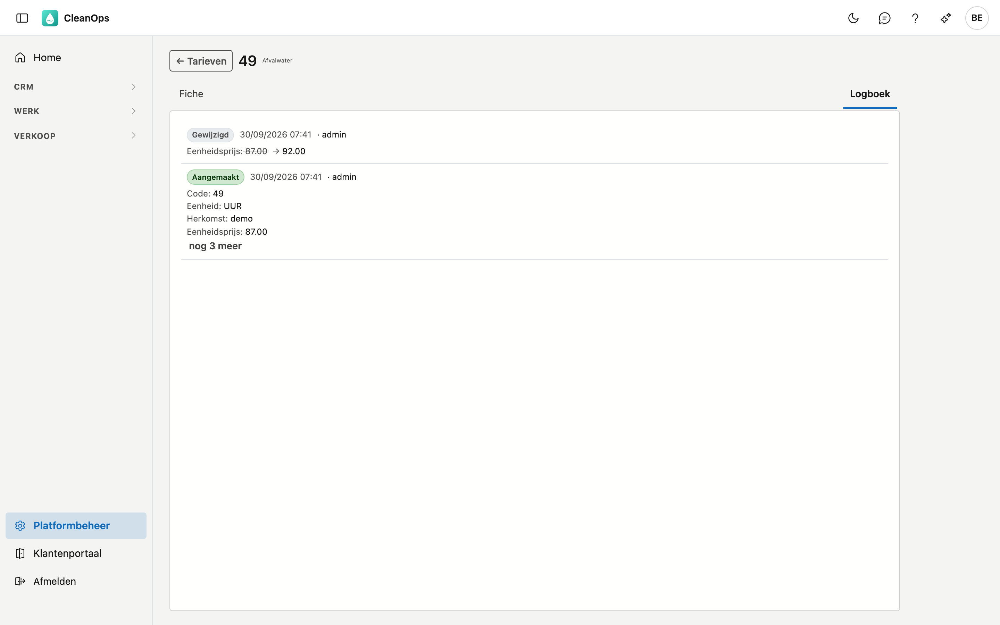

# Tarieven

Uw facturatiecodes: elk tarief draagt een omschrijving, een eenheid, een eenheidsprijs en een btw-code.
Kiest u een tarief op een offertelijn, dan vult het die velden voor u in. Op dit scherm maakt u tarieven aan,
past u ze aan en archiveert u ze.

## Het scherm openen

Klik onderaan in het menu op **Platformbeheer** en daarna op de tegel **Tarieven**. De cursor staat meteen in
het zoekveld: typ een code of een deel van de omschrijving.

## De lijst

| Kolom | Wat het is |
|---|---|
| Code | de korte sleutel waarmee u het tarief kiest, bijvoorbeeld `121` |
| Taal | **NL** of **FR**: een tarief bestaat per taal, en een werkorder kiest het in de taal van de klant |
| Omschrijving | de tekst die op de offerte- of factuurlijn komt |
| Eenheid | waarin u rekent: uur, stuk, ton, m³ … |
| Eenheidsprijs | de prijs per eenheid |
| Btw-code | de btw-code die standaard meekomt |
| Verkooprekening | de algemene rekening voor het boekhoudkantoor — standaard verborgen: zet ze aan via **Kolommen kiezen** |

Bovenaan staat een teller, bijvoorbeeld **105 van 114**: hoeveel tarieven u nu ziet, en hoeveel er in
totaal zijn. Een tarief dat u zelf aanmaakte, draagt het label **eigen**.

!!! warning "Een streepje bij de prijs is niet hetzelfde als gratis"
    Staat er een **—** in plaats van een bedrag, dan is er geen prijs ingevuld. Dat betekent *nog in te
    vullen*, niet *gratis*. U vult de prijs dan op de offertelijn zelf in.

    Bij ongeveer twee derde van de tarieven is dat zo. Dat is normaal: veel werken worden per dossier
    geprijsd.

## Een tarief bewerken of aanmaken

**Dubbelklik** op een tarief in de lijst, of klik op **Nieuw tarief**. De fiche van het tarief opent.

| Veld | Wat u invult |
|---|---|
| **Code** *(verplicht)* | maximaal 5 tekens, in hoofdletters bewaard. Ligt vast zodra het tarief bewaard is. Een code die enkel in hoofdletters verschilt van een bestaande in dezelfde taal (`rv1` naast `RV1`), wordt geweigerd. |
| **Taal** *(verplicht)* | Nederlands of Français. Dezelfde code kan in elke taal één keer bestaan. Ligt vast zodra het tarief bewaard is. |
| **Omschrijving** *(verplicht)* | maximaal 35 tekens; komt op de offerte- of factuurlijn. |
| **Eenheid** | een keuze uit de [eenheden](eenheden.md) van Platformbeheer (UUR, T, M3 …). |
| **Eenheidsprijs** | niet negatief. Laat ze op nul als de prijs per dossier bepaald wordt. |
| **Btw-code** | een keuze uit uw btw-codes; mag leeg blijven. |
| **Verkooprekening** | de algemene rekening voor uw boekhoudkantoor, gekozen uit het [rekeningplan](rekeningplan.md); mag leeg blijven. |
| **Tekst op de factuur** | komt bij het kiezen van dit tarief op een werkorder in haar factuuropmerking, en zo op de factuur — die leest de klant. |
| **Tekst op de offerte** | komt bij het kiezen van dit tarief in de tekst van de offertelijn — ook die leest de klant. |

Klik op **Bewaren**. Na het aanmaken van een nieuw tarief opent zijn fiche vanzelf.

## Een tarief archiveren of terughalen

Op de fiche staat onderaan rechts **Archiveren**. Een gearchiveerd tarief verdwijnt uit de keuzelijsten, maar het
blijft bestaan: oudere werkorders, offertes en facturen dragen de code nog.

Wilt u het terug? Zet bovenaan de lijst **Tonen** op **Ook gearchiveerde tarieven**, open het tarief en klik op
**Terughalen**.

## Een tarief op een offerte gebruiken

Op een offertelijn kiest u een tarief. CleanOps vult dan de omschrijving, de eenheid, de prijs, de btw-code en
de tekst op de offerte in. Op een werkorder komt de tekst op de factuur in de factuuropmerking.

Die velden blijven daarna **vrij aanpasbaar**. De prijs uit het tarief is een startwaarde: past u ze op de
lijn aan, dan verandert er niets aan het tarief zelf, en ook niet aan andere offertes.

## Het logboek

Op de fiche van een tarief staat het tabblad **Logboek**. Het toont wat er aan dat tarief gewijzigd is,
wanneer, door wie — en van welke waarde naar welke.

Hetzelfde ziet u zonder de fiche te openen: klik een tarief in de lijst aan en open rechts de strook
**Journaal**. Kiest u een ander tarief, dan volgt het journaal mee.

## Veelgemaakte fouten

!!! warning
    **Een tarief met dezelfde code aanmaken als een gearchiveerd tarief.** Dat kan niet: de code bestaat nog, alleen
    gearchiveerd. Haal het oude tarief terug en pas het aan, in plaats van een nieuw te maken.

!!! warning
    **Een prijs op nul zetten om een werk als gratis te markeren.** Nul betekent *nog in te vullen*. Een gratis
    werk geeft u op de offertelijn zelf aan.

## Veelgestelde vragen

**Ik vind een tarief niet terug dat we vroeger gebruikten.**
Zet **Tonen** op *Ook gearchiveerde tarieven*. Waarschijnlijk is het gearchiveerd; het blijft bestaan voor de
oudere documenten die ernaar verwijzen.

**De prijs op mijn offerte klopt niet met wat hier staat.**
Dat kan kloppen: de prijs uit het tarief is een startwaarde en mag op de lijn aangepast worden. Kijk in
het logboek van het tarief of het zelf tussentijds gewijzigd is.

**Ik mis een eenheid in de keuzelijst.**
Voeg ze toe in Platformbeheer → [Eenheden](eenheden.md). Een gearchiveerde eenheid staat er niet meer in; haal ze
daar terug.

## Zie ook

- [Btw-codes](btw-codes.md) — de btw-codes die u op een tarief kiest
- [Platformbeheer](../platformbeheer.md) — alle beheerschermen
