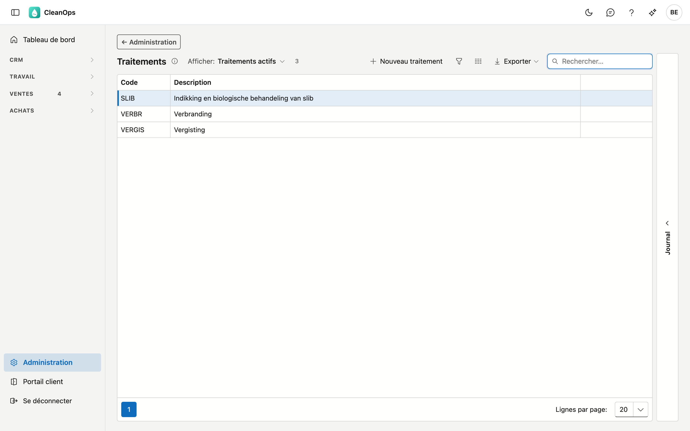
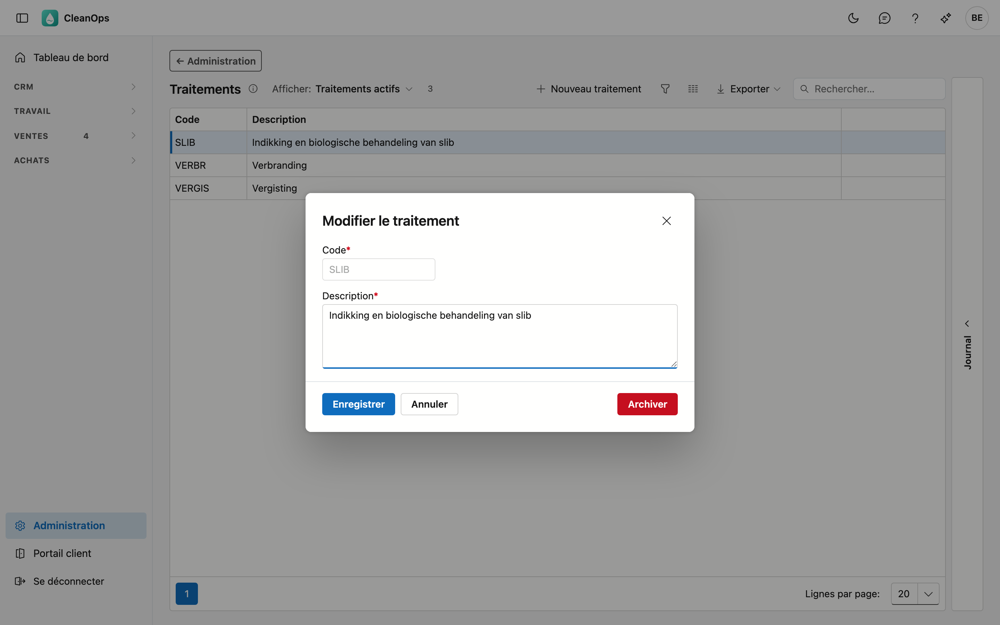

# Traitements

La façon dont le déchet est traité : incinération, biométhanisation, un code R… Vous choisissez le traitement sur une
[attestation de traitement](../attesten.fr.md) ; sa description complète figure sur l'attestation.

## Ouvrir l'écran

En bas du menu, cliquez sur **Administration** puis sur la tuile **Traitements**.

## La liste

| Colonne | Ce que c'est |
|---|---|
| Code | la clé courte, par exemple *VERBR* ou *R12*. |
| Description | ce qui figure sur l'attestation. |

Avec **Afficher**, vous voyez aussi les traitements archivés. Un traitement que vous avez créé vous-même dans CleanOps
porte l'étiquette **propre**.

## Ajouter ou modifier un traitement

Cliquez sur **Nouveau traitement**, ou double-cliquez sur une ligne existante.

| Champ | Ce que vous indiquez |
|---|---|
| **Code** *(obligatoire)* | 6 caractères au plus. Un code n'existe qu'une fois, aussi en d'autres majuscules et aussi si l'existant est archivé. Il est fixé dès que le traitement existe. |
| **Description** *(obligatoire)* | 500 caractères au plus, sur plusieurs lignes. La liste de choix de l'attestation montre le code avec la première ligne ; l'attestation imprime la description complète. |

!!! note "Pourquoi le code est fixé"
    Vos attestations gardent le traitement qu'elles ont choisi. Vous pouvez toujours adapter la description ; un
    nouveau code se crée comme nouveau traitement.

## Archiver ou rétablir

Ouvrez le traitement et cliquez sur **Archiver** : il disparaît de la liste de choix, mais les anciennes attestations le
gardent. **Rétablir** le rend à nouveau sélectionnable.

## Le journal

Sélectionnez un traitement et ouvrez la bande **Journal** à droite : qui l'a créé, modifié, archivé ou rétabli.

## Voir aussi

- [Attestations](../attesten.fr.md)
- [Produits (attestations)](attest-producten.fr.md) et [Entreprises de traitement](verwerkingsbedrijven.fr.md)
