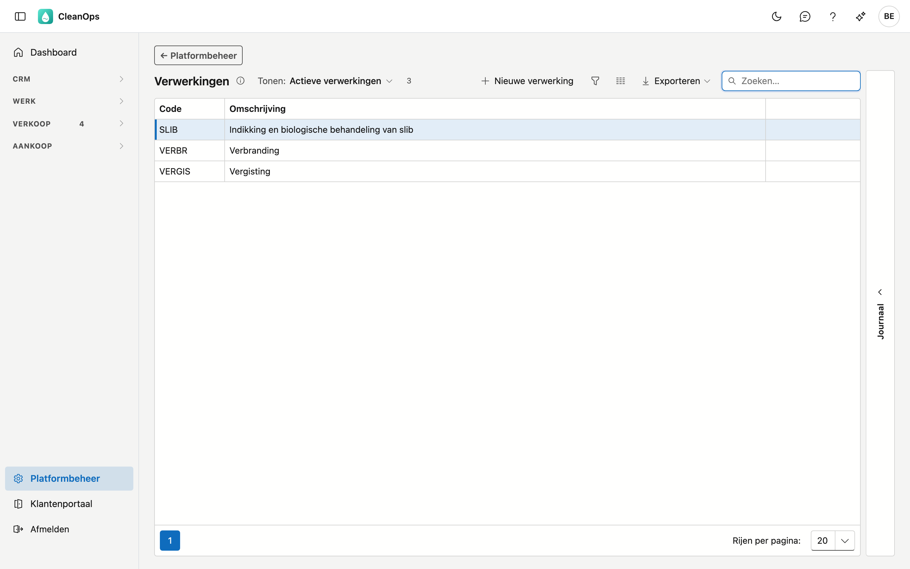
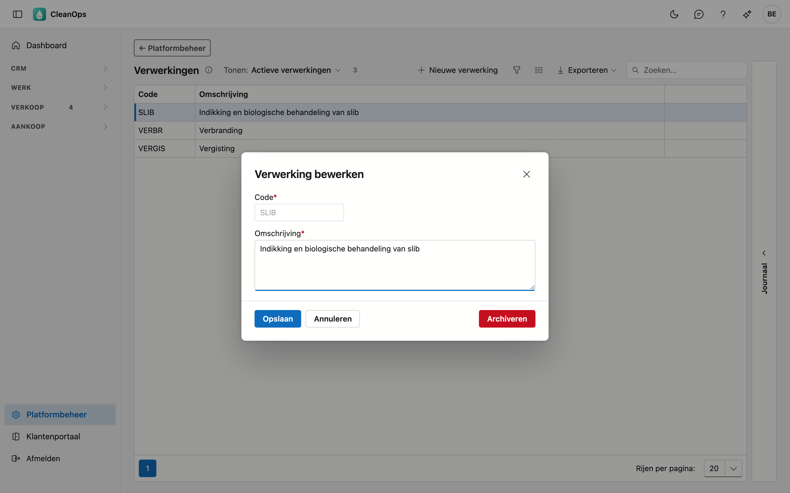

# Verwerkingen

Hoe het afval verwerkt wordt: verbranding, vergisting, een R-code… U kiest de verwerking op een
[verwerkingsattest](../attesten.md); haar volledige omschrijving staat op het attest.

## Het scherm openen

Klik onderaan in het menu op **Platformbeheer** en daarna op de tegel **Verwerkingen**.

## De lijst

| Kolom | Wat het is |
|---|---|
| Code | de korte sleutel, bijvoorbeeld *VERBR* of *R12*. |
| Omschrijving | wat op het attest staat. |

Met **Tonen** ziet u ook de gearchiveerde verwerkingen. Een verwerking die u zelf in CleanOps aangemaakt hebt, draagt het
label **eigen**.

## Een verwerking toevoegen of wijzigen

Klik op **Nieuwe verwerking**, of dubbelklik op een bestaande rij.

| Veld | Wat u invult |
|---|---|
| **Code** *(verplicht)* | maximaal 6 tekens. Een code bestaat maar één keer, ook in andere hoofdletters en ook als de bestaande gearchiveerd is. Ligt vast zodra de verwerking bestaat. |
| **Omschrijving** *(verplicht)* | maximaal 500 tekens, op meerdere regels. De keuzelijst op het attest toont de code met de eerste regel; het attest drukt de volledige omschrijving. |

!!! note "Waarom de code vastligt"
    Uw attesten bewaren de verwerking die ze kozen. De omschrijving kunt u altijd aanpassen; een nieuwe code maakt u
    als nieuwe verwerking.

## Archiveren of terughalen

Open de verwerking en klik op **Archiveren**: ze verdwijnt uit de keuzelijst, maar oude attesten houden haar.
**Terughalen** maakt ze weer kiesbaar.

## Het journaal

Klik een verwerking aan en open rechts de strook **Journaal**: wie ze aanmaakte, wijzigde, archiveerde of terughaalde.

## Zie ook

- [Attesten](../attesten.md)
- [Producten (attesten)](attest-producten.md) en [Verwerkingsbedrijven](verwerkingsbedrijven.md)
