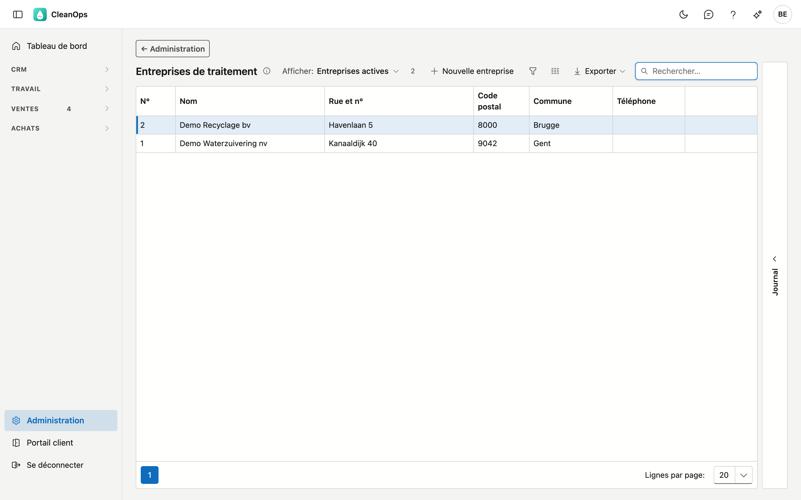
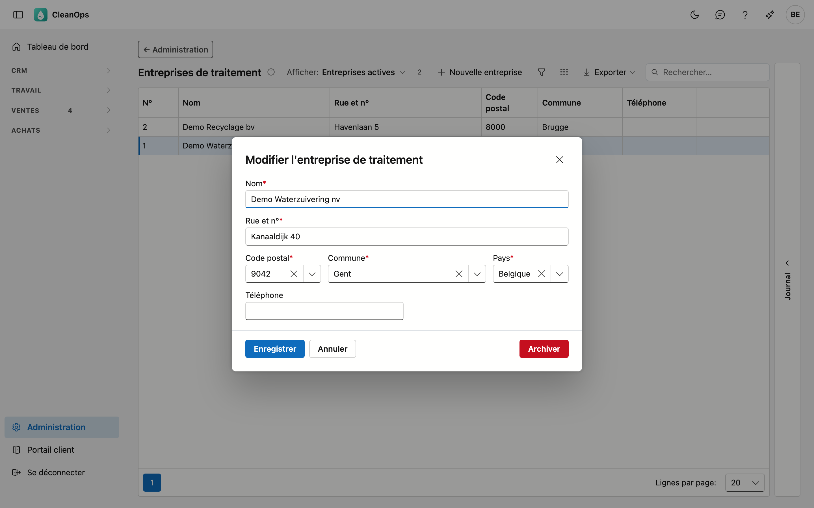

# Entreprises de traitement

Les entreprises agréées qui traitent le déchet. Vous choisissez l'entreprise de traitement sur une
[attestation de traitement](../attesten.fr.md) ; son nom et son adresse figurent sur l'attestation.

## Ouvrir l'écran

En bas du menu, cliquez sur **Administration** puis sur la tuile **Entreprises de traitement**.

## La liste

La liste montre le numéro d'ordre (**N°**, que CleanOps donne automatiquement), le nom, l'adresse et le numéro de
téléphone. Avec **Afficher**, vous voyez aussi les entreprises archivées. Une entreprise que vous avez créée vous-même
dans CleanOps porte l'étiquette **propre**.

## Ajouter ou modifier une entreprise de traitement

Cliquez sur **Nouvelle entreprise**, ou double-cliquez sur une ligne existante.

| Champ | Ce que vous indiquez |
|---|---|
| **Nom** *(obligatoire)* | 35 caractères au plus. |
| **Rue et n°** *(obligatoire)* | 35 caractères au plus. |
| **Code postal**, **Commune** *(obligatoire)* | après le code postal, Commune propose les localités de ce code ; vous pouvez aussi taper vous-même. |
| **Pays** *(obligatoire)* | la Belgique par défaut. |
| **Téléphone** | un numéro de téléphone valide, ou vide. |

## Archiver ou rétablir

Ouvrez l'entreprise et cliquez sur **Archiver** : elle disparaît de la liste de choix, mais les anciennes attestations la
gardent. **Rétablir** la rend à nouveau sélectionnable.

## Le journal

Sélectionnez une entreprise et ouvrez la bande **Journal** à droite : qui l'a créée, modifiée, archivée ou rétablie.

## Voir aussi

- [Attestations](../attesten.fr.md)
- [Produits (attestations)](attest-producten.fr.md) et [Traitements](verwerkingen.fr.md)
