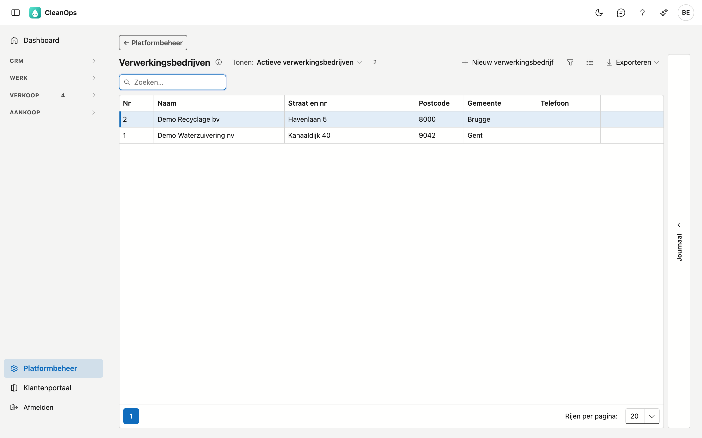
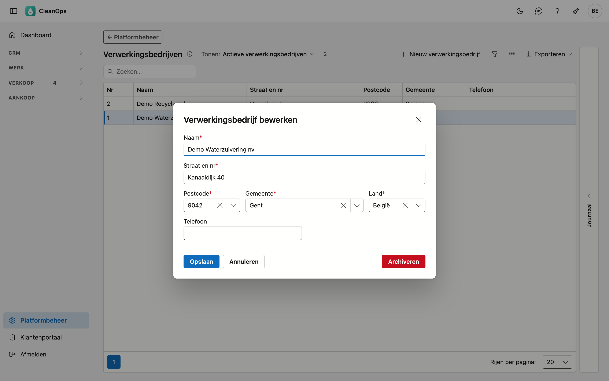

# Verwerkingsbedrijven

De erkende bedrijven die het afval verwerken. U kiest het verwerkingsbedrijf op een [verwerkingsattest](../attesten.md);
zijn naam en adres staan op het attest.

## Het scherm openen

Klik onderaan in het menu op **Platformbeheer** en daarna op de tegel **Verwerkingsbedrijven**.

## De lijst

De lijst toont het volgnummer (**Nr**, dat CleanOps vanzelf geeft), de naam, het adres en het telefoonnummer. Met
**Tonen** ziet u ook de gearchiveerde bedrijven. Een bedrijf dat u zelf in CleanOps aangemaakt hebt, draagt het label
**eigen**.

## Een verwerkingsbedrijf toevoegen of wijzigen

Klik op **Nieuw verwerkingsbedrijf**, of dubbelklik op een bestaande rij.

| Veld | Wat u invult |
|---|---|
| **Naam** *(verplicht)* | maximaal 35 tekens. |
| **Straat en nr** *(verplicht)* | maximaal 35 tekens. |
| **Postcode**, **Gemeente** *(verplicht)* | na de postcode biedt Gemeente de plaatsen van die postcode aan; u mag ook zelf typen. |
| **Land** *(verplicht)* | standaard België. |
| **Telefoon** | een geldig telefoonnummer, of leeg. |

## Archiveren of terughalen

Open het bedrijf en klik op **Archiveren**: het verdwijnt uit de keuzelijst, maar oude attesten houden het.
**Terughalen** maakt het weer kiesbaar.

## Het journaal

Klik een bedrijf aan en open rechts de strook **Journaal**: wie het aanmaakte, wijzigde, archiveerde of terughaalde.

## Zie ook

- [Attesten](../attesten.md)
- [Producten (attesten)](attest-producten.md) en [Verwerkingen](verwerkingen.md)
