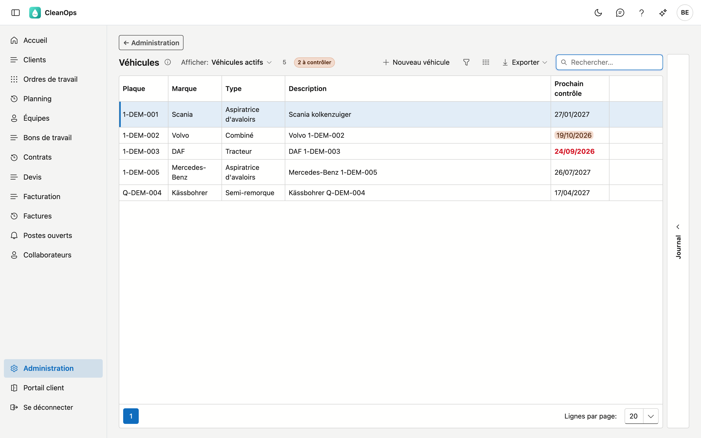
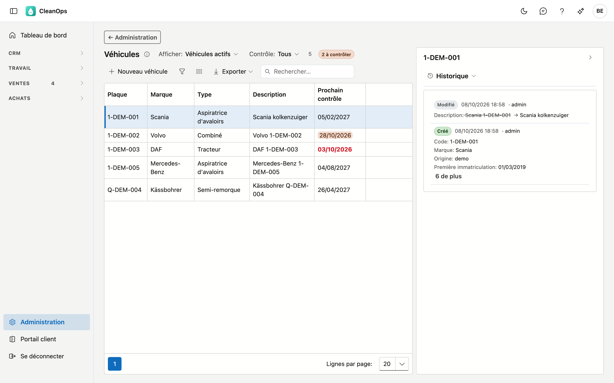
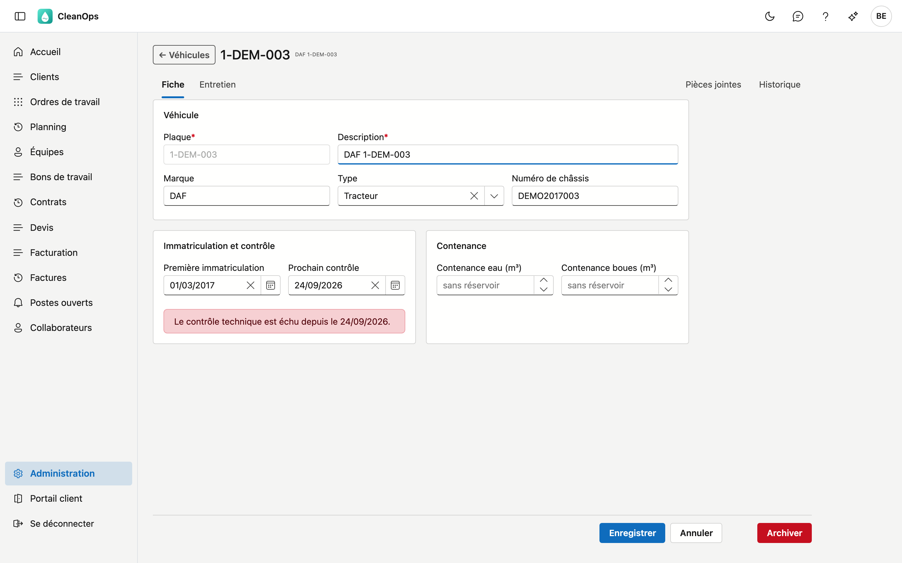
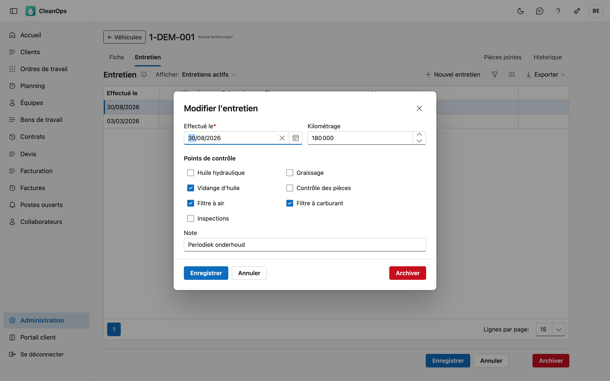

# Véhicules

Vous trouvez ici **votre parc** : pour chaque véhicule la plaque, la marque, le type, la contenance,
l'entretien, les pièces jointes et un rappel pour le contrôle technique.

## Ouvrir l'écran

Cliquez en bas du menu sur **Administration**, puis sur la tuile **Véhicules**. Le curseur est directement dans
le champ de recherche : tapez une plaque, une marque, un type ou une partie de la description.

## La liste

| Colonne | Ce que c'est |
|---|---|
| Plaque | la plaque d'immatriculation ; c'est la clé à laquelle renvoient les ordres et les bons de travail |
| Marque | la marque, par exemple Scania ou DAF |
| Type | hydrocureuse, tracteur, semi-remorque… — vous gérez cette liste vous-même, voir plus loin |
| Description | un court texte libre, par exemple *« Scania kolkenzuiger »* |
| Prochain contrôle | la date, colorée dès qu'elle approche ou qu'elle est passée |

En haut figure un compteur : combien de véhicules vous voyez. S'ils ne sont pas tous affichés, il indique aussi
combien il y en a au total. Un véhicule que vous avez créé vous-même porte l'étiquette **propre** ; un véhicule archivé l'étiquette
**archivé**.

Avec **Afficher**, vous choisissez entre **Véhicules actifs** et **Aussi les véhicules archivés**. Avec **Contrôle** sur
**À contrôler**, vous ne voyez que les véhicules dont le contrôle est échu ou tombe dans les 30 jours.

## Le journal d'un véhicule

Sélectionnez un véhicule dans la liste et ouvrez à droite le volet **Journal**. Vous y voyez, sans ouvrir la
fiche :

- les **Pièces jointes** de ce véhicule ;
- l'**Historique** : qui a modifié quel champ et quand, et de quelle valeur vers quelle autre.

Si vous choisissez un autre véhicule, le journal suit.

## Ajouter ou ouvrir un véhicule

Cliquez sur **Nouveau véhicule**, ou double-cliquez sur une ligne pour ouvrir la fiche.

La fiche comporte quatre onglets :

| Onglet | Ce qu'on y trouve |
|---|---|
| Fiche | les données du véhicule, en trois blocs |
| Entretien | les entretiens de ce véhicule |
| Pièces jointes | le certificat de contrôle, l'immatriculation, l'assurance… |
| Historique | qui a modifié quoi et quand sur le véhicule |

### Le bloc Véhicule

| Champ | Ce que vous complétez |
|---|---|
| **Plaque** *(obligatoire)* | 10 caractères maximum. Fixée dès que le véhicule est enregistré. |
| **Description** *(obligatoire)* | 50 caractères maximum, par exemple *« tracteur MAN »* ou *« semi-remorque »*. |
| **Marque** | 40 caractères maximum. |
| **Type** | un choix dans votre liste de types. |
| **Numéro de châssis** | 30 caractères maximum. |

La **plaque** est fixée parce que les ordres et les bons de travail y renvoient : si elle changeait, ils
renverraient à quelque chose qui n'existe plus.

### Le bloc Immatriculation et contrôle

**Première immatriculation** et **Prochain contrôle**. Si le contrôle est échu, ou tombe dans les 30 jours, un
message apparaît dans ce bloc. Voir *Le contrôle technique et son rappel*, plus loin.

### Le bloc Contenance

Une hydrocureuse a **deux** compartiments, et cette différence détermine ce qu'elle peut emporter. D'où deux
champs et pas un total :

- **Contenance eau (m³)** — l'eau propre servant au rinçage.
- **Contenance boues (m³)** — ce qui peut être emporté. C'est le chiffre dont un planificateur a besoin.

!!! tip "Laissez-les vides pour un véhicule sans réservoir"
    Pour un tracteur ou une semi-remorque, ne complétez rien. **Vide** signifie *sans objet* ; **0**
    signifierait que le véhicule a un réservoir ne pouvant rien contenir.

Cliquez sur **Enregistrer** pour conserver vos modifications, ou sur **Annuler** pour les abandonner.

## Gérer les types vous-même

La liste des types est **à vous**. Allez dans **Administration → Tables de base** et choisissez en haut la
liste **Types de véhicule**. Vous y ajoutez ce dont vous avez besoin, en néerlandais et en français.

Si vous y archivez un type, vous ne pouvez plus le choisir pour un autre véhicule. Un véhicule qui le porte
déjà le garde.

## Le contrôle technique et son rappel

Si vous complétez **Prochain contrôle** pour un véhicule, CleanOps vous le rappelle. Dès **30 jours** avant
cette date, vous le voyez à quatre endroits :

| Où | Ce que vous voyez |
|---|---|
| le [tableau de bord](../dashboard.md) | la tuile *véhicules à contrôler* ; un clic ouvre cette liste sur **À contrôler** |
| la liste | la date en orange, ou **en rouge et en gras** dès qu'elle est passée |
| au-dessus de la liste | un compteur, par exemple *« 2 à contrôler »* |
| la fiche elle-même | un message dans le bloc **Immatriculation et contrôle** |

!!! note "Sans date, il n'y a rien à rappeler"
    Un véhicule dont **Prochain contrôle** est vide ne compte pas : CleanOps ne peut pas rappeler une date
    que personne ne connaît. Un véhicule archivé ne compte pas non plus — il ne roule plus.

## Suivre l'entretien

Sous l'onglet **Entretien**, chaque passage figure avec sa date, le kilométrage, les points de contrôle cochés
et une note. Le plus récent est en haut.

Cliquez sur **Nouvel entretien**, ou double-cliquez sur un entretien existant pour le modifier.

| Champ | Ce que vous complétez |
|---|---|
| **Effectué le** *(obligatoire)* | la date du passage. |
| **Kilométrage** | pas négatif. Il peut rester vide : une semi-remorque n'a pas de compteur. |
| **Points de contrôle** | cochez ce qui a été fait : huile hydraulique, graissage, vidange d'huile, contrôle des pièces, filtre à air, filtre à carburant, inspections. |
| **Note** | texte libre, aussi sur plusieurs lignes. |

**Archiver ou rétablir un entretien.** Dans la fenêtre d'un entretien figure **Archiver**. L'entretien
disparaît alors de la liste, mais reste conservé. Mettez en haut de l'onglet **Afficher** sur **Aussi les
entretiens archivés**, ouvrez l'entretien et cliquez sur **Rétablir** pour le remettre.

## Joindre des pièces à un véhicule

Sous l'onglet **Pièces jointes**, vous glissez des fichiers vers le véhicule : le certificat de contrôle,
l'immatriculation, l'assurance, une facture de réparation.

## Archiver ou rétablir un véhicule

Sur la fiche figure en bas à droite **Archiver**. Un véhicule archivé disparaît des listes de choix et du rappel
de contrôle, mais il continue d'exister : les ordres et les bons de travail portent encore la plaque.

Vous le voulez de retour ? Mettez en haut de la liste **Afficher** sur **Aussi les véhicules archivés**, ouvrez
le véhicule et cliquez sur **Rétablir**.

## L'historique

L'onglet **Historique** de la fiche — ou le journal à droite de la liste — montre qui a modifié quel champ et
quand sur ce véhicule, et de quelle valeur vers quelle autre.

!!! note "L'historique porte sur le véhicule, pas sur son entretien"
    Si vous ajoutez un entretien, cela **n'apparaît pas** dans l'historique du véhicule. L'onglet
    **Entretien** est lui-même l'historique des passages.

## Erreurs fréquentes

!!! warning "La plaque existe déjà"
    Une plaque ne peut exister qu'une fois, même en d'autres majuscules (*1-abc-123* est *1-ABC-123*) et
    même lorsque le véhicule est archivé. Mettez **Afficher** sur **Aussi les véhicules archivés** : s'il y
    figure, rétablissez-le plutôt que de créer un nouveau véhicule.

**Pourquoi la liste de choix du Type est-elle vide ?**
Parce que la liste des types est encore vide. Complétez-la dans **Administration → Tables de base → Types de
véhicule**.

**Je ne vois aucun message sur les contrôles, alors qu'il y a des véhicules.**
Alors **Prochain contrôle** n'est complété pour aucun véhicule, ou aucune date ne tombe dans les 30 jours.
Complétez les dates sur les fiches.

**Pourquoi la contenance eau est-elle vide plutôt que 0 ?**
Parce que le véhicule n'a pas de réservoir, ou parce que la contenance n'est pas encore complétée. **Vide**
et **0** signifient ici deux choses différentes — voir ci-dessus.

## Voir aussi

- [Tables de base](basistabellen.md) — la liste **Types de véhicule**
