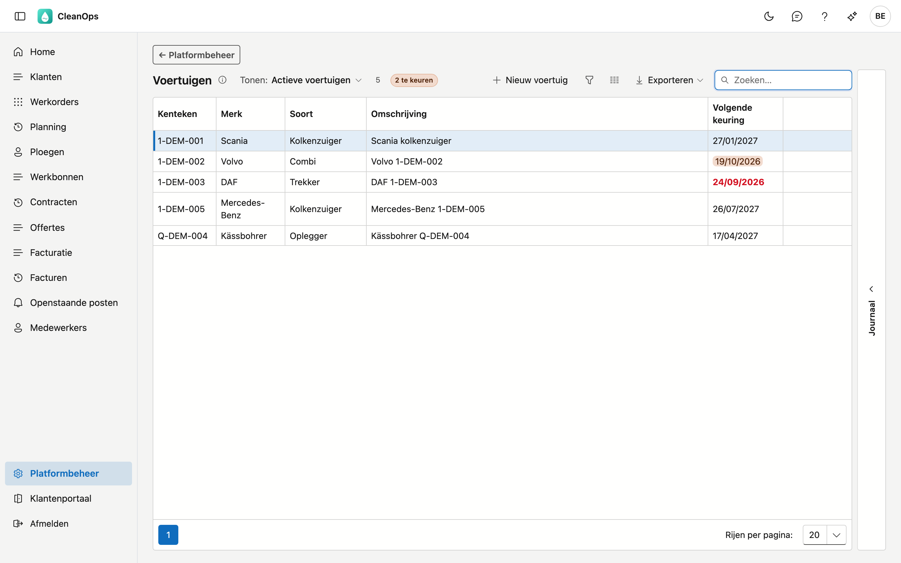
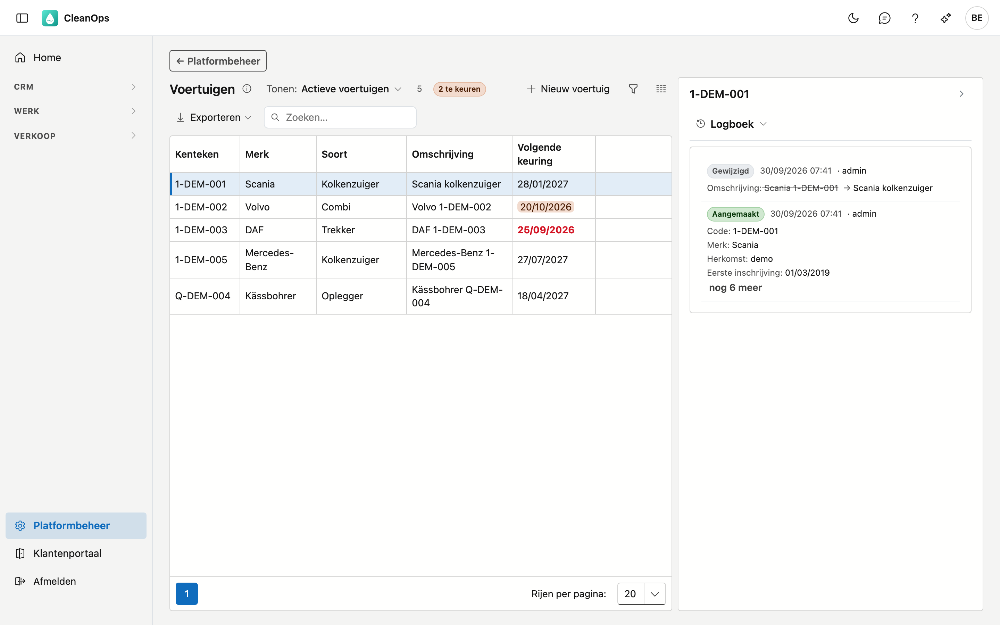
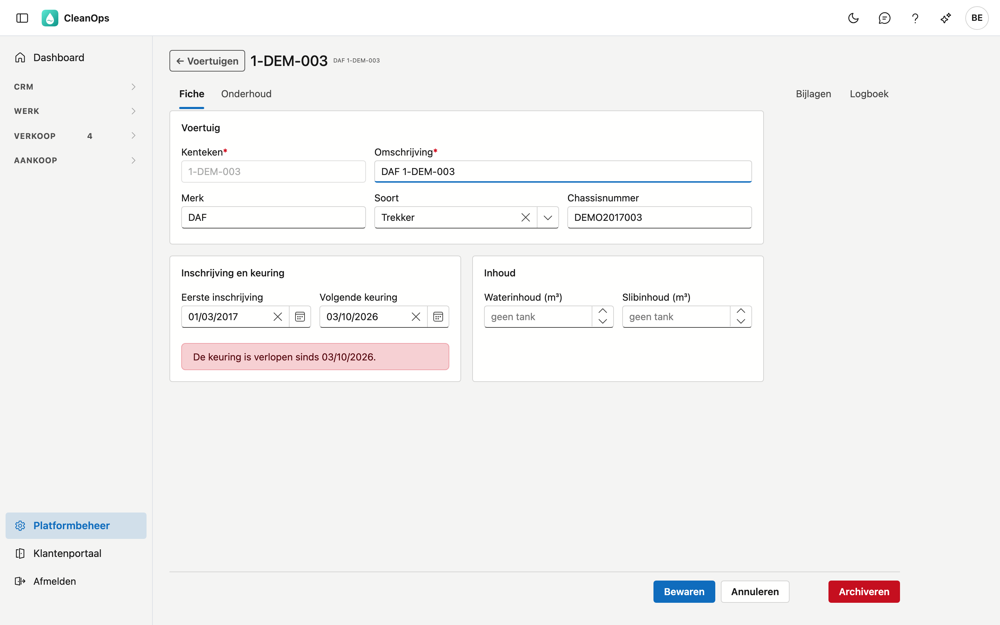
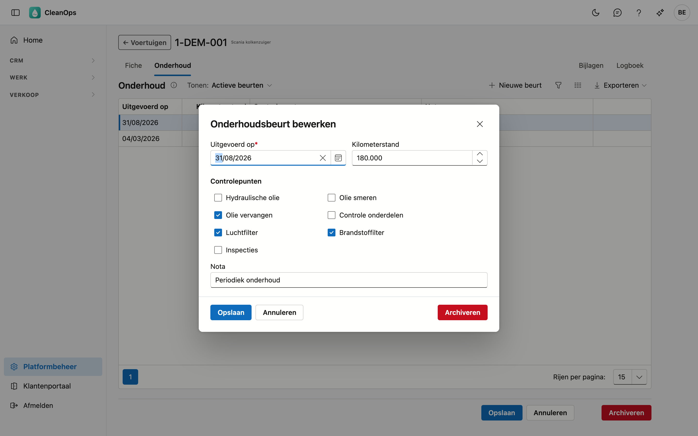

# Voertuigen

Hier staat **uw vloot**: per voertuig het kenteken, het merk, de soort, de tankinhoud, het onderhoud, de
bijlagen en een herinnering voor de keuring.

## Het scherm openen

Klik onderaan in het menu op **Platformbeheer** en daarna op de tegel **Voertuigen**. De cursor staat meteen in
het zoekveld: typ een kenteken, een merk, een soort of een deel van de omschrijving.

## De lijst

| Kolom | Wat het is |
|---|---|
| Kenteken | de nummerplaat; dit is de sleutel waarnaar werkorders en werkbonnen verwijzen |
| Merk | het merk, bijvoorbeeld Scania of DAF |
| Soort | kolkenzuiger, trekker, oplegger… — u beheert die lijst zelf, zie verderop |
| Omschrijving | een korte vrije tekst, bijvoorbeeld *"Scania kolkenzuiger"* |
| Volgende keuring | de datum, gekleurd zodra ze nadert of voorbij is |

Bovenaan staat een teller: hoeveel voertuigen u ziet. Worden er niet alle getoond, dan staat er ook hoeveel
er in totaal zijn. Een voertuig dat u zelf aanmaakte, draagt het label **eigen**; een gearchiveerd voertuig het label
**gearchiveerd**.

Met **Tonen** kiest u tussen **Actieve voertuigen** en **Ook gearchiveerde voertuigen**. Met **Keuring** op **Te keuren**
ziet u enkel de voertuigen waarvan de keuring verlopen is of binnen 30 dagen valt.

## Het journaal van een voertuig

Klik een voertuig in de lijst aan en open rechts de strook **Journaal**. Daar ziet u, zonder de fiche te
openen:

- de **Bijlagen** van dat voertuig;
- het **Logboek**: wie welk veld wanneer gewijzigd heeft, en van welke waarde naar welke.

Kiest u een ander voertuig, dan volgt het journaal mee.

## Een voertuig toevoegen of openen

Klik op **Nieuw voertuig**, of dubbelklik op een rij om de fiche te openen.

De fiche heeft vier tabbladen:

| Tabblad | Wat er staat |
|---|---|
| Fiche | de gegevens van het voertuig, in drie blokken |
| Onderhoud | de onderhoudsbeurten van dit voertuig |
| Bijlagen | het keuringsbewijs, de inschrijving, de verzekering… |
| Logboek | wie wat wanneer gewijzigd heeft aan het voertuig |

### Het blok Voertuig

| Veld | Wat u invult |
|---|---|
| **Kenteken** *(verplicht)* | maximaal 10 tekens. Ligt vast zodra het voertuig bewaard is. |
| **Omschrijving** *(verplicht)* | maximaal 50 tekens, bijvoorbeeld *"MAN trekker"* of *"oplegger"*. |
| **Merk** | maximaal 40 tekens. |
| **Soort** | een keuze uit uw lijst met soorten. |
| **Chassisnummer** | maximaal 30 tekens. |

Het **kenteken** ligt vast omdat werkorders en werkbonnen ernaar verwijzen: zou het veranderen, dan wijzen ze
naar iets dat er niet meer is.

### Het blok Inschrijving en keuring

**Eerste inschrijving** en **Volgende keuring**. Is de keuring verlopen, of valt ze binnen 30 dagen, dan staat
er in dit blok een melding. Meer daarover bij *De keuring en haar herinnering*, verderop.

### Het blok Inhoud

Een kolkenzuiger heeft **twee** compartimenten, en dat verschil bepaalt wat hij kan ophalen. Daarom zijn het
twee velden en geen totaal:

- **Waterinhoud (m³)** — het schone water waarmee gespoeld wordt.
- **Slibinhoud (m³)** — wat er opgehaald kan worden. Dit is het getal dat een planner nodig heeft.

!!! tip "Laat ze leeg bij een voertuig zonder tank"
    Bij een trekker of een oplegger vult u niets in. **Leeg** betekent *niet van toepassing*; **0** zou
    betekenen dat het voertuig een tank heeft die niets kan bevatten.

Klik op **Bewaren** om uw wijzigingen te bewaren, of op **Annuleren** om ze weg te gooien.

## De soorten zelf beheren

De lijst met soorten is **van u**. Ga naar **Platformbeheer → Basistabellen** en kies bovenaan de lijst
**Soorten voertuig**. Daar voegt u toe wat u nodig hebt, in het Nederlands en het Frans.

Archiveert u daar een soort, dan kunt u ze niet meer kiezen voor een ander voertuig. Een voertuig dat die soort
al draagt, houdt ze wel.

## De keuring en haar herinnering

Vult u bij een voertuig **Volgende keuring** in, dan herinnert CleanOps u eraan. Vanaf **30 dagen** vóór die
datum ziet u het op vier plaatsen:

| Waar | Wat u ziet |
|---|---|
| het [dashboard](../dashboard.md) | de tegel *voertuigen te keuren*; een klik opent deze lijst op **Te keuren** |
| de lijst | de datum oranje, of **rood en vet** zodra ze voorbij is |
| boven de lijst | een teller, bijvoorbeeld *"2 te keuren"* |
| de fiche zelf | een melding in het blok **Inschrijving en keuring** |

!!! note "Zonder datum is er niets om aan te herinneren"
    Een voertuig waarbij **Volgende keuring** leeg is, telt niet mee: aan een datum die niemand kent, kan
    CleanOps niet herinneren. Ook een gearchiveerd voertuig telt niet mee — het rijdt niet meer.

## Onderhoud bijhouden

Op het tabblad **Onderhoud** staat elke beurt met haar datum, de kilometerstand, de controlepunten die
afgevinkt zijn en een nota. De jongste staat bovenaan.

Klik op **Nieuwe beurt**, of dubbelklik op een bestaande beurt om ze te wijzigen.

| Veld | Wat u invult |
|---|---|
| **Uitgevoerd op** *(verplicht)* | de datum van de beurt. |
| **Kilometerstand** | niet negatief. Leeg laten mag: een oplegger heeft geen teller. |
| **Controlepunten** | vink aan wat er gedaan is: hydraulische olie, olie smeren, olie vervangen, controle onderdelen, luchtfilter, brandstoffilter, inspecties. |
| **Nota** | vrije tekst, ook over meerdere regels. |

**Een beurt archiveren of terughalen.** In het venster van een beurt staat **Archiveren**. De beurt verdwijnt
dan uit de lijst, maar blijft bewaard. Zet bovenaan het tabblad **Tonen** op **Ook gearchiveerde beurten**,
open de beurt en klik op **Terughalen** om ze terug te zetten.

## Bijlagen aan een voertuig hangen

Op het tabblad **Bijlagen** sleept u bestanden naar het voertuig: het keuringsbewijs, de inschrijving, de
verzekering, een factuur van een herstelling.

## Een voertuig archiveren of terughalen

Op de fiche staat onderaan rechts **Archiveren**. Een gearchiveerd voertuig verdwijnt uit de keuzelijsten en uit
de keuringsherinnering, maar het blijft bestaan: werkorders en werkbonnen dragen het kenteken nog.

Wilt u het terug? Zet bovenaan de lijst **Tonen** op **Ook gearchiveerde voertuigen**, open het voertuig en klik
op **Terughalen**.

## Het logboek

Het tabblad **Logboek** op de fiche — of het journaal rechts van de lijst — toont wie welk veld wanneer
gewijzigd heeft aan dit voertuig, en van welke waarde naar welke.

!!! note "Het logboek gaat over het voertuig, niet over zijn onderhoud"
    Voegt u een onderhoudsbeurt toe, dan verschijnt dat **niet** in het logboek van het voertuig. Het
    tabblad **Onderhoud** is zelf de geschiedenis van de beurten.

## Veelgemaakte fouten

!!! warning "Het kenteken bestaat al"
    Een kenteken kan maar één keer bestaan, ook in andere hoofdletters (*1-abc-123* is *1-ABC-123*) en ook
    wanneer het voertuig gearchiveerd is. Zet **Tonen** op **Ook gearchiveerde voertuigen**: staat het er,
    haal het dan terug in plaats van een nieuw voertuig aan te maken.

**Waarom is de keuzelijst bij Soort leeg?**
Omdat de lijst met soorten nog leeg is. Vul ze aan bij **Platformbeheer → Basistabellen → Soorten voertuig**.

**Ik zie geen melding over keuringen, terwijl er voertuigen zijn.**
Dan is bij geen enkel voertuig **Volgende keuring** ingevuld, of valt geen enkele datum binnen 30 dagen. Vul
de datums in op de fiches.

**Waarom staat er bij Waterinhoud niets in plaats van 0?**
Omdat het voertuig geen tank heeft, of omdat de inhoud nog niet ingevuld is. **Leeg** en **0** betekenen hier
iets anders — zie hierboven.

## Zie ook

- [Basistabellen](basistabellen.md) — de lijst **Soorten voertuig**
