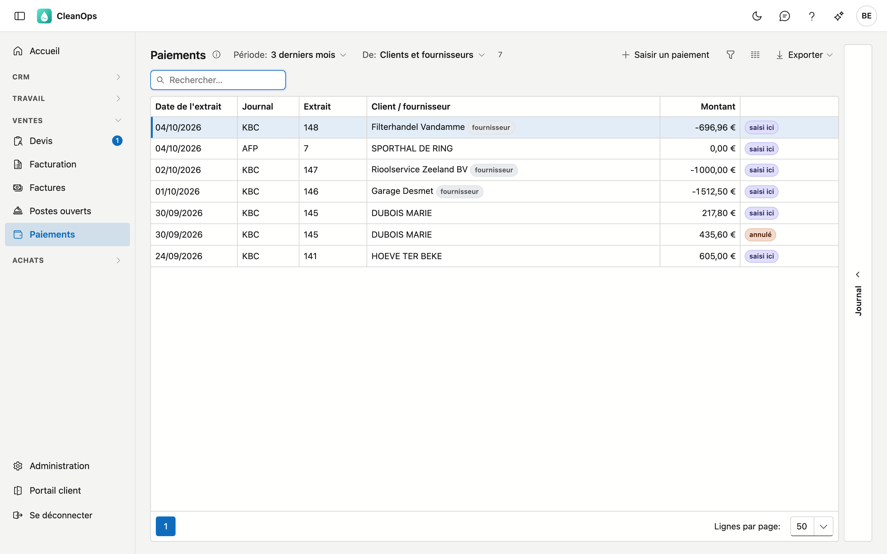
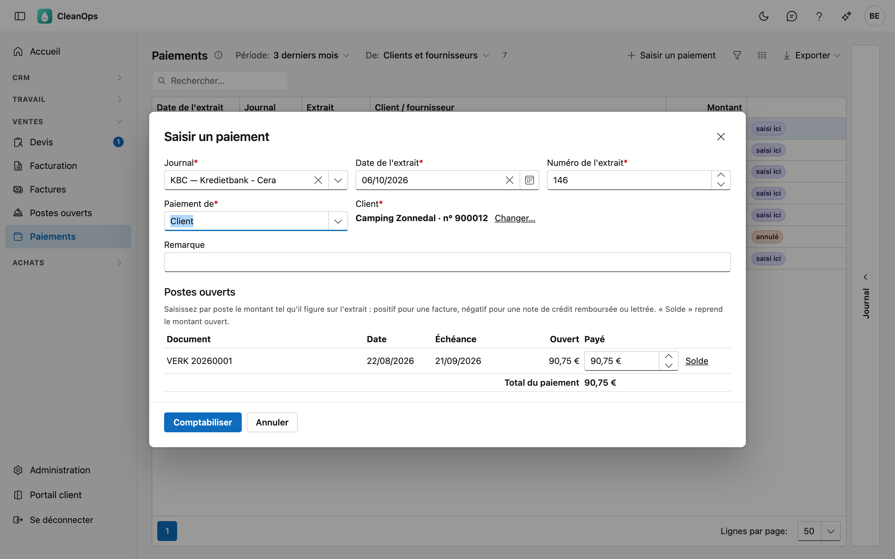
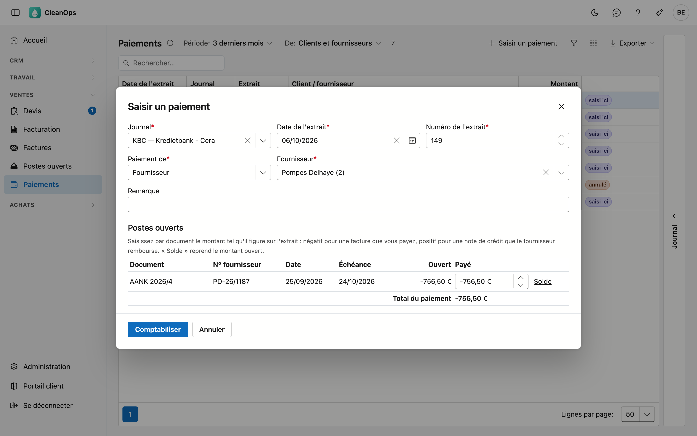
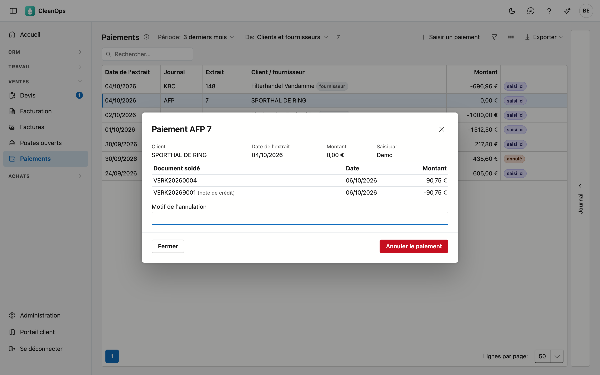

# Paiements

Les montants payés par vos clients et ceux que vous avez payés à vos fournisseurs — et ce qui a été remboursé —, par extrait de
votre banque ou de votre caisse. Vous y saisissez un paiement, et vous y voyez aussi les paiements de votre application précédente.

## Ouvrir l'écran

Dans le menu de gauche, sous **Ventes**, cliquez sur **Paiements**. Vous le voyez avec le droit de consulter les postes ouverts,
ou avec le droit *Voir les achats*. Avec le premier, vous voyez les paiements des clients ; avec le second, les paiements aux
fournisseurs ; avec les deux, l'ensemble. Saisir et annuler des paiements demande le droit *Saisir des paiements*.

## La liste

| Colonne | Ce que c'est |
|---|---|
| Date de l'extrait | la date figurant sur l'extrait de la banque ou de la caisse |
| Journal | le journal financier : votre compte bancaire, la caisse, ou un journal de lettrage (voir [Journaux](beheer/dagboeken.fr.md)) |
| Extrait | le numéro de l'extrait |
| Client / fournisseur | qui a payé, ou qui vous avez payé ; un fournisseur porte l'étiquette **fournisseur** |
| Montant | comme sur l'extrait : positif ce qui entre, négatif ce qui sort |

Un paiement saisi dans CleanOps porte l'étiquette **saisi ici** ; un paiement annulé l'étiquette **annulé**.

Choisissez en haut la **Période** : les 3 derniers mois, cette année, ou tout l'historique. Avec **De**, vous n'affichez que les
clients ou que les fournisseurs.

## Saisir un paiement

Cliquez sur **Saisir un paiement**.

1. Choisissez le **journal**, la **date** et le **numéro de l'extrait**. Ils restent pour le paiement suivant : qui traite un
   extrait en saisit plusieurs à la suite.
2. Choisissez sous **Paiement de** s'il s'agit d'un client ou d'un fournisseur, et cherchez le **client** ou choisissez le
   **fournisseur**. Ses postes ouverts apparaissent, du plus ancien au plus récent.
3. Indiquez par poste le **montant payé**. **Solde** reprend le montant ouvert. Le total figure en bas.
4. Cliquez sur **Comptabiliser**.

!!! note "Un seul virement pour plusieurs factures"
    Si un client paie trois factures en une fois, indiquez le montant pour chacune des trois : cela devient un seul paiement.

Le montant s'indique **comme sur l'extrait** : ce qui entre est positif, ce qui sort négatif.

- Pour un **client** : positif lorsqu'il paie une facture ; négatif lorsque vous remboursez une note de crédit, ou lorsque vous
  lettrez une note de crédit contre une facture — vous indiquez alors dans la même fenêtre le montant sur la facture (positif) et
  sur la note de crédit (négatif), dans un journal comme *Lettrage*.
- Pour un **fournisseur**, c'est l'inverse : négatif lorsque vous payez sa facture, positif lorsqu'il rembourse une note de crédit.
  Imputer une note de crédit sur une facture se fait dans la même fenêtre : la facture négative, la note de crédit positive.

Un paiement partiel est possible : le poste reste ouvert pour le reste. Plus que le montant ouvert, ou un montant de signe
contraire, est refusé. La date de l'extrait ne peut pas être dans le futur.

Un poste entièrement payé disparaît des [Postes ouverts](openstaande-posten.fr.md), et donc des rappels. Si la facture avait été
transmise à un bureau de recouvrement, CleanOps le signale après la comptabilisation : prévenez le bureau si nécessaire.

Vous pouvez aussi saisir un paiement directement depuis les [Postes ouverts](openstaande-posten.fr.md) — sélectionnez le poste et
cliquez sur **Saisir un paiement…** — ou depuis la fiche d'une [facture](facturen.fr.md) encore ouverte, avec le même bouton. Pour
un fournisseur, c'est possible depuis les [Postes ouverts fournisseurs](openstaande-posten-leveranciers.md), depuis la fiche du
[fournisseur](leveranciers.md) et depuis une [facture d'achat](aankoopfacturen.md). Le montant ouvert est alors déjà rempli.

## Ce qu'un paiement a soldé

Double-cliquez sur un paiement : vous voyez le client ou le fournisseur, l'extrait, qui l'a saisi et quelles factures et notes de
crédit il a soldées. Pour un fournisseur, un clic sur le document ouvre la facture d'achat.

Sur la fiche d'une [facture](facturen.fr.md) figurent à l'inverse les paiements reçus, à côté de la ventilation de la TVA ; sur
une [facture d'achat](aankoopfacturen.md), dans l'onglet **Paiements**.

## Annuler un paiement

Un paiement mal saisi — un mauvais client, un mauvais montant — s'annule : ouvrez le paiement, indiquez éventuellement un motif et
cliquez sur **Annuler le paiement**. Les montants ouverts redeviennent ce qu'ils étaient avant le paiement. Le paiement reste dans
la liste comme **annulé**, avec qui l'a fait et quand.

Un paiement d'un client de votre application précédente ne peut pas être annulé : les factures qu'il a soldées ne sont plus
ouvertes. Un paiement à un fournisseur de votre application précédente, si : le document d'achat retrouve son montant ouvert.

## Le journal des modifications

À droite de l'écran se trouve une bande **Journal**. Sélectionnez un paiement et ouvrez la bande : vous voyez quand il a été
comptabilisé et éventuellement annulé, et par qui.

## Questions fréquentes

**Je ne vois pas le bouton Saisir un paiement.**
Il faut pour cela le droit *Saisir des paiements*. Demandez-le à votre administrateur.

**Je ne trouve pas mon compte bancaire dans la liste des journaux.**
Seuls les journaux **financiers** y figurent. Créez-en un dans [Journaux](beheer/dagboeken.fr.md).

**Un ancien paiement indique « pas de facture dans l'application précédente ».**
Votre application précédente a conservé ce paiement, mais pas la facture qu'il a soldée — surtout pour les premières années. Le
document figure avec son numéro et sa date.

## Voir aussi

- [Postes ouverts](openstaande-posten.fr.md)
- [Postes ouverts fournisseurs](openstaande-posten-leveranciers.md)
- [Factures](facturen.fr.md)
- [Factures d'achat](aankoopfacturen.md)
- [Journaux](beheer/dagboeken.fr.md)
