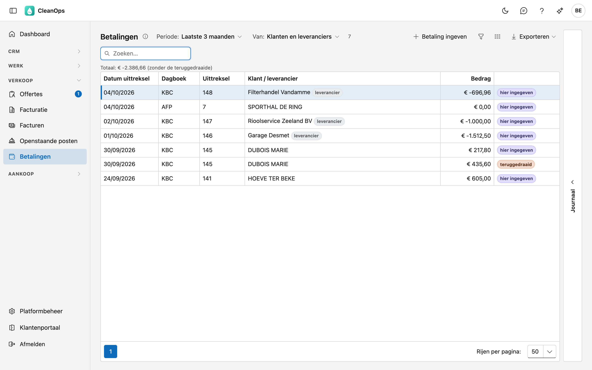
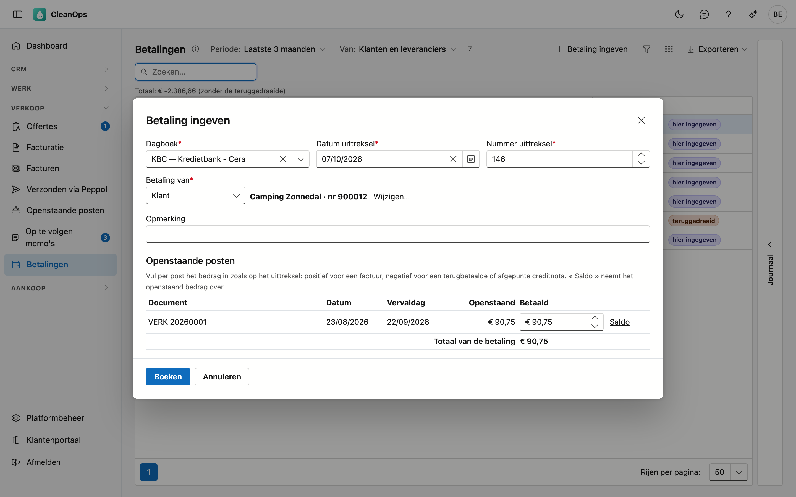
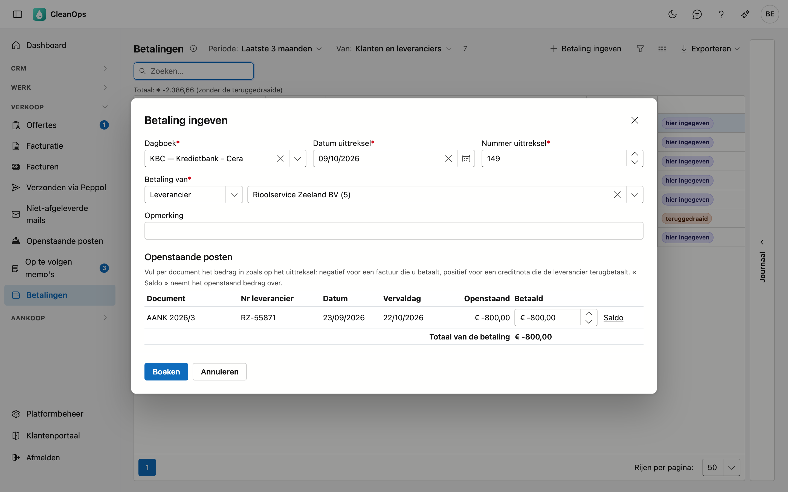
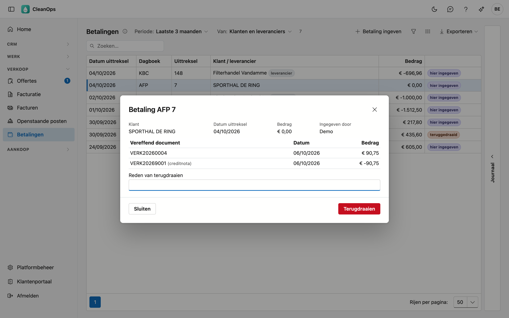

# Betalingen

De bedragen die uw klanten betaalden en die u uw leveranciers betaalde — en wat er terugbetaald werd —, per uittreksel van uw
bank of kas. Hier geeft u een betaling in, en ziet u ook de betalingen uit uw vorige toepassing.

## Het scherm openen

Klik in het menu links onder **Verkoop** op **Betalingen**. U ziet het met het recht om de openstaande posten te bekijken, of
met het recht *Aankoop bekijken*. Met het eerste ziet u de betalingen van klanten, met het tweede de betalingen aan
leveranciers; met beide allebei. Betalingen ingeven en terugdraaien vraagt het recht *Betalingen ingeven*.

## De lijst

| Kolom | Wat het is |
|---|---|
| Datum uittreksel | de datum op het uittreksel van de bank of kas |
| Dagboek | het financiële dagboek: uw bankrekening, de kas, of een dagboek waarmee vereffend wordt (zie [Dagboeken](beheer/dagboeken.md)) |
| Uittreksel | het nummer van het uittreksel |
| Klant / leverancier | wie betaalde, of wie u betaalde; een leverancier draagt het label **leverancier** |
| Bedrag | zoals op het uittreksel: positief wat binnenkomt, negatief wat buitengaat |

Een betaling die u in CleanOps ingaf, draagt het label **hier ingegeven**; een teruggedraaide het label **teruggedraaid**.

Kies bovenaan de **Periode**: deze maand, de laatste 3 maanden, dit jaar, of de volledige historiek. Met **Van** toont u enkel
de klanten of enkel de leveranciers.

Onder de filters staat het **totaal** van de getoonde betalingen, zoals op het uittreksel. Een teruggedraaide betaling telt
niet mee. Met **Deze maand** en **Klanten** is dat het getal van de tegel *ontvangen van klanten deze maand* op het
[dashboard](dashboard.md).

## Een betaling ingeven

Klik op **Betaling ingeven**.

1. Kies het **dagboek**, de **datum** en het **nummer van het uittreksel**. Ze blijven staan voor de volgende betaling: wie een
   uittreksel afwerkt, geeft er meerdere na elkaar in.
2. Kies bij **Betaling van** of het om een klant of een leverancier gaat, en zoek de **klant** of kies de **leverancier**. Zijn
   openstaande posten verschijnen, de oudste eerst.
3. Vul per post het **betaalde bedrag** in. **Saldo** neemt het openstaande bedrag over. Onderaan staat het totaal.
4. Klik op **Boeken**.

!!! note "Eén overschrijving voor meerdere facturen"
    Betaalt een klant drie facturen in één keer, vul dan bij elk van de drie het bedrag in: het wordt één betaling.

Het bedrag staat **zoals op het uittreksel**: wat binnenkomt is positief, wat buitengaat negatief.

- Bij een **klant**: positief wanneer hij een factuur betaalt; negatief wanneer u een creditnota terugbetaalt, of wanneer u een
  creditnota tegen een factuur afpunt — dan vult u in hetzelfde venster het bedrag op de factuur (positief) én op de creditnota
  (negatief) in, op een dagboek zoals *Afpunten*.
- Bij een **leverancier** omgekeerd: negatief wanneer u zijn factuur betaalt, positief wanneer hij een creditnota terugbetaalt. Een
  creditnota verrekenen met een factuur doet u in hetzelfde venster: de factuur negatief, de creditnota positief.

Een deelbetaling mag: de post blijft openstaan voor de rest. Meer dan wat openstaat, of een bedrag met het verkeerde teken, wordt
geweigerd. De datum van het uittreksel kan niet in de toekomst liggen.

Een volledig betaalde post verdwijnt uit [Openstaande posten](openstaande-posten.md), en dus uit de rappels. Was de factuur
doorgegeven aan een incassobureau, dan zegt CleanOps het na het boeken: verwittig het bureau zo nodig.

U kunt een betaling ook rechtstreeks ingeven vanuit [Openstaande posten](openstaande-posten.md) — selecteer de post en klik op
**Betaling ingeven…** — of vanaf de fiche van een [factuur](facturen.md) die nog openstaat, met dezelfde knop. Voor een
leverancier kan dat vanuit [Openstaande posten leveranciers](openstaande-posten-leveranciers.md), vanaf de fiche van de
[leverancier](leveranciers.md) en vanaf een [aankoopfactuur](aankoopfacturen.md). Het openstaande bedrag staat dan al ingevuld.

## Wat een betaling vereffende

Dubbelklik een betaling: u ziet de klant of leverancier, het uittreksel, wie ze ingaf en welke facturen en creditnota's ze
vereffende. Bij een leverancier opent een klik op het document de aankoopfactuur.

Op de fiche van een [factuur](facturen.md) staan omgekeerd de betalingen die erop kwamen, naast de btw-opbouw; op een
[aankoopfactuur](aankoopfacturen.md) in het tabblad **Betalingen**.

## Een betaling terugdraaien

Een verkeerd ingegeven betaling — een verkeerde klant, een verkeerd bedrag — draait u terug: open de betaling, vul eventueel een
reden in en klik op **Terugdraaien**. De openstaande bedragen worden weer wat ze vóór de betaling waren. De betaling blijft in de
lijst staan als **teruggedraaid**, met wie het deed en wanneer.

Een betaling van een klant uit uw vorige toepassing kunt u niet terugdraaien: de facturen die ze vereffende, staan niet meer
open. Een betaling aan een leverancier uit uw vorige toepassing kan wel: het aankoopdocument krijgt zijn openstaande bedrag terug.

## Het journaal

Rechts op het scherm zit een strook **Journaal**. Klik een betaling aan en open de strook: u ziet wanneer ze geboekt en eventueel
teruggedraaid werd, en door wie.

## Veelgestelde vragen

**Ik zie de knop Betaling ingeven niet.**
Daarvoor is het recht *Betalingen ingeven* nodig. Vraag het aan uw beheerder.

**Ik vind mijn bankrekening niet in de lijst van de dagboeken.**
Enkel de **financiële** dagboeken staan erin. Maak er een aan in [Dagboeken](beheer/dagboeken.md).

**Bij een oude betaling staat "geen factuur in de vorige toepassing".**
Uw vorige toepassing bewaarde die betaling, maar niet de factuur die ze vereffende — vooral bij de eerste jaren. Het document
staat erbij met zijn nummer en datum.

## Zie ook

- [Openstaande posten](openstaande-posten.md)
- [Openstaande posten leveranciers](openstaande-posten-leveranciers.md)
- [Facturen](facturen.md)
- [Aankoopfacturen](aankoopfacturen.md)
- [Dagboeken](beheer/dagboeken.md)
