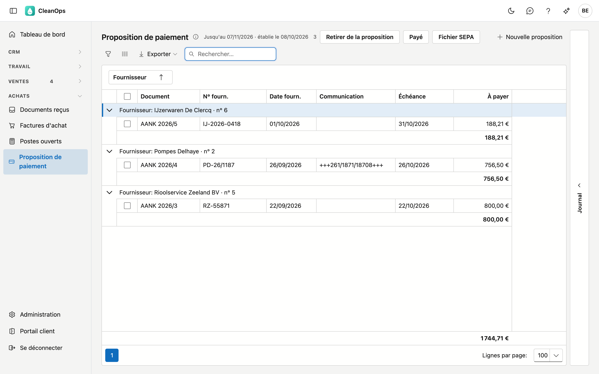
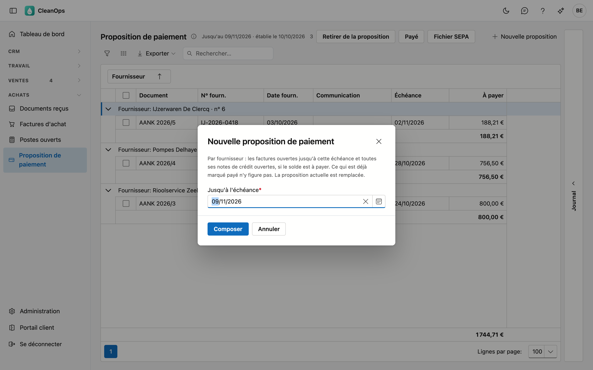
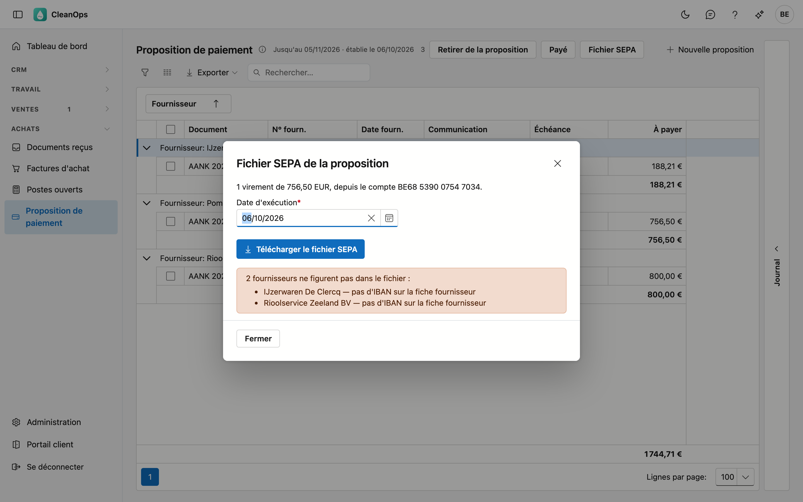
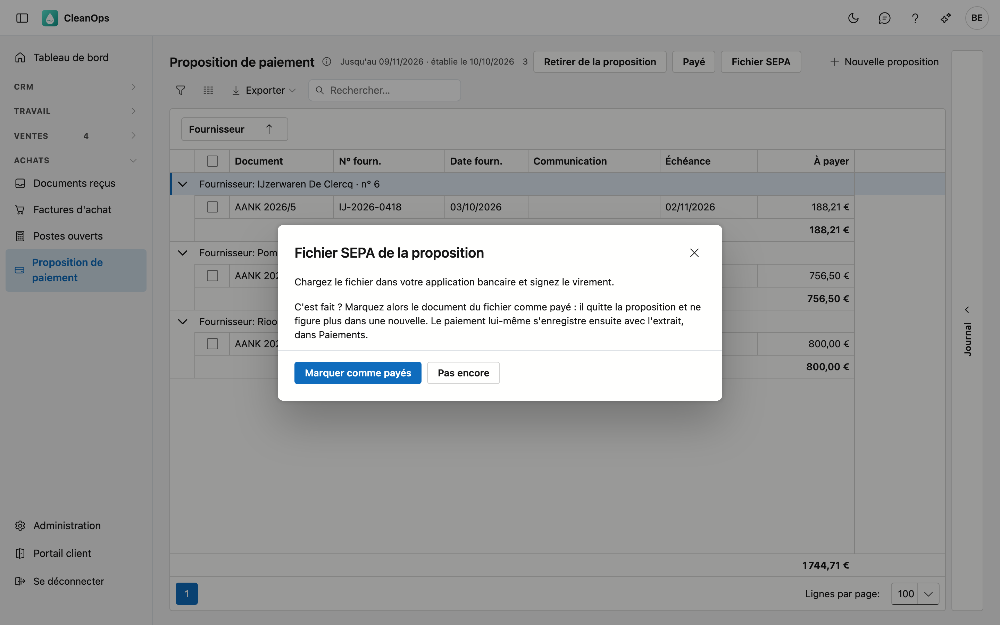

# Proposition de paiement

Ce que vous payez à vos fournisseurs jusqu'à une échéance donnée, par fournisseur avec le montant à virer. C'est aussi
d'ici que vous créez le fichier SEPA à charger dans votre application bancaire, pour ne pas devoir encoder les virements
un par un.

## Ouvrir l'écran

Cliquez à gauche dans le menu, sous **Achats**, sur **Proposition de paiement**. Il vous faut le droit *Voir les achats*.
Pour composer une proposition, en retirer des documents, les marquer payés ou créer le fichier SEPA, il vous faut aussi
le droit *Saisir des paiements*.

## La liste

La liste montre la dernière proposition, groupée par fournisseur. À côté du titre figurent l'échéance jusqu'à laquelle elle
court et la date à laquelle elle a été établie.

| Colonne | Ce que c'est |
|---|---|
| Document | le journal, l'exercice et le numéro, avec l'étiquette **note de crédit** pour une note de crédit |
| N° fourn. et Date fourn. | le numéro et la date sur le document du fournisseur |
| Communication | la communication structurée du fournisseur, si elle figure sur la [facture d'achat](aankoopfacturen.md) |
| Échéance | avec l'étiquette **échu** quand l'échéance est dépassée |
| À payer | ce que vous payez pour ce document : une facture en positif, une note de crédit en négatif |

Sous chaque fournisseur figure le montant que vous lui virez : ses factures moins ses notes de crédit. Le total de la
proposition figure en bas.

- **Rechercher** — le curseur est tout de suite dans le champ de recherche.
- **Exporter** — le bouton **Exporter** vous donne la liste sous forme de fichier.
- **Ouvrir** — double-cliquez sur une ligne pour ouvrir le document.
- **Journal** — le volet à droite montre les pièces jointes et l'historique du document sur lequel vous cliquez.

## Composer une nouvelle proposition

1. Cliquez sur **Nouvelle proposition**.
2. Indiquez dans **Jusqu'à l'échéance** la dernière échéance que vous voulez payer maintenant. Elle se situe au plus
   90 jours en arrière et au plus 150 jours en avant.
3. Cliquez sur **Composer**.

CleanOps reprend par fournisseur :

- les factures ouvertes dont l'échéance tombe au plus tard à la date choisie ;
- **toutes** ses notes de crédit ouvertes, même celles qui ne sont pas encore échues, pour qu'elles soient déduites.

Un fournisseur n'entre dans la proposition que s'il reste quelque chose à payer après cette déduction. Ce qui est déjà
**marqué payé** n'y figure pas. La nouvelle proposition **remplace** la précédente.

## Retirer des documents ou les marquer payés

Cochez les documents, ou cliquez sur une seule ligne, et choisissez :

- **Retirer de la proposition** — vous ne payez pas ce document maintenant. CleanOps vous demande d'abord confirmation. Le
  document lui-même reste ; une nouvelle proposition le reprend s'il est alors à payer.
- **Payé** — vous l'avez déjà payé, mais le paiement ne figure pas encore sur un extrait. Le document quitte la proposition
  et n'entre plus dans une nouvelle. Il reste toutefois ouvert jusqu'à ce que vous enregistriez le paiement dans
  [Paiements](betalingen.md). Pour annuler, utilisez **Non payé** dans
  [Postes ouverts fournisseurs](openstaande-posten-leveranciers.md).

## Le fichier SEPA

Avec le fichier SEPA, vous chargez tous les virements de la proposition en une fois dans votre application bancaire.
CleanOps crée **un virement par fournisseur**, pour le montant qui figure sous son nom, depuis l'IBAN de votre
[fiche entreprise](beheer/bedrijfsfiche.md).

1. Cliquez sur **Fichier SEPA**. La fenêtre indique combien de virements le fichier contient, pour quel total et depuis
   quel compte.
2. Vérifiez la **Date d'exécution** : le jour où la banque exécute les virements. Elle est fixée à aujourd'hui et peut se
   situer au plus un an plus tard.
3. Cliquez sur **Télécharger le fichier SEPA**. Votre navigateur enregistre le fichier (`sepa-betalingsvoorstel-` suivi de
   la date d'exécution).
4. Chargez le fichier dans votre application bancaire et signez-y les virements.

**Fournisseurs absents du fichier.** La fenêtre indique quel fournisseur manque et pourquoi : pas d'IBAN ou un IBAN invalide
sur la [fiche fournisseur](leveranciers.md), ou rien à payer parce que les notes de crédit l'emportent. Complétez l'IBAN sur
la fiche et rouvrez la fenêtre, ou payez ce fournisseur séparément.

**La communication.** Si le virement porte sur une seule facture avec une communication structurée, cette communication
l'accompagne : le fournisseur peut ainsi lettrer votre paiement automatiquement. Sinon, les numéros de ses documents y
figurent, par exemple *Fact. 2026131, 2026132 / CN 2026031*. Une communication compte au plus 140 caractères ; ce qui n'y
tient plus se termine par *...*.

### Ensuite : marquer comme payés

Après le téléchargement, la fenêtre demande si les virements ont été chargés et signés dans votre banque.

- **Marquer comme payés** — les documents **du fichier** sont marqués payés et quittent la proposition. Les fournisseurs
  qui ne figuraient pas dans le fichier restent.
- **Pas encore** — la fenêtre se ferme sans rien marquer. Vous pouvez encore marquer les documents plus tard avec **Payé**.

Le paiement lui-même ne s'enregistre que lorsqu'il figure sur l'extrait, dans [Paiements](betalingen.md). Le document quitte
alors aussi les [postes ouverts](openstaande-posten-leveranciers.md).

!!! warning "La proposition a changé entre-temps"
    Si quelqu'un (ou vous-même, dans un autre onglet) a retiré un document de la proposition après l'ouverture de la
    fenêtre, CleanOps ne crée pas de fichier. Fermez la fenêtre et rouvrez-la : ce que vous voyez correspond alors de
    nouveau à ce que vous téléchargez.

## Questions fréquentes

**Je ne vois pas les boutons.**
Il faut pour cela le droit *Saisir des paiements*. Demandez-le à votre administrateur.

**Un fournisseur ne figure pas dans le fichier SEPA.**
La fenêtre indique pourquoi. Le plus souvent, l'IBAN manque sur la fiche fournisseur : complétez-le et rouvrez la fenêtre.

**La fenêtre indique que mon IBAN manque.**
CleanOps paie depuis l'IBAN de votre [fiche entreprise](beheer/bedrijfsfiche.md). Indiquez-le là.

**Pourquoi une note de crédit non échue figure-t-elle dans la proposition ?**
La proposition reprend toutes les notes de crédit ouvertes d'un fournisseur, pour que vous ne lui viriez que la
différence. Si vous ne voulez pas les déduire maintenant, retirez-les de la proposition.

**Le paiement est-il enregistré quand je clique sur Payé ?**
Non. Payé est un marquage jusqu'à l'extrait : le document n'entre plus dans une proposition, mais reste ouvert.
Enregistrez le paiement dans [Paiements](betalingen.md) quand il figure sur l'extrait.

## Voir aussi

- [Postes ouverts fournisseurs](openstaande-posten-leveranciers.md)
- [Paiements](betalingen.md)
- [Factures d'achat](aankoopfacturen.md)
- [Fournisseurs](leveranciers.md)
