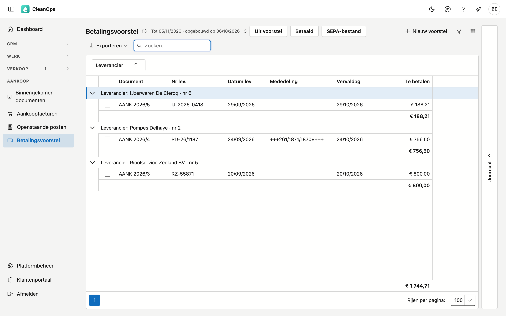
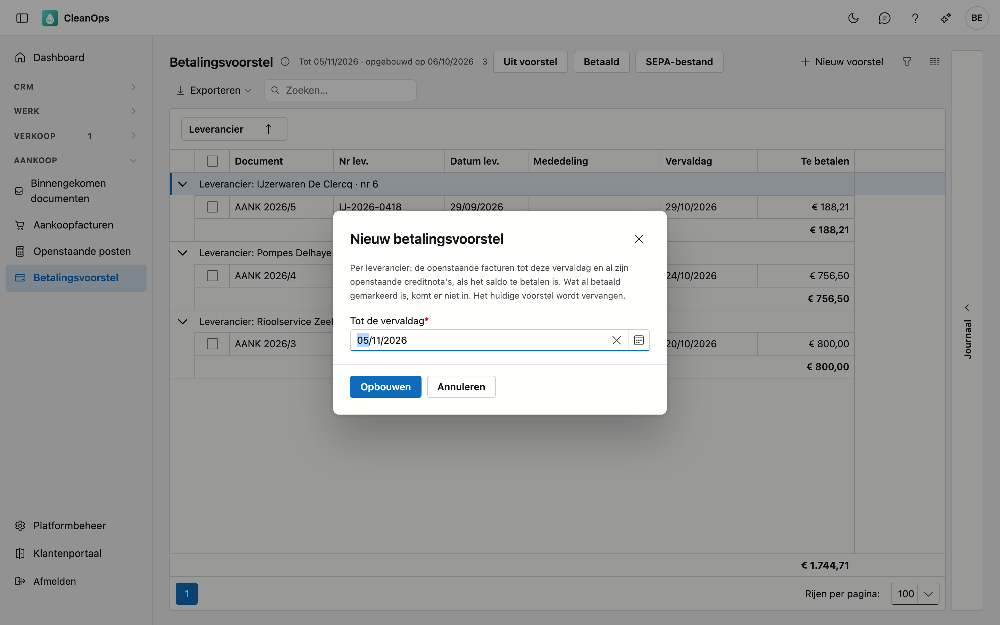
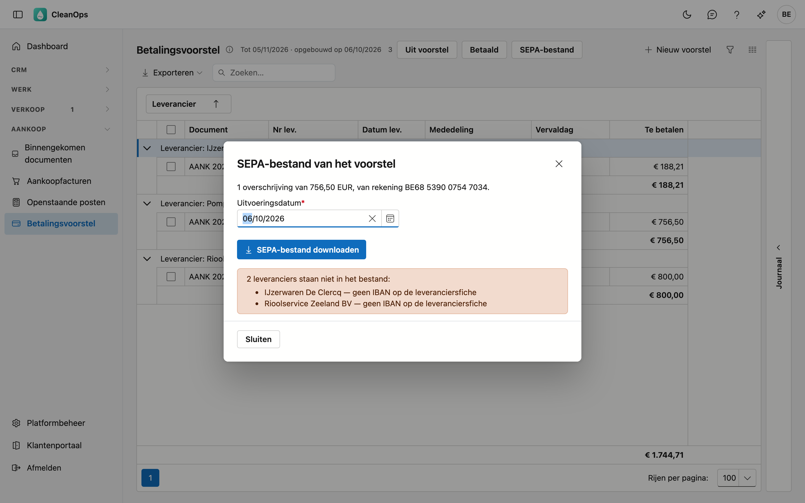
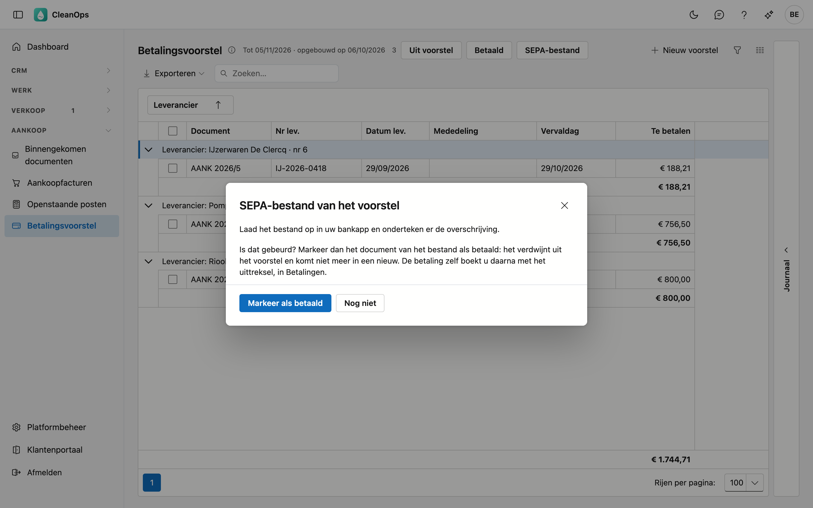

# Betalingsvoorstel

Wat u uw leveranciers tot een bepaalde vervaldag betaalt, per leverancier met het bedrag om over te schrijven. Van hieruit
maakt u ook het SEPA-bestand dat u in uw bankapp oplaadt, zodat u de overschrijvingen niet één voor één hoeft in te typen.

## Het scherm openen

Klik links in het menu, onder **Aankoop**, op **Betalingsvoorstel**. U hebt het recht *Aankoop bekijken* nodig. Om een
voorstel op te bouwen, documenten eruit te halen, ze betaald te markeren of het SEPA-bestand te maken, hebt u ook het
recht *Betalingen ingeven* nodig.

## De lijst

De lijst toont het laatste voorstel, gegroepeerd per leverancier. Naast de titel staat tot welke vervaldag het loopt en
wanneer het opgebouwd is.

| Kolom | Wat het is |
|---|---|
| Document | het dagboek, het boekjaar en het nummer, met het label **creditnota** voor een creditnota |
| Nr lev. en Datum lev. | het nummer en de datum op het document van de leverancier |
| Mededeling | de gestructureerde mededeling van de leverancier, als ze op de [aankoopfactuur](aankoopfacturen.md) staat |
| Vervaldag | met het label **vervallen** wanneer de vervaldag voorbij is |
| Te betalen | wat u voor dit document betaalt: een factuur positief, een creditnota negatief |

Onder elke leverancier staat het bedrag dat u hem overschrijft: zijn facturen min zijn creditnota's. Onderaan staat het
totaal van het voorstel.

- **Zoeken** — de cursor staat meteen in het zoekveld.
- **Exporteren** — via de knop **Exporteren** krijgt u de lijst als bestand.
- **Openen** — dubbelklik op een rij om het document te openen.
- **Journaal** — de strook rechts toont de bijlagen en het logboek van het document dat u aanklikt.

## Een nieuw voorstel opbouwen

1. Klik op **Nieuw voorstel**.
2. Vul bij **Tot de vervaldag** de laatste vervaldag in die u nu wilt betalen. Die ligt hoogstens 90 dagen terug en
   hoogstens 150 dagen vooruit.
3. Klik op **Opbouwen**.

CleanOps neemt per leverancier:

- de openstaande facturen met een vervaldag tot en met de gekozen datum;
- **al** zijn openstaande creditnota's, ook die nog niet vervallen zijn, zodat ze verrekend worden.

Een leverancier komt enkel in het voorstel als er na die verrekening iets te betalen is. Wat al **betaald gemarkeerd** is,
komt er niet in. Het nieuwe voorstel **vervangt** het vorige.

## Documenten uit het voorstel halen of betaald markeren

Vink de documenten aan, of klik op één rij, en kies:

- **Uit voorstel** — u betaalt dit document nu niet. CleanOps vraagt eerst of u het zeker weet. Het document zelf blijft
  bestaan; een nieuw voorstel neemt het opnieuw op als het dan te betalen is.
- **Betaald** — u hebt het al betaald, maar de betaling staat nog niet op een uittreksel. Het document verdwijnt uit het
  voorstel en komt in geen nieuw voorstel meer. Het blijft wel openstaan tot u de betaling boekt in
  [Betalingen](betalingen.md). Ongedaan maken doet u in [Openstaande posten leveranciers](openstaande-posten-leveranciers.md)
  met **Niet betaald**.

## Het SEPA-bestand

Met het SEPA-bestand laadt u alle overschrijvingen van het voorstel in één keer op in uw bankapp. CleanOps maakt **één
overschrijving per leverancier**, voor het bedrag dat onder zijn naam staat, vanaf de IBAN op uw
[bedrijfsfiche](beheer/bedrijfsfiche.md).

1. Klik op **SEPA-bestand**. Het venster toont hoeveel overschrijvingen het bestand bevat, voor welk totaal en van welke
   rekening.
2. Kijk de **Uitvoeringsdatum** na: de dag waarop de bank de overschrijvingen uitvoert. Ze staat op vandaag en mag
   hoogstens een jaar vooruit liggen.
3. Klik op **SEPA-bestand downloaden**. Uw browser bewaart het bestand (`sepa-betalingsvoorstel-` gevolgd door de
   uitvoeringsdatum).
4. Laad het bestand op in uw bankapp en onderteken er de overschrijvingen.

**Leveranciers die niet in het bestand staan.** Het venster zegt welke leverancier ontbreekt en waarom: geen IBAN of een
ongeldige IBAN op de [leveranciersfiche](leveranciers.md), of niets te betalen omdat de creditnota's zwaarder wegen. Vul
de IBAN aan op de fiche en open het venster opnieuw, of betaal die leverancier apart.

**De mededeling.** Gaat de overschrijving over één factuur met een gestructureerde mededeling, dan gaat die mededeling
mee: zo kan de leverancier uw betaling automatisch afpunten. Anders staan de nummers van zijn documenten erin, bijvoorbeeld
*Fact. 2026131, 2026132 / CN 2026031*. Een mededeling is hoogstens 140 tekens lang; wat er niet meer in past, eindigt op
*...*.

### Daarna: als betaald markeren

Na het downloaden vraagt het venster of de overschrijvingen in uw bank opgeladen en ondertekend zijn.

- **Markeer als betaald** — de documenten **van het bestand** worden betaald gemarkeerd en verdwijnen uit het voorstel. De
  leveranciers die niet in het bestand stonden, blijven staan.
- **Nog niet** — het venster sluit zonder iets te markeren. U kunt de documenten later nog met **Betaald** markeren.

De betaling zelf boekt u pas wanneer ze op het uittreksel staat, in [Betalingen](betalingen.md). Dan verdwijnt het document
ook uit de [openstaande posten](openstaande-posten-leveranciers.md).

!!! warning "Het voorstel veranderde intussen"
    Haalde iemand (of uzelf, in een ander tabblad) een document uit het voorstel nadat u het venster opende, dan maakt
    CleanOps geen bestand. Sluit het venster en open het opnieuw: dan klopt wat u ziet weer met wat u downloadt.

## Veelgestelde vragen

**Ik zie de knoppen niet.**
Daarvoor is het recht *Betalingen ingeven* nodig. Vraag het aan uw beheerder.

**Een leverancier staat niet in het SEPA-bestand.**
Het venster zegt waarom. Meestal ontbreekt de IBAN op de leveranciersfiche: vul ze aan en open het venster opnieuw.

**Het venster zegt dat mijn IBAN ontbreekt.**
CleanOps betaalt vanaf de IBAN op uw [bedrijfsfiche](beheer/bedrijfsfiche.md). Vul ze daar in.

**Waarom staat er een creditnota in die nog niet vervallen is?**
Het voorstel neemt alle openstaande creditnota's van een leverancier mee, zodat u hem enkel het verschil overschrijft.
Wilt u ze nu niet verrekenen, haal ze dan uit het voorstel.

**Is de betaling geboekt als ik op Betaald klik?**
Nee. Betaald is een markering tot het uittreksel: het document komt niet meer in een voorstel, maar staat nog open. Boek de
betaling in [Betalingen](betalingen.md) wanneer ze op het uittreksel staat.

## Zie ook

- [Openstaande posten leveranciers](openstaande-posten-leveranciers.md)
- [Betalingen](betalingen.md)
- [Aankoopfacturen](aankoopfacturen.md)
- [Leveranciers](leveranciers.md)
