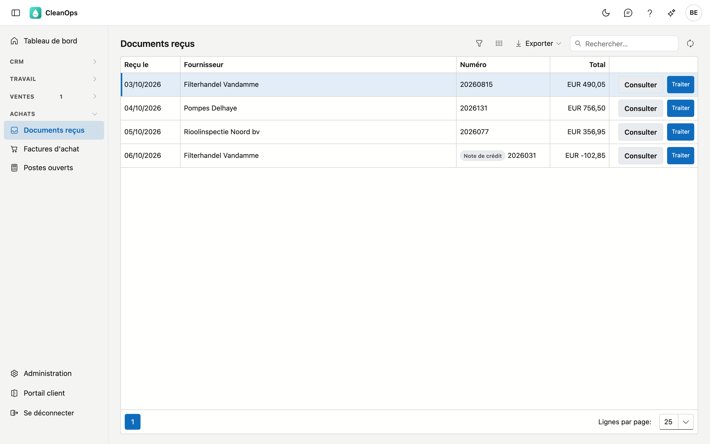
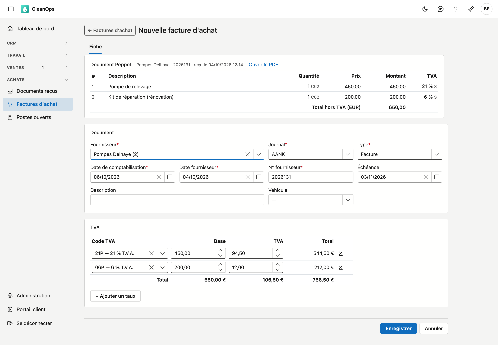
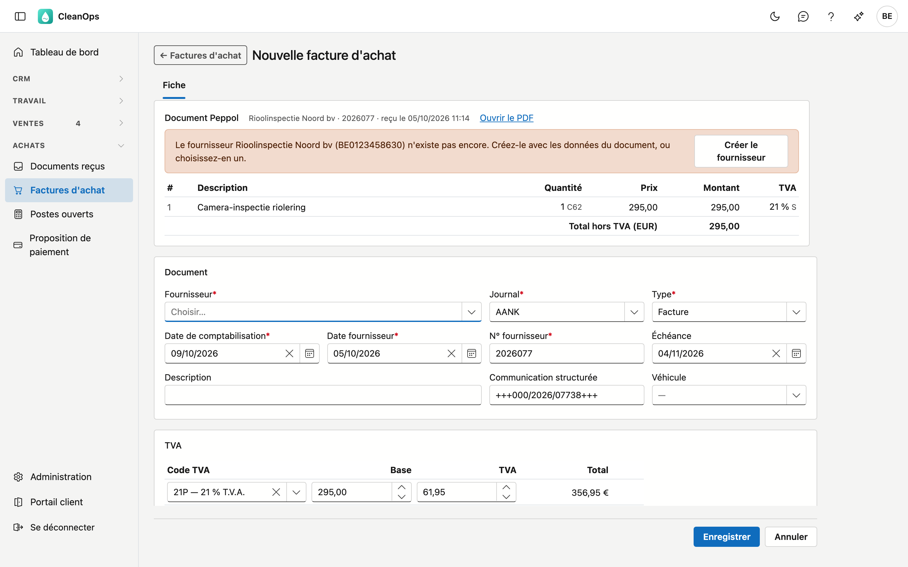

# Documents reçus

Les factures et notes de crédit que vos fournisseurs envoient par **Peppol**, le réseau belge des factures
électroniques. Vous ne devez plus les retaper : CleanOps lit le document et en fait une
[facture d'achat](aankoopfacturen.md) préremplie, que vous vérifiez et enregistrez.

## Ouvrir l'écran

Cliquez à gauche dans le menu, sous **Achats**, sur **Documents reçus**. Il vous faut le droit *Voir les achats* ;
pour traiter des documents aussi *Modifier les achats*. Le rôle Financieel reçoit les deux. Sans *Modifier les
achats*, vous voyez la liste et les PDF, mais pas le bouton **Traiter**.

!!! info "Adresse Peppol"
    Vos fournisseurs envoient à votre adresse Peppol. ADM-Concept l'enregistre pour vous ; demandez-la avant de
    communiquer l'adresse à vos fournisseurs. Si l'écran indique que cet environnement n'est pas lié, contactez
    ADM-Concept.

## La liste

Par document, vous voyez quand il a été reçu, le fournisseur, le numéro et le total. Une note de crédit porte
l'étiquette *Note de crédit* à côté du numéro et un signe moins dans le total. Le document le plus ancien figure en haut.

- **Consulter** — ouvre le PDF du fournisseur dans une nouvelle fenêtre.
- **Traiter** — ouvre une facture d'achat préremplie (voir ci-dessous).
- **Exporter** — la liste sous forme de fichier.

Un document reste dans la liste jusqu'à ce que vous le traitiez.

## Traiter un document

Cliquez sur **Traiter**. La fiche d'une nouvelle facture d'achat s'ouvre, déjà remplie avec ce que porte le document :

- **Fournisseur** — recherché sur le numéro de TVA du document.
- **Type** — facture ou note de crédit, comme sur le document.
- **Date fournisseur**, **N° fournisseur** et **Échéance** — du document.
- **TVA** — une ligne par taux de TVA avec la base et la TVA du document. CleanOps choisit le code TVA sur le
  pourcentage et le type de TVA (normal, autoliquidation, exonéré…).

En haut figure la carte **Document Peppol** : de qui il vient, quand il est arrivé, **Ouvrir le PDF**, et les lignes
telles que le fournisseur les a mises sur sa facture. Ces lignes ne se modifient pas ; la facture d'achat porte les
montants par taux de TVA.

Vérifiez tout, complétez éventuellement une **Description** ou un **Véhicule** et cliquez sur **Enregistrer**. La
facture reçoit son numéro, et le document quitte la liste.

!!! note "La TVA du fournisseur compte"
    Pour une facture d'achat ordinaire, CleanOps propose la TVA à partir du code et de la base. Pour un document Peppol,
    non : la TVA que le fournisseur facture reste, même si vous choisissez un autre code. Un fournisseur qui arrondit
    par ligne peut différer d'un centime de ce que CleanOps calculerait, et le montant de sa facture est ce qu'il
    demande.

### Ce que la fiche vous fait vérifier

En haut de la fiche figure un message quand quelque chose n'a pas pu être rempli automatiquement :

- **Le fournisseur n'existe pas encore** — cliquez sur **Créer le fournisseur** (voir ci-dessous), ou choisissez-en un
  dans la liste.
- **Plusieurs fournisseurs** portent le même numéro de TVA — choisissez le bon.
- **Pas de numéro de TVA** sur le document — choisissez vous-même le fournisseur.
- **Fournisseur dans la corbeille** — restaurez-le d'abord dans [Fournisseurs](leveranciers.md), ou choisissez-en un
  autre.
- **Aucun code TVA ne correspond** à un taux, ou plusieurs correspondent — choisissez le code dans cette ligne TVA.
- Le **total** des lignes diffère du document, le document est dans une **autre devise**, ou un **acompte** a déjà été
  payé — vérifiez les montants ; un acompte s'enregistre séparément dans [Paiements](betalingen.md).

### Un nouveau fournisseur

Si CleanOps ne connaît pas encore le fournisseur, cliquez sur **Créer le fournisseur**. La fiche d'un nouveau
fournisseur s'ouvre, préremplie avec le nom, l'adresse, le numéro de TVA, l'adresse e-mail, l'IBAN et le BIC du
document.

Complétez le **Délai de paiement** (il ne figure pas sur une facture) et cliquez sur **Enregistrer**. Vous revenez
aussitôt à la facture d'achat, où le nouveau fournisseur est déjà rempli.

### Déjà saisi à la main

Vous aviez déjà saisi la facture avant qu'elle n'arrive par Peppol, par exemple à partir du PDF d'un e-mail ? La fiche
le signale : *Ce document semble déjà saisi*, avec le numéro de ce document. CleanOps cherche chez le même fournisseur
sur le numéro du fournisseur, même si la date diffère. Si le total diffère, c'est indiqué.

- **Ouvrir** — montre le document existant, dans une nouvelle fenêtre.
- **Lier à ce document** — après confirmation, CleanOps rattache le document Peppol au document existant. **Aucune
  deuxième facture** n'est créée ; l'UBL et le PDF vont dans les pièces jointes, et le document quitte la liste.

La liaison est possible même si le document existant est déjà payé : elle ne modifie aucun montant.

### Une note de crédit

Une note de crédit devient une note de crédit d'achat, avec des montants positifs comme tout document d'achat. Une
facture au total négatif est proposée comme note de crédit, et CleanOps le signale.

## Après l'enregistrement

- L'**UBL** (le fichier Peppol) et le **PDF** figurent sous **Pièces jointes** de la facture d'achat.
- La carte **Document Peppol** reste en haut de la fiche, avec le PDF et les lignes.
- ADM One reçoit la confirmation que le document est traité. Si cela ne réussit pas tout de suite, la fiche l'indique,
  et cet écran réessaie à chaque ouverture. Entre-temps, le document ne figure plus dans la liste, pour que personne ne
  le traite une deuxième fois.

## Supprimer une facture traitée

Si vous supprimez la facture d'achat (tant que rien n'est payé), le document revient dans cette liste, avec un message
en haut. Vous pouvez alors le traiter à nouveau.

## Questions fréquentes

**Le bouton Traiter n'apparaît pas.**
Il vous faut le droit *Modifier les achats*.

**L'écran indique qu'ADM One est injoignable.**
Les documents n'ont pas pu être récupérés. Ce que vous voyez alors peut être incomplet : une liste vide ne veut pas dire
que rien n'est arrivé. Réessayez avec le bouton du message.

**Un fournisseur dit avoir envoyé par Peppol, mais le document n'apparaît pas.**
Demandez-lui à quelle adresse Peppol il l'a envoyé. Si le document n'est pas arrivé à votre adresse, ADM-Concept peut
le retrouver.

## Voir aussi

- [Factures d'achat](aankoopfacturen.md)
- [Fournisseurs](leveranciers.md)
- [Paiements](betalingen.md)
