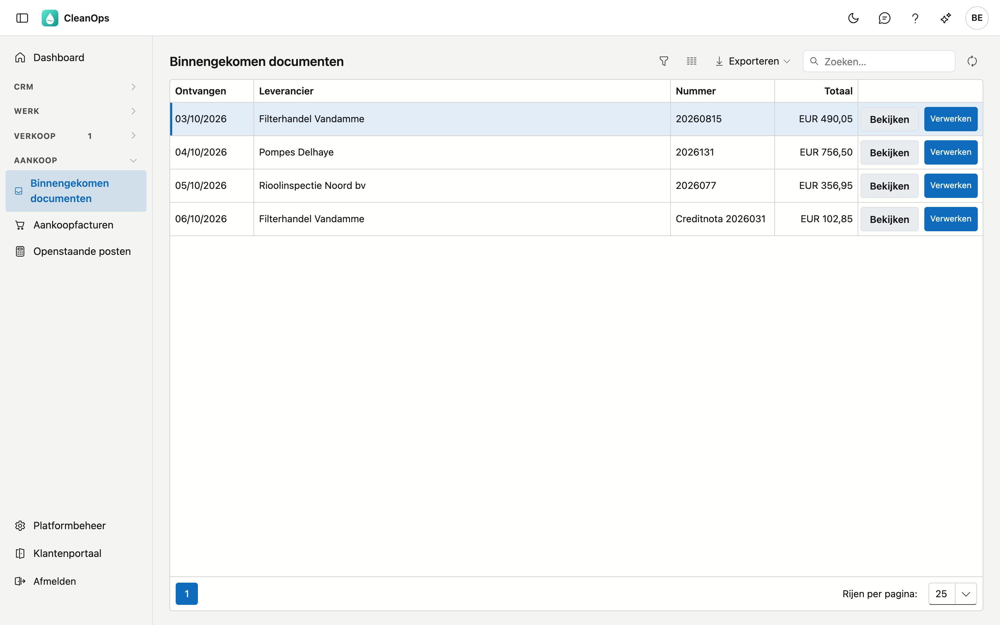
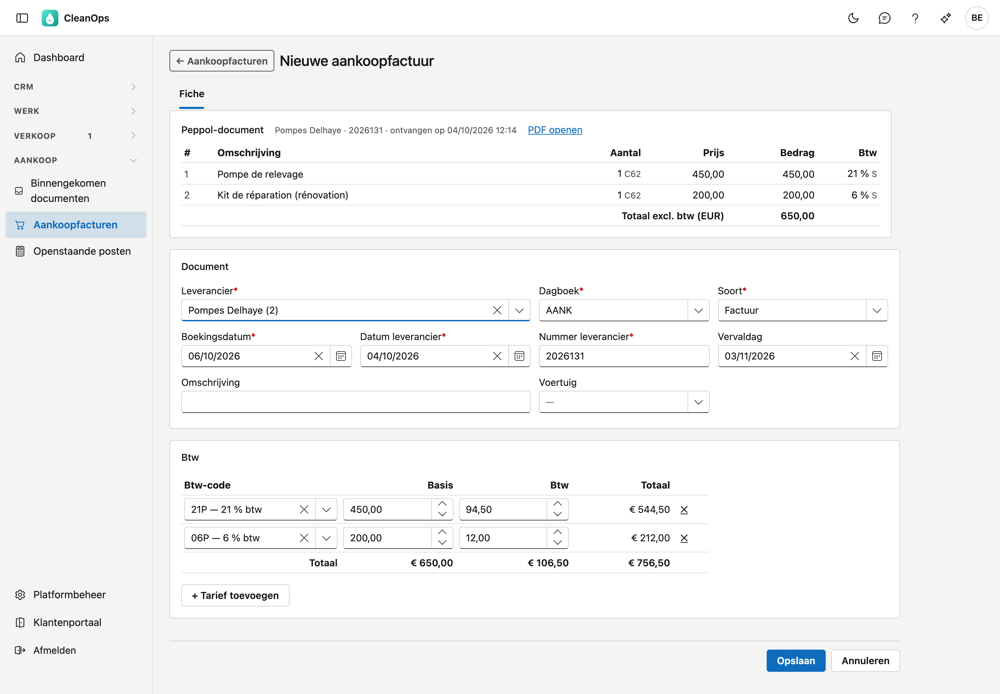
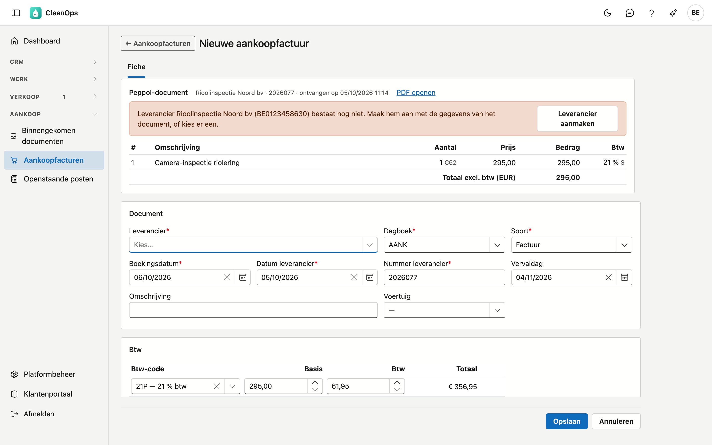

# Binnengekomen documenten

De facturen en creditnota's die uw leveranciers via **Peppol** sturen, het Belgische netwerk voor elektronische
facturen. U hoeft ze niet meer over te typen: CleanOps leest het document en maakt er een voorgevulde
[aankoopfactuur](aankoopfacturen.md) van, die u nakijkt en bewaart.

## Het scherm openen

Klik links in het menu, onder **Aankoop**, op **Binnengekomen documenten**. U hebt het recht *Aankoop bekijken*
nodig; om documenten te verwerken ook *Aankoop bewerken*. De rol Financieel krijgt beide. Zonder *Aankoop bewerken*
ziet u de lijst en de PDF's, maar niet de knop **Verwerken**.

!!! info "Peppol-adres"
    Uw leveranciers sturen naar uw Peppol-adres. ADM-Concept registreert dat voor u; vraag het aan vóór u het
    adres aan uw leveranciers geeft. Staat er bovenaan dat deze omgeving niet gekoppeld is, neem dan contact op met
    ADM-Concept.

## De lijst

Per document ziet u wanneer het ontvangen werd, de leverancier, het nummer en het totaal. Een creditnota staat er met
het woord *Creditnota* voor het nummer. Het oudste document staat bovenaan.

- **Bekijken** — opent de PDF van de leverancier in een nieuw venster.
- **Verwerken** — opent een voorgevulde aankoopfactuur (zie hieronder).
- **Exporteren** — de lijst als bestand.

Een document blijft in de lijst tot u het verwerkt.

## Een document verwerken

Klik op **Verwerken**. De fiche van een nieuwe aankoopfactuur opent, al ingevuld met wat er op het document staat:

- **Leverancier** — gezocht op het btw-nummer van het document.
- **Soort** — factuur of creditnota, zoals op het document.
- **Datum leverancier**, **Nummer leverancier** en **Vervaldag** — van het document.
- **Btw** — per btw-tarief een regel met de basis en de btw van het document. De btw-code kiest CleanOps op het
  percentage en de soort btw (normaal, verlegd, vrijgesteld…).

Bovenaan staat de kaart **Peppol-document**: van wie het komt, wanneer het binnenkwam, **PDF openen**, en de lijnen
zoals de leverancier ze op zijn factuur zette. Die lijnen kunt u niet wijzigen; de aankoopfactuur draagt de bedragen
per btw-tarief.

Kijk alles na, vul eventueel een **Omschrijving** of een **Voertuig** aan en klik op **Opslaan**. De factuur krijgt
haar nummer, en het document verdwijnt uit de lijst.

!!! note "De btw van de leverancier telt"
    Bij een gewone aankoopfactuur stelt CleanOps de btw voor op basis van de code en de basis. Bij een document uit
    Peppol niet: de btw die de leverancier aanrekent, blijft staan, ook als u een andere code kiest. Een leverancier
    die per lijn afrondt, kan een cent verschillen van wat CleanOps zou berekenen, en het bedrag op zijn factuur is wat
    hij vraagt.

### Wat de fiche u laat nakijken

Bovenaan de fiche staat een melding als iets niet vanzelf ingevuld kon worden:

- **Leverancier bestaat nog niet** — klik op **Leverancier aanmaken** (zie hieronder), of kies er een uit de lijst.
- **Meerdere leveranciers** dragen hetzelfde btw-nummer — kies de juiste.
- **Geen btw-nummer** op het document — kies de leverancier zelf.
- **Leverancier in de prullenbak** — haal hem eerst terug in [Leveranciers](leveranciers.md), of kies een andere.
- **Geen btw-code past** bij een tarief, of er passen er meerdere — kies de code in die btw-regel.
- Het **totaal** van de regels wijkt af van het document, het document staat in een **andere munt**, of er is al een
  **voorschot** betaald — kijk de bedragen na; een voorschot boekt u apart in [Betalingen](betalingen.md).

### Een nieuwe leverancier

Kent CleanOps de leverancier nog niet, klik dan op **Leverancier aanmaken**. De fiche van een nieuwe leverancier opent,
voorgevuld met de naam, het adres, het btw-nummer, het e-mailadres, de IBAN en de BIC van het document.

Vul de **Betaaltermijn** aan (die staat niet op een factuur) en klik op **Opslaan**. U gaat meteen terug naar de
aankoopfactuur, en daar staat de nieuwe leverancier al ingevuld.

### Al met de hand ingegeven

Gaf u de factuur al in voor ze via Peppol binnenkwam, bijvoorbeeld vanuit de PDF in een mail? Dan meldt de fiche:
*Dit document lijkt al ingegeven*, met het nummer van dat document. CleanOps zoekt bij dezelfde leverancier op het
nummer van de leverancier, ook als de datum verschilt. Wijkt het totaal af, dan staat dat erbij.

- **Openen** — toont het document dat er al is, in een nieuw venster.
- **Koppelen aan dit document** — na een bevestiging hangt CleanOps het Peppol-document aan het bestaande document.
  Er komt **geen tweede factuur** bij; de UBL en de PDF gaan bij de bijlagen, en het document verdwijnt uit de lijst.

Koppelen kan ook als het bestaande document al betaald is: het wijzigt geen bedragen.

### Een creditnota

Een creditnota wordt een aankoopcreditnota, met positieve bedragen zoals elk aankoopdocument. Een factuur met een
negatief totaal stelt CleanOps als creditnota voor, en meldt dat.

## Na het bewaren

- De **UBL** (het Peppol-bestand) en de **PDF** staan onder **Bijlagen** van de aankoopfactuur.
- De kaart **Peppol-document** blijft bovenaan de fiche staan, met de PDF en de lijnen.
- ADM One krijgt de bevestiging dat het document verwerkt is. Lukt dat niet meteen, dan zegt de fiche dat, en
  probeert dit scherm het bij elk openen opnieuw. Het document staat intussen niet meer in de lijst, zodat niemand het
  een tweede keer verwerkt.

## Een verwerkte factuur verwijderen

Verwijdert u de aankoopfactuur (zolang er niets op betaald is), dan komt het document terug in deze lijst, met een
melding bovenaan. U kunt het dan opnieuw verwerken.

## Veelgestelde vragen

**De knop Verwerken staat er niet.**
U hebt het recht *Aankoop bewerken* nodig.

**Er staat dat ADM One niet bereikbaar is.**
De documenten konden niet opgehaald worden. Wat u dan ziet, is mogelijk niet volledig: dat er niets staat, betekent niet
dat er niets binnenkwam. Probeer het opnieuw met de knop in de melding.

**Een leverancier zegt dat hij via Peppol stuurde, maar het document staat er niet.**
Vraag hem naar welk Peppol-adres hij stuurde. Kwam het document niet bij uw adres aan, dan kan ADM-Concept het
opsporen.

## Zie ook

- [Aankoopfacturen](aankoopfacturen.md)
- [Leveranciers](leveranciers.md)
- [Betalingen](betalingen.md)
