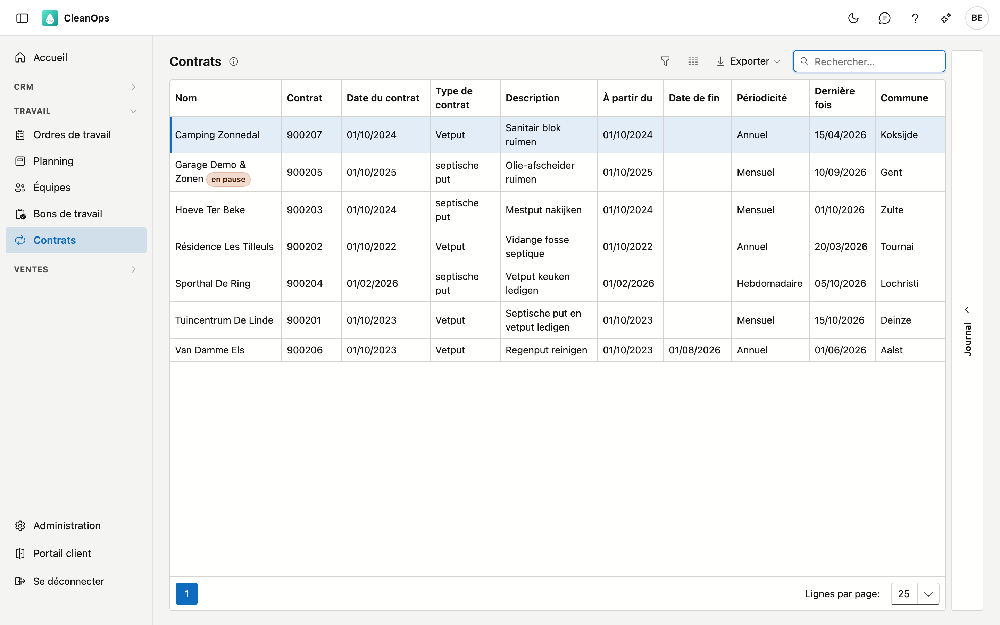
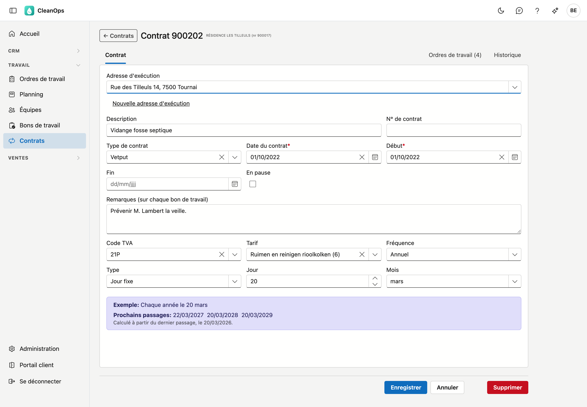
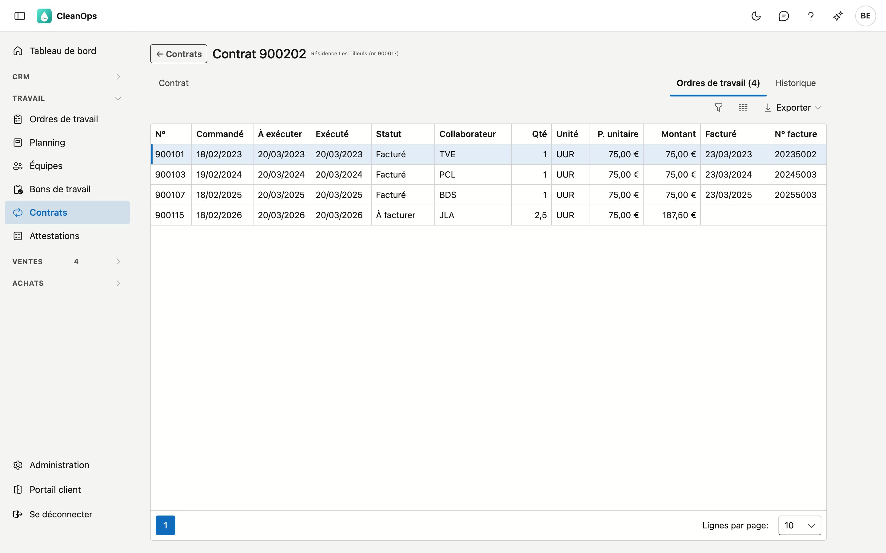

# Contrats

Un contrat fixe la fréquence à laquelle vous revenez chez un client : vider une fosse tous les six mois, un dégraisseur
toutes les deux semaines. D'un contrat en cours naissent les [ordres de travail](werkorders.fr.md) des prochains
passages ; vous n'avez pas à les créer vous-même. CleanOps les crée chaque nuit pour les 90 prochains jours, et aussitôt
que vous enregistrez un nouveau contrat.

## Ouvrir l'écran

Dans le menu de gauche, sous **Travail**, cliquez sur **Contrats**.

## La liste

Pour chaque contrat, vous voyez le client, le numéro du contrat, la date du contrat, le type de contrat, la
description, la date **À partir du**, la **Date de fin**, la **Périodicité**, la **Dernière fois** et la commune. Si un
contrat est en pause, **en pause** figure à côté du client. La liste est triée par nom de client.

- **Dernière fois** — la date planifiée du dernier ordre de travail du contrat.
- **Rechercher** — le curseur est directement dans le champ de recherche. La recherche porte sur ce que montre la
  liste, y compris la périodicité : *Annuel* trouve tous les contrats annuels. Vous trouvez aussi un contrat par la rue,
  la commune, le GSM et le numéro fixe du client, même s'ils ne figurent pas dans la liste.
- **Trier** — cliquez sur un titre de colonne ; un second clic inverse l'ordre.
- **Exporter** — le bouton en haut à droite vous donne la liste, telle qu'elle est filtrée, sous forme de fichier.
- **Ouvrir** — double-cliquez sur une ligne pour ouvrir le contrat.
- **Journal** — le volet de droite montre l'historique du contrat sélectionné dans la liste.

Un contrat terminé reste dans la liste, avec sa date de fin.

## Un nouveau contrat

Un nouveau contrat se crée depuis la fiche du [client](klanten.fr.md) : ouvrez l'onglet **Contrats** et cliquez sur
**Nouveau contrat**. Le contrat commence avec aujourd'hui comme date du contrat et date de début, et un rythme
mensuel le premier du mois. Après **Enregistrer**, le nouveau contrat s'ouvre.

## La fiche du contrat

En haut figurent le numéro du contrat et le client ; si le contrat est en pause, c'est indiqué. En dessous, trois
onglets : **Contrat**, **Ordres de travail** et **Historique**.

### L'onglet Contrat

| Champ | Explication |
|---|---|
| Adresse d'exécution | L'adresse du client ou l'une de ses adresses d'exécution. **Nouvelle adresse d'exécution** en crée une ; vous revenez ensuite au contrat. |
| Description | Ce qui est fait, 35 caractères au maximum. Si le contrat n'a pas de remarques, ce texte devient la description et l'instruction de ses ordres de travail. |
| N° de contrat | Un numéro ou une référence propre, 30 caractères au maximum. |
| Type de contrat | Un choix dans la liste *Types de contrat* des [tables de base](beheer/basistabellen.fr.md). |
| Date du contrat * | La date du contrat. Ne peut pas se situer dans le futur. |
| Début * | À partir de quand le rythme court. Ne peut pas précéder la date du contrat. |
| Fin | À partir de cette date, plus aucun passage ne s'ajoute. Ne peut pas précéder le début. |
| En pause | Suspend le contrat : aucun ordre de travail ne s'ajoute tant que la case est cochée. |
| Remarques (sur chaque bon de travail) | Un texte fixe pour chaque ordre de travail de ce contrat, comme *demander la clé à l'accueil*. Il devient l'instruction pour l'équipe, et ses 35 premiers caractères la description de l'ordre. |
| Code TVA, Tarif | Figurent sur les ordres de travail de ce contrat. La liste Tarif montre les tarifs dans la langue du client. |
| Fréquence | Le rythme — voir ci-dessous. |

### Le rythme

Choisissez sous **Fréquence** à quelle fréquence les passages reviennent. Selon le choix, d'autres champs apparaissent :

| Fréquence | Champs |
|---|---|
| Quotidien | **Tous les … jours**. |
| Hebdomadaire | **Toutes les … semaines**, et les jours : **Lu** à **Di**. |
| Mensuel | **Type** : un **Jour fixe** (par exemple le 15) ou un **Rang** (par exemple le deuxième mardi), et **Tous les … mois**. |
| Annuel | **Type** : un **Jour fixe** ou un **Rang**, et le **Mois**. |

Le cadre en dessous dit en mots ce que vous avez réglé, par exemple *Chaque année le 20 mars*. En dessous figurent les
**Prochains passages** : les cinq dates suivantes. Si une date a déjà un ordre de travail, *(ordre existant)* est
indiqué.

Voici comment CleanOps calcule les passages :

- Le rythme part du **dernier passage** du contrat — la dernière ligne du cadre indique lequel.
- Un passage le **week-end** glisse au lundi. Pour un contrat hebdomadaire, ce sont les jours cochés qui comptent,
  y compris un samedi.
- Un passage un **jour férié** ou un **jour de fermeture** glisse au jour ouvrable suivant. Les jours fériés et de
  fermeture se trouvent sous [Jours fériés](beheer/feestdagen.fr.md).
- Un jour fixe qui n'existe pas dans un mois — le 31 en avril — devient le dernier jour de ce mois.
- Aucun passage n'est créé avant la date de début.
- Un passage passé sans ordre de travail n'est pas rattrapé.

!!! info "Jours fériés inconnus"
    Si CleanOps ne peut momentanément pas récupérer les jours fériés, le cadre indique que les dates ne tiennent
    compte que des jours de fermeture. Réessayez plus tard.

### Si vous modifiez le rythme

Si vous modifiez le rythme d'un contrat qui a déjà des ordres de travail pour les prochains temps, CleanOps demande
après l'enregistrement s'il faut les recalculer : **Recalculer** ou **Laisser**. Seuls les ordres auxquels personne
n'a touché entrent en ligne de compte. Un ordre exécuté, planifié ou modifié reste toujours.

### L'onglet Ordres de travail

Tous les ordres de travail de ce contrat, avec leurs dates, leur statut, le collaborateur, la quantité, l'unité, le
prix unitaire, le montant, la date de facturation et le numéro de facture. Le **tarif** (code et description), la date planifiée, le convoyeur,
les instructions, le matériel et la remarque interne s'activent via **Choisir les colonnes** ; ils sont masqués par
défaut, car le tableau deviendrait plus large que la fiche.
Double-cliquez sur une ligne pour ouvrir l'ordre. Un ordre de travail isolé que quelqu'un a lié à la main à ce contrat y figure aussi ; il ne compte pas comme un passage
(voir [Ordres de travail](werkorders.fr.md)).

Avec **Créer les ordres de travail** en bas de l'onglet Contrat, CleanOps crée aussitôt les ordres de travail de ce contrat pour les 90
prochains jours, avec les mêmes règles que la nuit. L'onglet Ordres de travail montre ensuite la liste, avec au-dessus le nombre d'ordres ajoutés. Tant que
votre application précédente crée encore les ordres de travail, CleanOps n'en crée pas, et c'est indiqué.

### L'onglet Historique

Qui a modifié quel champ de ce contrat, quand, et de quelle valeur à quelle valeur.

## Supprimer un contrat

**Supprimer**, en bas de la fiche, place le contrat dans la [corbeille](beheer/prullenbak.fr.md). Si le contrat a
encore des ordres de travail pour les prochains temps auxquels personne n'a touché, CleanOps demande s'il faut les
supprimer : **Supprimer** ou **Laisser**.

## Questions fréquentes

**Le prochain passage ne tombe pas le jour attendu.**
Le rythme part du dernier passage, pas de la date de début. Si un passage tombe un week-end ou un jour férié, il
glisse au jour ouvrable suivant. Le cadre sur la fiche montre quel passage compte comme dernier.

**Je veux suspendre temporairement un contrat.**
Cochez **En pause**. Pour l'arrêter définitivement, indiquez une **Fin**.

**Je ne retrouve pas un contrat.**
Cherchez sur le nom du client, la description ou le numéro de contrat. S'il n'y est vraiment plus, consultez la
[corbeille](beheer/prullenbak.fr.md).
