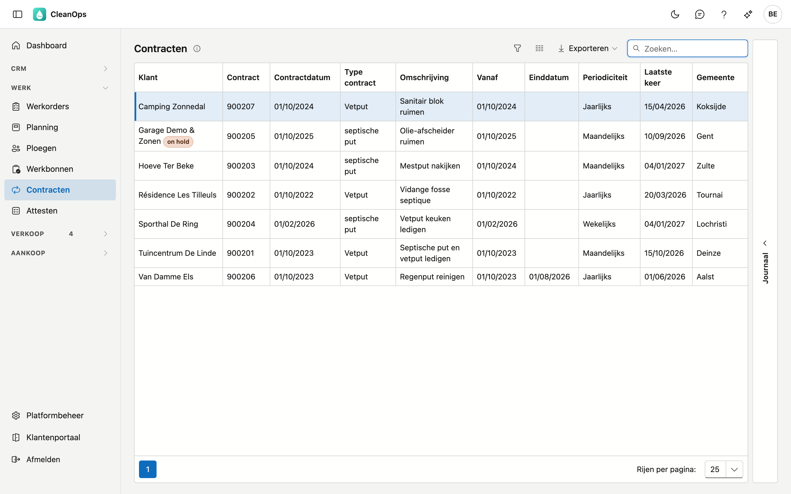
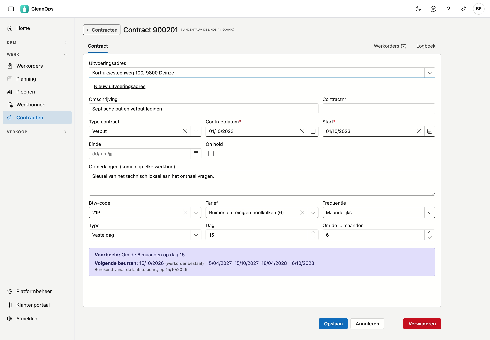
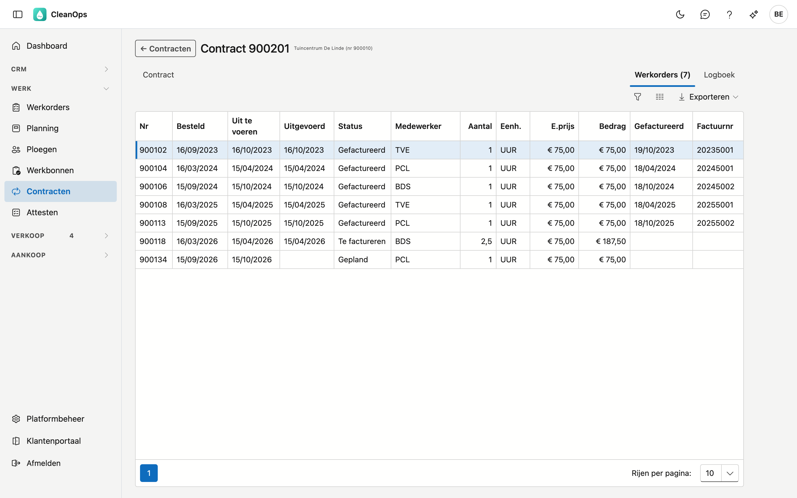

# Contracten

Een contract legt vast hoe vaak u bij een klant terugkomt: om de zes maanden een put ledigen, om de twee weken een
vetput. Uit een lopend contract ontstaan de [werkorders](werkorders.md) voor de komende beurten; u hoeft ze niet zelf
aan te maken. CleanOps maakt ze elke nacht voor de komende 90 dagen, en meteen wanneer u een nieuw contract bewaart.

## Het scherm openen

Klik links in het menu, onder **Werk**, op **Contracten**.

## De lijst

Per contract ziet u de klant, het contractnummer, de contractdatum, het type contract, de omschrijving, de datum
**Vanaf**, de **Einddatum**, de **Periodiciteit**, de **Laatste keer** en de gemeente. Staat een contract on hold, dan
staat er **on hold** naast de klant. De lijst staat op klantnaam.

- **Laatste keer** — de geplande datum van de laatste werkorder van het contract.
- **Zoeken** — de cursor staat meteen in het zoekveld. Er wordt gezocht in wat de lijst toont, ook in de
  periodiciteit: *Jaarlijks* vindt alle jaarlijkse contracten.
- **Sorteren** — klik op een kolomtitel; nog eens klikken keert de volgorde om.
- **Exporteren** — via de knop rechtsboven krijgt u de lijst zoals ze nu gefilterd is als bestand.
- **Openen** — dubbelklik op een rij om het contract te openen.
- **Journaal** — de strook rechts toont het logboek van het contract dat u in de lijst aanklikt.

Een afgelopen contract blijft in de lijst staan, met zijn einddatum.

## Een nieuw contract

Een nieuw contract maakt u op de fiche van de [klant](klanten.md): open het tabblad **Contracten** en klik op
**Nieuw contract**. Het contract begint met vandaag als contractdatum en begindatum, en maandelijks op de eerste
als ritme. Na **Opslaan** opent het nieuwe contract.

## De contractfiche

Bovenaan staan het contractnummer en de klant; staat het contract on hold, dan staat dat erbij. Daaronder drie
tabbladen: **Contract**, **Werkorders** en **Logboek**.

### Het tabblad Contract

| Veld | Toelichting |
|---|---|
| Uitvoeringsadres | Het adres van de klant of een van zijn uitvoeringsadressen. Met **Nieuw uitvoeringsadres** maakt u er een aan; daarna keert u terug naar het contract. |
| Omschrijving | Wat er gebeurt, hoogstens 35 tekens. Heeft het contract geen opmerkingen, dan wordt dit de omschrijving en de instructie van zijn werkorders. |
| Contractnr | Een eigen nummer of referentie, hoogstens 30 tekens. |
| Type contract | Een keuze uit de lijst *Contracttypes* van de [basistabellen](beheer/basistabellen.md). |
| Contractdatum * | De datum van het contract. Mag niet in de toekomst liggen. |
| Start * | Vanaf wanneer het ritme loopt. Mag niet vóór de contractdatum liggen. |
| Einde | Vanaf deze datum komen er geen beurten meer bij. Mag niet vóór de start liggen. |
| On hold | Pauzeert het contract: er komen geen werkorders bij tot u het vinkje weghaalt. |
| Opmerkingen (komen op elke werkbon) | Een vaste tekst voor elke werkorder uit dit contract, zoals *sleutel aan het onthaal vragen*. Ze wordt de instructie voor de ploeg, en haar eerste 35 tekens de omschrijving van de werkorder. |
| Btw-code, Tarief | Komen op de werkorders van dit contract. |
| Frequentie | Het ritme — zie hieronder. |

### Het ritme

Kies onder **Frequentie** hoe vaak de beurten terugkomen. Naargelang de keuze verschijnen andere velden:

| Frequentie | Velden |
|---|---|
| Dagelijks | **Om de … dagen**. |
| Wekelijks | **Om de … weken**, en de dagen waarop: **Ma** tot **Zo**. |
| Maandelijks | **Type**: een **Vaste dag** (bijvoorbeeld de 15de) of een **Rang** (bijvoorbeeld de tweede dinsdag), en **Om de … maanden**. |
| Jaarlijks | **Type**: een **Vaste dag** of een **Rang**, en de **Maand**. |

Het kader eronder zegt in woorden wat u instelde, bijvoorbeeld *Om de 6 maanden op dag 15*. Daaronder staan de
**Volgende beurten**: de vijf eerstvolgende datums. Heeft een datum al een werkorder, dan staat er
*(werkorder bestaat)* bij.

Zo rekent CleanOps de beurten:

- Het ritme loopt vanaf de **laatste beurt** van het contract — de onderste regel in het kader zegt welke dat is.
- Een beurt in het **weekend** schuift naar maandag. Bij een wekelijks contract gelden de dagen die u aanvinkt,
  ook een zaterdag.
- Een beurt op een **feestdag** of een **sluitingsdag** schuift naar de volgende werkdag. De feestdagen en
  sluitingsdagen staan bij [Feestdagen](beheer/feestdagen.md).
- Een vaste dag die in een maand niet bestaat — de 31ste in april — wordt de laatste dag van die maand.
- Er komt geen beurt vóór de startdatum.
- Een beurt die voorbij is zonder werkorder, wordt niet ingehaald.

!!! info "Feestdagen niet bekend"
    Kan CleanOps de feestdagen even niet ophalen, dan zegt het kader dat de datums enkel met de sluitingsdagen
    rekening houden. Kijk later opnieuw.

### Als u het ritme wijzigt

Wijzigt u het ritme van een contract dat al werkorders voor de komende tijd heeft, dan vraagt CleanOps na het
opslaan of die opnieuw berekend moeten worden: **Opnieuw berekenen** of **Laten staan**. Enkel de werkorders die
niemand aanraakte, komen daarvoor in aanmerking. Een werkorder die uitgevoerd, ingepland of aangepast is, blijft
altijd staan.

### Het tabblad Werkorders

Alle werkorders van dit contract, met hun datums, status, medewerker, aantal, eenheid, eenheidsprijs, bedrag, de
datum van facturatie en het factuurnummer. Dubbelklik op een rij om de werkorder te openen. Ook een losse werkorder die iemand met
de hand aan dit contract koppelde, staat hier; ze telt niet als beurt (zie [Werkorders](werkorders.md)).

Met **Werkorders nu aanmaken** onderaan het tabblad Contract maakt CleanOps meteen de werkorders van dit contract voor de komende 90 dagen,
met dezelfde regels als 's nachts. Daarna toont het tabblad Werkorders de lijst, met erboven hoeveel er bijkwamen. Zolang uw vorige toepassing de werkorders
nog maakt, maakt CleanOps er geen, en dat staat er dan ook.

### Het tabblad Logboek

Wie welk veld van dit contract gewijzigd heeft, wanneer, en van welke waarde naar welke.

## Een contract verwijderen

**Verwijderen** onderaan de fiche legt het contract in de [prullenbak](beheer/prullenbak.md). Heeft het contract nog
werkorders voor de komende tijd die niemand aanraakte, dan vraagt CleanOps of die geschrapt moeten worden:
**Schrappen** of **Laten staan**.

## Veelgestelde vragen

**De volgende beurt valt niet op de dag die ik verwacht.**
Het ritme loopt vanaf de laatste beurt, niet vanaf de startdatum. Valt een beurt in het weekend of op een feestdag,
dan schuift ze naar de volgende werkdag. Het kader op de fiche toont welke beurt als laatste telt.

**Ik wil een contract tijdelijk stopzetten.**
Vink **On hold** aan. Wilt u het voorgoed stoppen, vul dan een **Einde** in.

**Ik vind een contract niet terug.**
Zoek op de klantnaam, de omschrijving of het contractnummer. Staat het er echt niet meer, kijk dan in de
[prullenbak](beheer/prullenbak.md).
