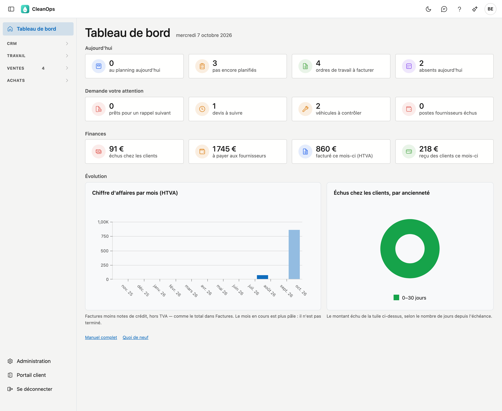

# Tableau de bord

Le tableau de bord est le premier écran après la connexion. Vous voyez d'un coup d'œil ce qui se passe aujourd'hui, ce
qui demande votre attention, où en sont les finances et comment se sont passés les douze derniers mois. Chaque tuile est
un raccourci : un clic ouvre la liste qui affiche exactement ce chiffre.

## Ouvrir l'écran

Le tableau de bord s'ouvre de lui-même après la connexion. Ailleurs, vous le retrouvez via **Tableau de bord**, en haut du
menu de gauche.

En haut figure la date du jour. Tous les chiffres portent sur ce jour-là.

## Aujourd'hui

| Tuile | Ce qu'elle compte | Un clic ouvre |
|---|---|---|
| au planning aujourd'hui | les ordres de travail planifiés aujourd'hui et pas encore exécutés | la [liste du planning](planning.md#la-liste-du-planning) sur le jour même |
| pas encore planifiés | les ordres de travail au statut **Encodé** | les [ordres de travail](werkorders.md) au statut **Encodé** |
| ordres de travail à facturer | le travail exécuté qui attend une facture, jusqu'à aujourd'hui inclus — sans ce qui a été payé comptant | [Facturation](facturatie.md) |
| absents aujourd'hui | les collaborateurs en congé aujourd'hui | le [calendrier des congés](verlofkalender.md) |

## Demande votre attention

| Tuile | Ce qu'elle compte | Un clic ouvre |
|---|---|---|
| prêts pour un rappel suivant | les postes qui ont déjà reçu un rappel et sont prêts pour le suivant — le même chiffre que dans le menu | les [postes ouverts](openstaande-posten.md) sur **Prochain rappel** |
| devis à suivre | les devis envoyés dont la date de suivi est aujourd'hui ou passée | les [devis](offertes.md) sur **À suivre** |
| véhicules à contrôler | les véhicules dont le contrôle technique est échu ou tombe dans les 30 jours | les [véhicules](beheer/voertuigen.md) sur **À contrôler** |
| postes fournisseurs échus | les documents d'achat dont l'échéance est passée et qui sont encore ouverts | les [postes ouverts fournisseurs](openstaande-posten-leveranciers.md) sur **Échus** |

Un **0** reste affiché : « rien à faire » est aussi une réponse.

## Finances

| Tuile | Ce qu'elle compte | Un clic ouvre |
|---|---|---|
| échus chez les clients | le montant ouvert des postes sur **Échus** | les [postes ouverts](openstaande-posten.md) sur **Échus** |
| à payer aux fournisseurs | ce que vous devez encore à vos fournisseurs, moins les notes de crédit qu'ils doivent encore vous rembourser | les [postes ouverts fournisseurs](openstaande-posten-leveranciers.md) |
| facturé ce mois-ci (HTVA) | les factures moins les notes de crédit du mois en cours, hors TVA | les [factures](facturen.md) sur **Ce mois-ci** |
| reçu des clients ce mois-ci | les paiements des clients du mois en cours, moins les remboursements | les [paiements](betalingen.md) sur **Ce mois-ci**, uniquement les clients |

Sur le tableau de bord, les montants sont arrondis à l'euro. La liste affiche le même montant au centime près.

!!! note "À payer figure dans la liste avec un signe moins"
    Dans les postes ouverts fournisseurs, les montants figurent comme sur votre extrait bancaire : une facture que vous
    devez encore payer est négative. Le solde en bas est donc un montant négatif. Sur le tableau de bord, le même montant
    s'appelle *à payer*, sans signe moins.

## Évolution

Deux graphiques sur les douze derniers mois. Le mois en cours est **plus pâle** : il n'est pas terminé.

- **Chiffre d'affaires par mois (HTVA)** — par mois les factures moins les notes de crédit, hors TVA. La dernière barre est
  le montant de la tuile *facturé ce mois-ci*.
- **Échus chez les clients, par ancienneté** — le montant de la tuile *échus chez les clients*, réparti selon le nombre de
  jours depuis l'échéance : 0–30 jours, 31–60, 61–90, 91–365 et plus d'un an. Du vert au rouge foncé : plus c'est ancien,
  plus c'est grave.

Si vous ne pouvez pas voir la facturation mais bien les ordres de travail, vous voyez à gauche **Ordres de travail par
mois** : les ordres de travail dont la date de planification tombe dans ce mois, quel que soit leur statut.

## Ce que vous voyez dépend de vos droits

Vous ne voyez que les tuiles et graphiques des listes que vous pouvez ouvrir. Une tuile affichée peut donc toujours être
cliquée. Un bloc sans aucune tuile n'apparaît pas. Si vous n'avez de droit pour aucun bloc, vous ne voyez qu'une phrase
de bienvenue ; le menu de gauche affiche les écrans que vous pouvez ouvrir.

## Erreurs fréquentes

!!! warning "Le chiffre de la tuile diffère de la liste"
    La tuile ouvre la liste avec le bon filtre. Si vous modifiez ensuite un filtre ou le champ de recherche, la liste
    affiche autre chose. Cliquez à nouveau sur la tuile pour repartir de la même sélection.

!!! warning "Il y a … au lieu d'un chiffre"
    Ce chiffre n'a pas pu être calculé, et la mention *peut-être incomplet* apparaît. CleanOps n'affiche alors
    volontairement pas 0 : un 0 promettrait une journée calme qui n'en est peut-être pas une. Rechargez l'écran dans un
    instant.

!!! warning "Le mois en cours semble faible"
    Il n'est pas terminé. C'est pourquoi il est plus pâle dans le graphique. Ne le comparez à un mois précédent qu'une
    fois qu'il est passé.

## Voir aussi

- [Ordres de travail](werkorders.md)
- [Planning](planning.md)
- [Postes ouverts](openstaande-posten.md)
- [Postes ouverts fournisseurs](openstaande-posten-leveranciers.md)
- [Factures](facturen.md)
- [Paiements](betalingen.md)
